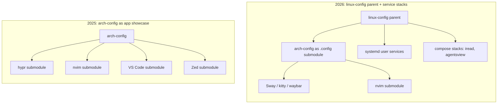

<BilibiliVideo bvid="BV1yLTM6SE82" />

<TOCInline fromHeading={1} toHeading={2} toc={props.toc} />

---

A year ago I published [My Arch Linux Dotfiles](/blog/misc/arch-linux-dotfiles), a tour of the [arch-config repository](https://github.com/isomoes/arch-config) as it stood on 2025-07-30. That post was, honestly, a showcase. It listed editors, window managers, browsers, and 163 packages, and it framed the repository as a personal toolkit refined through daily use. The implicit message was that the configuration *was* the work: the more carefully each application was tuned, the better the system.

A year of daily use later, the repository looks very different, and the reason it looks different is not aesthetic. The center of my work moved from typing to supervising AI agents, and the configuration followed. This post does three things, in order: it traces the timeline of what actually changed, it compares the current 2026 setup against the 2025 snapshot in concrete terms, and it explains why the agent phase reshaped almost everything.

## The Timeline: What Changed Since 2025

The repository has 363 commits between April 2025 and June 2026. Rather than recite all of them, it helps to read the history as a sequence of phases, each one a small bet about where control should live.

### The starting point: Hyprland, Fish, and an early CLAUDE.md

The repository was born around a Hyprland, Fish, and Waybar stack on a desktop with Apple peripherals, the era described in the original [Arch Linux setup](/blog/misc/arch-linux). The theme settled quickly on Catppuccin Macchiato dark after a brief Tritanopia light-scheme experiment, the terminal was kitty, and Surfingkeys was already present by June 2025. The editor story peaked in this early period (by mid-2025): Neovim, VS Code, and Zed were all carried as separate git submodules, with real effort going into VS Code Vim-emulation keybindings. One detail matters in hindsight: a `CLAUDE.md` repository guide was added on 2025-05-26. The agent was in the room before the workflow was built around it.

### The window-manager churn and the July snapshot

In mid-2025 the window-manager experimentation started in earnest: Hyprland gained a River trial, the terminal switched from kitty to foot, qutebrowser arrived as a keyboard-driven browser, and a Caps/Esc swap grew into proper xremap-based CapsLock navigation. This is the state captured by the [old dotfiles post](/blog/misc/arch-linux-dotfiles) and the [May-to-July journey](/blog/misc/arch-linux-may-july-journey): Hyprland plus River, foot as the terminal, Firefox and qutebrowser for browsing, with Surfingkeys layered on top.

### Bootstrapping the agent, and moving the shell upstream

From late August 2025, agent work began as hand-rolled shell functions: `claude-deepseek`, `claude-kimi`, `claude-bigmodel`, each pointing Claude at a different cheap provider, alongside the first `.claude` submodule. This is also where the shell changed. The migration from Fish to Zsh, and then to Oh My Zsh, did not happen in `arch-config` at all. It happened in a new parent repository, [linux-config](https://github.com/isomoes/linux-config), created on 2025-09-24. From this point on the shell lives upstream in `linux-config` while `arch-config` stays focused on the desktop configuration.

### The detour through Niri, and landing on Sway

Late 2025 finally resolved the window-manager question. River became primary, a one-day Niri experiment with Alacritty was tried and reverted, and the configuration landed on Sway on 2025-11-19. The terminal returned to kitty, now with Neovim wired in as the scrollback pager. Editors consolidated quietly rather than by decision: the VS Code and Zed submodules stopped being updated, leaving Neovim as the only actively maintained editor. The reflective version of this stretch is in [My 2025 Big Changes](/blog/misc/change-2025).

### OpenCode, the rename, and agent services

Through the winter and spring, agent tooling matured from shell functions into the [OpenCode](/blog/tools/opencode-cli) submodule with a multi-provider backend, adding MIMO and volcengine alongside the earlier DeepSeek, KIMI, and GLM. Orchestration moved toward a vibe-kanban runner, then toward an `ikanban` server split into direct and proxy services, and a `cli-proxy-api` gateway in front of the providers. The GitHub account was renamed from jiahaoxiang2000 to isomoes on 2026-01-30, which forced the user services to become path-independent. The browser also migrated decisively to Chrome plus Surfingkeys, the shift I documented in [One Year with Arch Linux](/blog/misc/one-year-arch-linux-browser-workflow) and touched on in [the best OS for AI-agent coding](/blog/misc/best-os-ai-agent-coding).

### Back to Claude Code, and the compose stacks

The final phase, from May 2026, moved the daily driver [back to Claude Code](/blog/tools/back-to-claude-code). The cleanest marker of that return is a one-line kitty tweak so that Shift+Enter behaves correctly in Claude Code under tmux. Around it came kitty `font_size 20`, a Sway integer scale of 2.0, and a `chrome-flags.conf` tuned for Wayland. Agent orchestration consolidated into systemd user services, and then `iread` and `agentsview` were packaged as Docker Compose stacks, both bound to localhost. The phase closed on 2026-06-28 with a README rebrand to isomoes and the removal of the now-redundant `CLAUDE.md`, all under the parent `linux-config` and child `arch-config` structure.

## The Comparison: 2025 Snapshot vs. 2026 Setup

Reading the timeline as a before-and-after makes the shape of the change clearer. Almost every layer was replaced, and the replacements all point in the same direction.

| Layer | 2025 (July snapshot) | 2026 (current) |
| --- | --- | --- |
| Shell | Fish | Zsh with Oh My Zsh, in `linux-config` |
| Window manager | Hyprland, plus River | Sway (Hyprland, River, Niri now legacy) |
| Terminal | foot (kitty also present) | kitty (CSI-u Shift+Enter, nvim scrollback pager, font 20, scale 2.0) |
| Editors | Neovim + VS Code + Zed, three submodules | Neovim actively maintained; VS Code and Zed submodules linger but went stale |
| Browser | Firefox + qutebrowser + Surfingkeys | Chrome + Surfingkeys |
| Status bar | Waybar + i3bar-river + i3status-rust | Waybar |
| Services layer | none | 12 systemd user services + Docker Compose stacks |
| Repo architecture | single `arch-config`, submodule-heavy editor configs | `linux-config` parent with `arch-config` as the `.config` submodule |
| Explicit packages | 163 | 190 (168 native + 22 AUR) |

A few cells need honesty rather than a clean checkmark. The editor row is the clearest example. The README reads as if Neovim is the only editor, but the `Code/User` and `zed` entries are still in `.gitmodules`; they simply stopped being updated by mid-to-late 2025 (Zed in July, VS Code in early September). The consolidation to Neovim was de facto, not a deliberate removal, and the dead submodules are still sitting in the tree. The same is true of the window managers: the README states plainly that "legacy configs (River, Hyprland, etc.) remain in repo but are no longer actively used." The repository did not get smaller. It got a clear active core surrounded by inert history.

The two genuinely new things are the services layer and the repository split, and they are best seen as a single architectural move.

In 2025 the repository's structure was about *editors*. The submodules that mattered were configuration repos for VS Code, Zed, and Neovim, with Hyprland config carried the same way. The architecture optimized for tuning many applications independently.

In 2026 the structure is about *services*. `arch-config` is now the `.config` submodule of a `linux-config` parent that holds the Zsh shell upstream. Inside `arch-config`, a `compose/` directory holds two self-hosted stacks. `compose/iread` runs an RSS and Atom reader backed by SQLite and an OPML file, bound to `127.0.0.1:9999`. `compose/agentsview` runs a read-only viewer that mounts the Claude, Codex, and OpenCode session directories and exposes them at `127.0.0.1:8585`. Both are deliberately localhost-only, not LAN-exposed. Around them sit twelve systemd user services, including `iagent`, `ipaper`, `iread`, `agentsview`, `ikanban`, `ikanban-proxy`, `vibe-kanban`, the `cli-proxy-api` gateway, `xremap`, a mouse-gesture service, and two SSH tunnels. The package count grew modestly, from 163 to 190, which is the smaller story. The larger one is that a configuration repository now ships running services.

## Why It Changed: The Agent Took the Wheel

The honest explanation for all of this is a shift in who does the work.

In the 2025 setup, I was the one typing. Every window-manager keybinding, every editor keymap, every terminal tweak paid off in proportion to how many hours my hands spent inside those tools. A three-editor configuration made sense when I was the runtime. Tuning VS Code's Vim emulation for a week was a reasonable trade because I would spend hundreds of hours inside it.

That assumption no longer holds. As I described in the [browser-first workflow post](/blog/misc/one-year-arch-linux-browser-workflow), the agent now owns most of the work time on many tasks. When an agent is planning, editing, running tools, and waiting for review, my role is not continuous typing. It is supervising: comparing, approving, redirecting. Once that is true, the value of micro-tuning the typing surface drops, and the value of a stable, predictable substrate that the agent can run inside goes up. The configuration shifted to match that, from a personal-app showcase toward a minimal substrate for agent-supervised work.

Every concrete choice in the current setup follows from this. Sway is no longer expected to carry my productivity; it is a stable, boring container for a browser and a terminal, which is exactly what you want underneath long-running agent sessions. kitty is tuned for one specific job, running Claude Code under tmux, which is why the CSI-u Shift+Enter fix and the Neovim scrollback pager exist at all rather than a broad terminal-aesthetics effort. Chrome plus Surfingkeys is the uniform keyboard layer for everything that lives in the browser, including agent control surfaces, so I am not rebuilding modal navigation separately for each web application.

Editors collapsed to Neovim because maintaining three editor configurations is effort spent on a surface I touch less and less; the stale VS Code and Zed submodules are the visible residue of that decision. The self-hosted services are agent-adjacent by design: `agentsview` watches agent sessions read-only, `ikanban` and `ipaper` exist to review and research agent work, and `iread` keeps the reading inputs flowing. Packaging the newest of these as Docker Compose stacks bound to localhost is what makes them reproducible parts of the configuration rather than ad-hoc processes.

The tradeoffs are real and worth stating plainly. The setup leans hard on the web stack, with the network dependence and reduced local ownership that implies; the [browser-first post](/blog/misc/one-year-arch-linux-browser-workflow) covers that boundary in detail. It now also depends on Docker and self-hosting, which is more moving parts than a directory of plain config files, even if each stack is localhost-only. And the repository still carries its own history as dead weight: the legacy River, Hyprland, Niri, foot, and Fish configs, plus the stale editor submodules, are clutter I have chosen to keep rather than clean. A configuration that runs services is harder to fully understand at a glance than one that only stores settings.

I accept those costs because they match how the work is actually distributed now. It is the same philosophy I have pursued all along, *less and more uniform control*, except that uniform control turns out to be easier to reach in one well-chosen layer than across many independent ones. A year ago the right question was how to tune every tool I typed into. Today the right question is what kind of stable, minimal environment best lets an agent do the typing while I supervise. The repository is the answer to the second question, and that is why it no longer looks like the one I wrote about a year ago.
