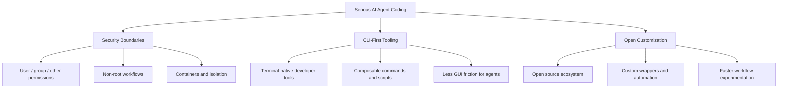

<BilibiliVideo bvid="BV1gGQQBoELw" />

<TOCInline fromHeading={1} toHeading={2} toc={props.toc} />

---

## The OS Question Changed in the Agent Era

For a long time, choosing an operating system for development mostly meant choosing a better **human interface**. People compared desktop polish, app availability, driver support, and how comfortable the system felt for daily use. In the age of **AI agent coding**, however, the main question has changed. The more important issue is no longer “Which OS is nicest for me to click through?” but rather **“Which OS gives agents the safest, most composable, and most automatable environment to work in?”**

From that perspective, Linux fits the workflow better than its alternatives. This is not because Linux is perfect, and it is not because every developer should move immediately. The narrower claim is more practical: **if you are serious about agent-driven coding, Linux currently provides the best foundation**. Its security boundaries are clearer, its software ecosystem is more naturally CLI-oriented, and its open design makes it easier to adapt the system around new agent workflows <a href="#ref-1">[1]</a> <a href="#ref-2">[2]</a>.

This argument also follows the direction of our earlier posts. In [The Better AI IDE](/blog/ide/great-ai-ide), we argued that software should serve **AI first, then humans**. In our [OpenCode guide](/blog/tools/opencode-cli) and [four-layer multi-agent workflow post](/blog/tools/four-layer-multi-agent-workflow), we made a similar point from the tooling side: agents work best through repositories, terminals, and structured automation, not through large GUI surfaces <a href="#ref-3">[3]</a> <a href="#ref-4">[4]</a> <a href="#ref-5">[5]</a>. At the operating-system layer, Linux is the environment that matches that model most closely.

## What Serious Agent Coding Actually Needs

A serious agent workflow is not just autocomplete with better marketing. Once an agent starts reading files, editing code, running tests, installing dependencies, opening processes, and coordinating multi-step tasks, the operating system becomes part of the workflow itself. In practice, that means the OS should support three things especially well.

First, it should provide **clear security boundaries**. Agents are useful precisely because they can act, but that also means they need well-defined limits. Second, it should offer a **CLI-first software environment** because agents operate far more naturally through commands than through pixel-based interfaces. Third, it should remain **open and customizable**, because the agent era is still evolving and workflows are changing faster than vendor-designed desktop abstractions.

Linux is strong on all three. That is why it matters more in the agent era than it did in the earlier IDE era.

## Why Linux Fits the Agent Workflow Better

The diagram above captures the core claim of this article. Linux is not “best” because of one feature alone. It is best for serious agent coding because **three different strengths reinforce each other**. Security keeps the agent bounded, CLI tooling keeps the workflow programmable, and openness keeps the system adaptable as the workflow evolves.

## Reason 1: Linux Has Better Security Boundaries for Agent Execution

The first reason is **security**. Linux is built around a permission model that is simple, old, and still extremely useful: every file and directory belongs to a user and a group, and access is separated into **user, group, and other** permission scopes <a href="#ref-1">[1]</a>. That model is not new, but it is exactly the kind of explicit boundary that helps when an agent is allowed to operate inside a real working environment.

An AI coding agent should rarely have unlimited authority over the whole machine. In a Linux environment, it is much easier to think in terms of scope: which user owns the repository, which directories are writable, which processes belong to which account, and which actions should require elevation. This does not make Linux automatically secure, but it does make the system easier to reason about. If you want an agent to stay inside one repository, one workspace, or one service account, Linux gives you a natural model for expressing that boundary.

Linux also benefits from the broader isolation machinery built around it. Containers, namespaces, cgroups, chroots, per-user services, and virtual machines all fit naturally into the Linux world <a href="#ref-2">[2]</a> <a href="#ref-6">[6]</a>. In practical terms, this means you can run agents inside **bounded environments** instead of treating the entire desktop as one undifferentiated execution surface. When an agent can be limited to a worktree, a container, or a non-privileged user account, accidental damage becomes easier to contain and malicious behavior becomes harder to spread.

There is also a deeper architectural point here. Traditional desktop software often assumed that the human operator would be trusted and present at every step. Agent workflows break that assumption. If the system is going to execute longer chains of actions on the user’s behalf, **permission granularity and isolation quality matter more than visual convenience**.

## Reason 2: Linux Has the Most Natural CLI Ecosystem for Agents

The second reason is the most visible in daily use: **Linux has the strongest CLI-first software ecosystem**. Agents do not think like humans using a desktop. They do not benefit much from nested menus, floating toolbars, or elegant drag-and-drop workflows. They work best when tools expose clear text interfaces, composable commands, and machine-readable outputs.

That is why the rise of agent coding has also strengthened the importance of tools like `git`, `rg`, `fd`, `fzf`, `sed`, `jq`, `tmux`, `docker`, `pytest`, and build-system CLIs. These tools already formed the backbone of serious terminal-based development, but in the agent era they become even more central. A human may appreciate a polished GUI wrapper around those tools. An agent usually does not need it. In many cases, the wrapper is just extra indirection.

This is also the key reason we argued earlier that the ideal AI IDE should optimize **prompting and verifying**, not pile more interface chrome on top of the workflow <a href="#ref-3">[3]</a>. On Linux, that model feels natural because the operating system already treats the terminal as a first-class environment. The ecosystem is full of tools designed to be chained together, scripted, logged, inspected, and rerun. That is exactly what agents need.

An interesting recent example is [CLI Anything](https://github.com/HKUDS/CLI-Anything), which tries to convert complex software operations into **CLI wrappers** that an agent can call more easily <a href="#ref-7">[7]</a>. The idea is revealing. When software is too UI-heavy, one response is to build a command-line layer on top of it so the agent can use it. That trend tells us something important: in the agent era, many beautiful UIs are not advantages. They are often **translation problems**.

This does not mean UI is useless. Humans still need to review, guide, and approve. But from the agent’s point of view, a complex GUI is frequently a burden rather than a benefit. Linux stands out because so much of its culture, tooling, and developer workflow was already built around **text interfaces, pipes, scripts, and automation**.

## Reason 3: Linux Is More Open, So Agent Workflows Can Evolve Faster

The third reason is **openness**. Linux is not just an operating system kernel or a desktop choice; it is part of a broader open-source ecosystem that encourages inspection, modification, and recombination. That matters because agent coding is still early. The workflows that feel standard today may look incomplete one year from now. In a fast-changing environment, an open system is simply more adaptable.

We have already seen this in our own workflow. OpenCode gives us a provider-agnostic runtime. Superpowers adds worktrees, structured planning, and parallel execution. iKanban gives us a review interface designed around prompting and verification rather than traditional IDE habits <a href="#ref-4">[4]</a> <a href="#ref-5">[5]</a>. None of that depends on a single vendor deciding what the correct experience should be. The workflow can evolve because the surrounding ecosystem is open enough to let us compose the pieces differently.

This openness also affects the operating-system layer itself. On Linux, it is normal to customize shells, terminals, compositors, service managers, package managers, and development environments. In our earlier [NixOS journey](/blog/misc/nixos-config-journey), we described how Linux eventually became not just a platform for running applications, but a platform for **declaring and reproducing an entire environment** <a href="#ref-8">[8]</a>. That becomes even more valuable when part of the “user” of the machine is now an agent.

The practical result is simple: when agent workflows need new abstractions, Linux gives them room to appear quickly. You can add wrappers, daemons, scripts, containers, orchestration layers, review surfaces, and permission controls without waiting for one platform owner to bless the approach. In an era where the workflow itself is still being invented, that flexibility is a serious advantage.

## Why This Matters More Than Desktop Polish

One way to summarize the argument is this: the agent era changes what “best OS” means. If the main operator is a human, then visual polish, app design, and ecosystem convenience dominate the conversation. If the main operator is increasingly an **AI agent supervised by a human**, then the winning criteria shift toward permission clarity, automation quality, and composability.

That is why Linux now looks stronger than it did in older desktop-centered comparisons. The strengths that once felt “for power users only” turn out to be exactly the strengths that agents need. A shell-friendly environment, explicit process and file boundaries, scriptable tools, reproducible system configuration, and open customization all become more valuable once software work is delegated through prompts and automation.

This is also why Linux pairs so naturally with the broader move toward keyboard-first and AI-first workflows. In our earlier writing on IDE evolution and terminal-centric tooling, the recurring pattern was reduction: fewer layers of GUI, more direct control, clearer tool boundaries. Linux fits that direction unusually well because it has been optimized for that kind of work for decades.

## A Necessary Limitation: Best for Serious Workflows Does Not Mean Best for Everyone

It is still important to state the limitation clearly. This article is **not** saying that Linux is automatically the best choice for every person, every team, or every kind of computing. Many users care more about commercial desktop apps, hardware support, gaming, office tooling, or a smoother default experience. Those priorities are real, and they can outweigh agent-centric concerns.

The narrower claim is that **for serious AI/agent coding workflows**, Linux currently offers the best fit. If your daily work increasingly depends on agents that read repositories, call tools, run tests, manage branches, work in isolation, and participate in structured automation, then Linux gives you the most coherent foundation for that style of development. It aligns more closely with how agents actually operate.

That distinction matters because it keeps the argument grounded. Linux wins here not because of ideology, but because the workflow changed.

## Summary

In the agent coding era, the operating-system question should be asked differently. The right question is not which platform feels most comfortable in a traditional desktop comparison, but which one best supports **safe, scriptable, agent-driven execution**. On that question, Linux has the strongest answer.

The reason comes down to three advantages. First, Linux provides clearer **security and permission boundaries**, which matter when agents are acting on real files and processes. Second, Linux has the most mature **CLI-first ecosystem**, which fits the natural operating style of coding agents far better than GUI-heavy software. Third, Linux is more **open and customizable**, which makes it easier to adapt as agent workflows continue to evolve.

So if the goal is serious AI coding rather than general consumer convenience, Linux is not just a nostalgic developer preference. It is the operating system whose design assumptions happen to match the agent era best. 🐧

---

## References

<ol>
  <li id="ref-1"><a href="https://man7.org/linux/man-pages/man1/chmod.1.html">Linux chmod manual</a> — background on Unix-style file permission control.</li>
  <li id="ref-2"><a href="https://man7.org/linux/man-pages/man7/namespaces.7.html">Linux namespaces manual</a> — process and resource isolation primitives used by containers and sandboxes.</li>
  <li id="ref-3"><a href="/blog/ide/great-ai-ide">The Better AI IDE: Software Should Serve AI First, Then Humans</a> — our earlier argument for AI-first, CLI-centered interfaces.</li>
  <li id="ref-4"><a href="/blog/tools/opencode-cli">OpenCode: The Open Alternative to Claude Code</a> — why provider-agnostic runtime matters for agent workflows.</li>
  <li id="ref-5"><a href="/blog/tools/four-layer-multi-agent-workflow">A Four-Layer Multi-Agent Workflow That Finally Fits the Budget</a> — our latest stack for multi-agent execution, isolation, and review.</li>
  <li id="ref-6"><a href="https://systemd.io/CONTAINER_INTERFACE/">systemd container interface documentation</a> — one example of the Linux-native environment around isolation and service boundaries.</li>
  <li id="ref-7"><a href="https://github.com/HKUDS/CLI-Anything">CLI Anything</a> — a project that wraps complex application operations into CLI-oriented interfaces for agent use.</li>
  <li id="ref-8"><a href="/blog/misc/nixos-config-journey">From Ubuntu to NixOS: A Complete Configuration Management Journey</a> — our earlier post on declarative, reproducible Linux environments.</li>
</ol>
