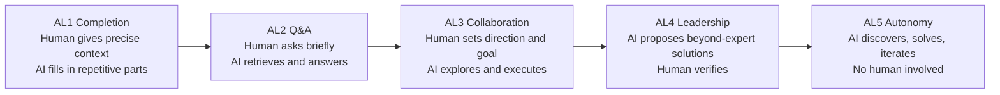
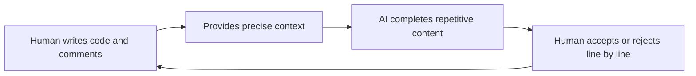
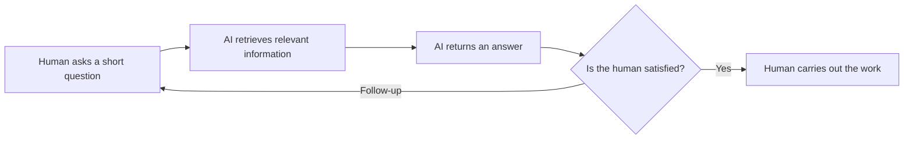
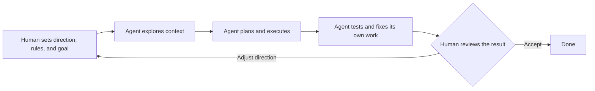
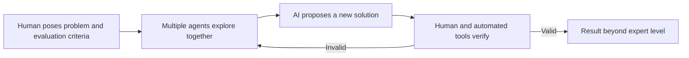
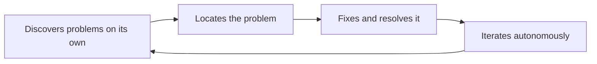

<BilibiliVideo bvid="BV11DhR61ECC" />

[Watch the video on Bilibili](https://www.bilibili.com/video/BV11DhR61ECC/)

<TOCInline fromHeading={1} toHeading={2} toc={props.toc} />

---

## Introduction

Over the past two years, this blog has tracked a steady stream of changes in AI tooling: from [GitHub Copilot's code completion](/blog/ide/ai-code), to chat assistants in the browser, to agents such as [Claude Code](/blog/tools/claude-code-config) and [OpenCode](/blog/tools/opencode-cli) that read files and run commands on their own, and later to [parallel multi-agent work](/blog/tools/multi-agent-parallel) and [dynamic workflows](/blog/tools/dynamic-workflows). Each change was concrete. Taken together, though, they lacked a shared coordinate system for answering a simple question: **where exactly is AI today?**

There is no shortage of existing classifications. Some are organized around model capability, such as OpenAI's five-stage path from Chatbots and Reasoners to Agents, Innovators, and Organizations. Others focus on the depth and breadth of general intelligence, such as Google DeepMind's _Levels of AGI_. Each has its own emphasis, but they tend to be tied to particular models, technical approaches, or benchmarks. That makes it hard to step back far enough to fit completion tools, chat assistants, coding agents, and multi-agent systems into one picture.

Self-driving levels suggest a different approach. SAE defines driving automation from L0 to L5, and the scale **does not care** whether a car uses lidar or cameras, or what its model looks like. It cares about one thing: **how much of the driving responsibility belongs to the human and how much to the system.** If we apply the same outcome-focused view to AI, we can divide agent capability into **AL1 through AL5** and place the last few years of products on a single map.

Moving from left to right, AI takes on more of the work, and the human shifts from "the person writing code" to "the person asking," "the person setting direction," "the person verifying," and finally steps out entirely at AL5. We first line this up against the self-driving scale, then walk through each level.

## A Coordinate System Borrowed from Self-Driving

The core idea behind self-driving levels is the **transfer of driving responsibility**. At L1 and L2, the human is always the driver and the system only assists. At L3, the system can drive under specific conditions, but the human must be ready to take over. L4 no longer needs a human within a limited domain, and L5 needs no human anywhere.

AI agent levels work the same way. We replace "driving" with "completing a piece of knowledge work," and "responsibility" with three questions: who supplies the context, who decides the direction, and who judges the result.

| Level | Self-driving (SAE)     | AI agent (AL)          | Who supplies context          | Who sets direction       | Typical form                                 |
| ----- | ---------------------- | ---------------------- | ----------------------------- | ------------------------ | -------------------------------------------- |
| L1    | Driver assistance      | Completion tool        | Human, and it must be precise | Human                    | Copilot code completion                      |
| L2    | Partial automation     | Q&A assistant          | Human, via a short question   | Human                    | Web chat, chat assistants                    |
| L3    | Conditional automation | Exploring collaborator | AI explores on its own        | Human                    | Agents such as Claude Code and OpenCode      |
| L4    | High automation        | Solution leader        | AI explores on its own        | AI leads, human verifies | Multi-agent research systems in a few fields |
| L5    | Full automation        | Fully autonomous       | AI                            | AI                       | Not yet seen                                 |

One caveat: these boundaries are not meant to be strict. There is a gray zone between AL2 and AL3, and some products show traits of several levels at once. The value of the scale is not in attaching a precise label to every tool, but in making **the human's position in the collaboration** easier to see.

## AL1: A Completion Tool That Needs Precise Context

The representative of AL1 is GitHub Copilot around 2021. As we described in [AI Coding](/blog/ide/ai-code), early Copilot was closer to a **smart snippet generator**: we wrote a function signature or a one-line comment, and it filled in the implementation.

The defining trait of this level is that **the AI depends entirely on the context we give it.** It sees the code near the cursor, the current file, and the comment we just wrote. It produces the right output only when that context is explicit enough, and what it produces is usually repetitive, pattern-like code: boilerplate, near-duplicate branches, or well-known algorithms.

At AL1, the human is still the real driver. We decide what to write and how to write it; the AI only speeds up the typing. The Copilot completion experience we described in [VSCode Plus Neovim](/blog/ide/vscode-neovim) is typical of this level.

## AL2: A Q&A Assistant That Answers Short Questions

At AL2, the interaction shifts from completion to conversation. We no longer need to write out precise context. A **short question** is enough for the AI to return the information most relevant to it. The answers usually cover things we are less familiar with but that are fairly general: how to use an API, what a concept means, what might be causing an error.

As a product, AL2 corresponds to web chat. The local chat client we set up in [NextChat with DeepSeek R1](/blog/misc/chat-deepseek) and the chat buffer in [CodeCompanion for Neovim](/blog/misc/neovim-ai) both belong here. The same applies outside programming: if we ran an online store, an AI support assistant could answer "what products do you sell?" or "how much does each item cost?"

The limit of AL2 is just as clear: **it has no process of discovery.** It answers the question we ask. It does not look through the repository, run commands, or follow other leads behind the problem. After it answers, a human still does the actual work.

## AL3: A Collaborator That Explores Once Given Direction

AL3 is where most people are today, and it is where most of our own daily work happens.

At this level, a **fairly short prompt** is enough. The agent explores on its own: it reads relevant files, searches the code, and checks documentation to find the context that matters most for the prompt. It then uses that context, together with our rules and goals, to carry out the task and try to finish a well-scoped piece of work end to end. The shift we documented in [Vibe Coding to Agent Coding](/blog/ide/ai-vibe-coding-2026) is exactly the move from AL2 to AL3.

In our experience, AL3 already succeeds at a fairly high rate: **above 50%** for typical tasks, and **70% to 80%** with the best models. That rate comes with a precondition, though: **we already understand the task well.** Usually we have a complete idea in mind, we know which direction the work should go and roughly what the steps are, and we describe that direction and process to the agent, which then does the implementation.

We have built many workflows around this level: extending agents with [Claude Code configuration, subagents, and MCP](/blog/tools/claude-code-config), raising throughput with [parallel multi-agent work](/blog/tools/multi-agent-parallel), letting Claude orchestrate its own agent fleet with [dynamic workflows](/blog/tools/dynamic-workflows), and trying to [let agents own more of the verification loop humans used to own](/blog/tools/ai-agent-own-what-we-owned). We also found that [the same model can behave differently in a different harness](/blog/tools/model-harness-fit), which suggests AL3 capability comes not only from the model but also from the environment it runs in.

AL3 has one clear boundary: **its autonomous discovery only works after a human has supplied the direction and the goal.**

If we ask an AL3 agent to choose its own direction and make its own decisions, it tends to pick **the most common, most conventional solution, the one best represented in its training data**. For everyday engineering tasks this is usually fine, even an advantage. But when a task calls for novelty, such as proposing a new research method or designing an architecture without precedent, AL3 struggles. We discussed a related pattern in [If We Own the AI, Do We Own Its Ability?](/blog/tools/is-ai-ability-really-our-ability): agents can implement baselines and run experiments quickly, but method choice, the boundary of novelty, and the overall logic of a paper still need human judgment.

AL3 is therefore always a **collaborator**, not a leader. The sense of direction still comes from the human.

## AL4: A Leader That Proposes Beyond-Expert Solutions

The fundamental difference between AL4 and AL3 is **who leads the solution**.

At AL4, AI can propose solutions beyond the level of human experts: ideas we would not have thought of, that even domain experts could not provide, and that turn out to work when checked. In the human–AI collaboration, **the AI's proposals take the lead**, while the human's role shifts to posing the problem, supplying ways to verify results, and judging whether they hold.

So far, AL4 results have appeared in only a few fields. Mathematics and algorithms are the clearest examples: the problems are highly complex, but results can be checked rigorously. Google DeepMind's [AlphaEvolve](https://deepmind.google/discover/blog/alphaevolve-a-gemini-powered-coding-agent-for-designing-advanced-algorithms/), for instance, loops multiple models with automated evaluators and has found solutions that improve on known results for some matrix multiplication and mathematical construction problems. What these systems share is **multi-agent collaboration plus an objective that can be verified automatically**, which also explains why AL4 has so far appeared in only a few fields.

AL4 also makes verification harder. When an AI's solution goes beyond what we understand, how do we confirm it is correct? The [exploration–verification paradox](/blog/tools/is-ai-ability-really-our-ability) we discussed earlier becomes sharper here. Mathematics and algorithms can rely on proofs or benchmarks, but in fields without objective evaluation criteria, AL4 is still hard to put into practice.

## AL5: A Fully Autonomous System with No Human Involved

AL5 is the end of the path: **the human is removed from the process entirely.**

At AL5, the system needs no human to set a direction and no human to review its work. It discovers problems, locates them, fixes them, and keeps iterating on its own.

It is worth drawing a distinction here. The direction we argued for in [AI Agents Should Own What We Used to Own](/blog/tools/ai-agent-own-what-we-owned) is **not AL5**. That post argued for removing humans from the inner loop of each task, while humans keep the final say to approve, reject a branch, or rewrite the goal. That is closer to an AL3 with stronger self-verification. AL5 means that even this outer loop no longer needs a human.

As of now, AL5 has not arrived.

## Conclusion

Back to the opening question: **where is AI today?**

Looking only at outcomes and the division of labor between humans and AI, the mainstream today is **AL3**: humans set the direction and goal, and agents explore the context and carry out the work, with a fairly high success rate on tasks we understand well. AL1 and AL2 are already part of everyday tooling. AL4 has produced a small number of results in fields such as mathematics and algorithms, where outcomes can be rigorously verified. AL5 remains a destination we have not reached.

| Level | Human role      | AI role                                 | Current status                      |
| ----- | --------------- | --------------------------------------- | ----------------------------------- |
| AL1   | Writes the code | Completes repetitive content            | Widespread                          |
| AL2   | Asks questions  | Retrieves and answers                   | Widespread                          |
| AL3   | Sets direction  | Collaborator that explores and executes | Mainstream, 50%–80% success rate    |
| AL4   | Verifies        | Leader that proposes solutions          | Emerging in a few verifiable fields |
| AL5   | Not involved    | Fully autonomous                        | Not yet seen                        |

The lesson we take from this scale is that moving from AL3 to AL4 is not only about stronger models or more tokens. It depends on **whether AI can choose an unconventional but correct path without a human pointing the way, and whether it has a way to show that the path is correct**. Until then, the human's value in the collaboration lies mainly in setting direction, judging novelty, and verifying results.

---

## Related Posts and Resources

- [**AI Coding**](/blog/ide/ai-code)
- [**VSCode Plus Neovim: The Ultimate Editor Setup**](/blog/ide/vscode-neovim)
- [**NextChat with DeepSeek R1**](/blog/misc/chat-deepseek)
- [**Vibe Coding to Agent Coding**](/blog/ide/ai-vibe-coding-2026)
- [**Multi-Agent Parallel Workflow: From Coder to Conductor**](/blog/tools/multi-agent-parallel)
- [**From Manual Task Splitting to Dynamic Workflows**](/blog/tools/dynamic-workflows)
- [**AI Agents Should Own What We Used to Own**](/blog/tools/ai-agent-own-what-we-owned)
- [**If We Own the AI, Do We Own Its Ability?**](/blog/tools/is-ai-ability-really-our-ability)
- [**Same Model, Different Harness: Why Does Performance Change?**](/blog/tools/model-harness-fit)
- [**SAE J3016: Levels of Driving Automation**](https://www.sae.org/standards/content/j3016_202104/)
- [**Levels of AGI: Operationalizing Progress on the Path to AGI**](https://arxiv.org/abs/2311.02462)
- [**AlphaEvolve: A Gemini-powered coding agent for designing advanced algorithms**](https://deepmind.google/discover/blog/alphaevolve-a-gemini-powered-coding-agent-for-designing-advanced-algorithms/)
