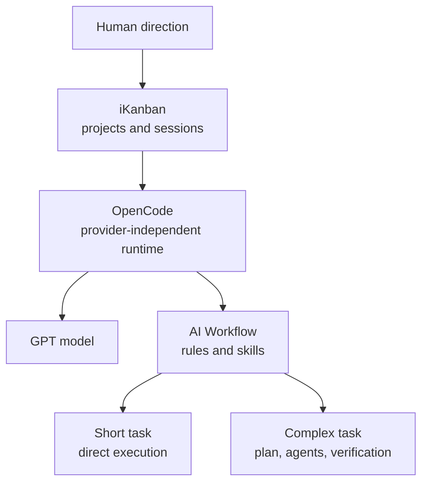
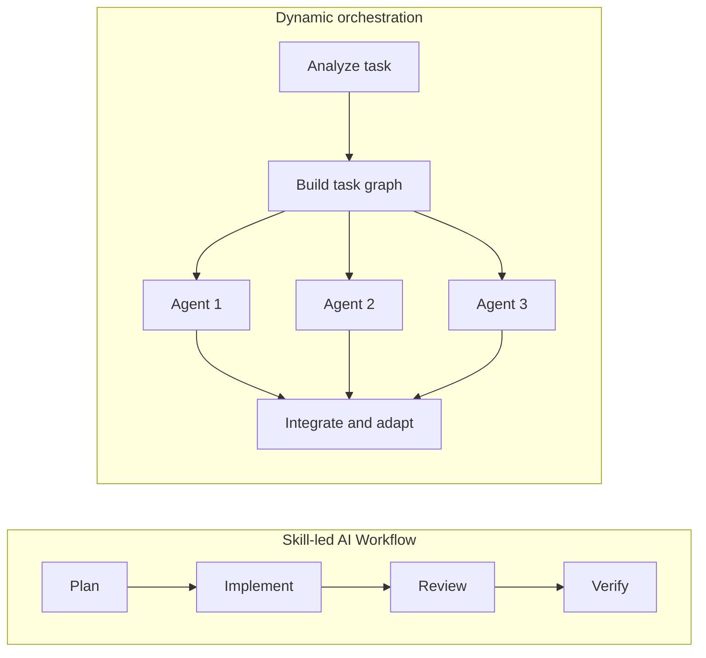

<BilibiliVideo bvid="BV1Hegv6AE1E" />

<TOCInline fromHeading={1} toHeading={2} toc={props.toc} />

---

## The Failure We Had Already Designed For

It has been a while since we wrote about our daily AI coding setup. The reason for returning to it is not a planned upgrade. Our Claude account was banned, and Claude models suddenly stopped being available to us.

There is an almost comical familiarity to this situation. Model access changes, account policies tighten, and a workflow that felt stable becomes unavailable overnight. This time, however, the interruption did not stop all of our work. During the previous days we had already been using **GPT with OpenCode** as a major part of the workflow. When Claude disappeared, we lost an important model and some advanced orchestration, but we did not lose the entire operating system around the model.

That distinction is the subject of this post. A resilient AI workflow is not one that makes every provider interchangeable. The models are not equal, and neither are their native runtimes. Resilience means that when one layer disappears, the remaining layers still let useful work continue.

This is also the real test of the provider-independent argument we made in [OpenCode: The Open Alternative to Claude Code](/blog/tools/opencode-cli). At the time, avoiding vendor lock-in was mostly an architectural preference. After an account ban, it becomes an operational requirement.

## The Workflow We Can Still Run

Our current fallback is built from three practical pieces:

- **OpenCode and GPT** provide the model runtime.
- **iKanban** manages sessions across different projects.
- **AI Workflow**, based on the Superpowers approach, provides reusable rules and skills for planning, implementation, debugging, review, and verification.

These pieces solve different problems. OpenCode prevents the runtime from being tied to one provider. iKanban lets us see and control work spread across several repositories. AI Workflow gives each session a repeatable engineering process instead of relying on one oversized prompt.

### iKanban for work across projects

iKanban is most useful when the unit of management is not one task but **many sessions from different projects**. A documentation update can run in one repository while an implementation agent works in another and a third session investigates a bug. The interface makes that portfolio visible without forcing all work into one conversation or one terminal pane.

This is parallelism at the session level. Each project keeps its own context and repository state, while the human can move between them to set direction and review results. It does not automatically understand every dependency inside a complex task, but it prevents the human from treating one active agent as the limit of available work.

### AI Workflow for short and long jobs

For work inside a session, we use a collection of rules and skills that we now call **AI Workflow**. It is based on ideas from [Superpowers](https://github.com/obra/superpowers): understand the problem before editing, write a plan when the scope requires one, isolate independent implementation work, debug systematically, and verify before declaring completion.

The important property is that these behaviors are modular. A small task should not be forced through the complete long-job process. It can use a short path: inspect, edit, verify. A large task can load planning, test-driven development, subagent dispatch, code review, and final verification as separate capabilities. The same foundation therefore works for a five-minute fix and for work that continues across multiple sessions.

This workflow is less spectacular than giving one prompt to a fully autonomous scheduler. It is also much easier to move. Rules and skills are plain repository assets. OpenCode can load them, agents can compose them, and the process survives a model change better than behavior hidden inside one vendor's runtime.

## What We Lost with Claude Dynamic Workflows

The fallback works, but it is not equivalent to the setup we had in Claude Code. Before the ban, we used **ultracode and dynamic workflows** for some of our most complex jobs. As described in [From Manual Task Splitting to Dynamic Workflows](/blog/tools/dynamic-workflows), Claude could analyze one high-level direction, create a task-specific orchestration harness, launch many specialized agents, and keep the job running for hours.

That changed the interaction loop. We did not need to repeatedly stop, inspect the next step, and prompt again. A single direction could become a plan, a parallel implementation fleet, adversarial review, integration, and verification. The scheduler adapted the workflow to the task at runtime rather than asking us to select every skill and phase in advance.

Our current AI Workflow does not yet reproduce that level of automation. It has two connected weaknesses.

First, much of the Superpowers-style process is still **linear**. Planning finishes before execution begins; execution finishes before review; review finishes before final verification. Independent tasks can be dispatched in parallel, but the top-level process still tends to move through a predefined sequence. If one stage is slow, the whole task waits behind it.

Second, a large collection of always-visible rules can become a **heavy harness**. More instructions do not always create a more capable agent. They consume context, compete for attention, and can make the model more cautious or mechanical. The workflow becomes reliable in form while losing some ability to adapt to the actual problem.

The difference is not simply “serial versus parallel.” It is **predefined workflow versus runtime scheduling**. Skills describe proven ways to work. A dynamic orchestrator decides which of those ways the current task needs, how they should be composed, and which parts can run at the same time.

## The Next Fix: Make Scheduling Portable

The immediate engineering problem is clear: keep the discipline of AI Workflow without forcing every complex task through one linear path or one enormous instruction set.

The community is already exploring ways to build higher-level agent scheduling outside a vendor's official roadmap. That matters because orchestration should not have to wait for OpenCode itself to merge one specific dynamic-workflow design. In fact, putting the whole feature into the core runtime may be the wrong boundary.

Our current view is that **high-level scheduling should be a plugin**, with skills supplying the reusable execution methods underneath it. The plugin can inspect the task, construct a dependency graph, dispatch independent agents at high parallelism, watch their results, and choose the next action. Skills can remain small and focused: planning, debugging, frontend review, test-driven development, verification, and so on. Our [opencode-config repository](https://github.com/isomoes/opencode-config) shows how we build and organize these OpenCode plugins, skills, agents, and workflow rules in practice.

This separation has several advantages:

- The OpenCode core remains a general agent runtime rather than absorbing every workflow opinion.
- The scheduler can evolve faster than the runtime release cycle.
- Users can choose a simple linear workflow or a dynamic one without changing tools.
- Skills remain portable across agents and providers.
- Scheduling policy can improve independently from model quality.

> [!WARNING]
> More agents, more tokens, and longer runtimes do not automatically mean that more useful work was completed. The relationship is not linear. A poorly decomposed task can keep many agents busy for hours while producing duplicated research, conflicting changes, or repeated verification loops. Parallelism is valuable only when it reduces the critical path or improves output quality; resource consumption itself is not a productivity metric.

The target is not to clone one Claude feature line by line. It is to recover the useful property we lost: **one direction should be able to become hours of adaptive, highly parallel work**, while still preserving explicit verification and boundaries.

## Simplifying iKanban Instead of Expanding It

This change also affects iKanban. Earlier versions tried to make the kanban board itself a built-in product feature. That seemed natural from the project's name, but it mixed two different responsibilities: managing sessions and deciding how agents should organize work.

We are now removing the old built-in kanban feature. The useful core of iKanban is multi-project and multi-session management: start work, observe it, return to it, and review the result. A particular task board or orchestration pattern is workflow policy, and that policy is better integrated through a **plugin or skill** that agents can use when a task actually needs it.

This is a smaller product boundary, but a more extensible one. iKanban does not need to predict every future coordination pattern. It only needs to expose enough session state and control for plugins and agents to build those patterns around it.

There is a broader lesson here. Not every useful agent pattern should become a permanent first-class feature in the host application. If a behavior can be loaded, combined, replaced, and improved independently, a plugin or skill is often the stronger abstraction.

## A Model Change Should Not Be a Workflow Reset

Losing Claude access was still costly. The dynamic workflow experience was ahead of what our fallback can currently provide, especially for long tasks that benefit from aggressive parallel scheduling. Pretending that GPT plus OpenCode is identical would hide the most important work we now need to do.

But the event also proved that the earlier investment was worthwhile. GPT and OpenCode kept the runtime available. iKanban kept multiple projects manageable. AI Workflow preserved the methods we rely on for both short and long jobs. The system degraded, but it did not collapse.

Our next step is to close the orchestration gap: reduce linear execution, keep skills small, and move adaptive scheduling into a portable plugin layer. We also hope Chinese models continue improving in both capability and price. A stronger low-cost model ecosystem would let more people run multi-agent workflows, experiment with new coordination patterns, and contribute improvements back to the community.

The goal is not loyalty to Claude, GPT, OpenCode, or any single framework. The goal is a workflow that can keep moving when one of them disappears, and can get better without waiting for one vendor to decide what belongs on its roadmap.

---

## Related Posts

- [From Manual Task Splitting to Dynamic Workflows](/blog/tools/dynamic-workflows)
- [A Four-Layer Multi-Agent Workflow That Finally Fits the Budget](/blog/tools/four-layer-multi-agent-workflow)
- [OpenCode: The Open Alternative to Claude Code](/blog/tools/opencode-cli)
- [Back to Claude Code](/blog/tools/back-to-claude-code)
- [Multi-Agent Parallel Workflow: From Coder to Conductor](/blog/tools/multi-agent-parallel)
- [The Better AI IDE](/blog/ide/great-ai-ide)
- [Our OpenCode Configuration and Plugins](https://github.com/isomoes/opencode-config)
