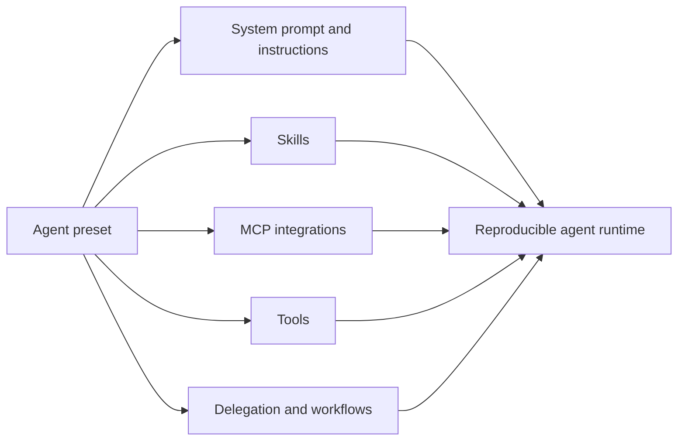

<BilibiliVideo bvid="BV1LLbe6wEcr" />

<TOCInline fromHeading={1} toHeading={2} toc={props.toc} />

---

## The Line That Made Us Try DSH

The first thing that attracted us to [**DeepSeek Harness**](https://github.com/deepseek-ai/deepseek-harness) was not a model benchmark or a long feature list. It was one line in the repository description: **“Everything is a Plugin.”**

This is also the direction we have been watching in OpenCode v2: move capabilities that would normally be fixed inside the runtime into plugins, including functions that used to feel “built in.” A smaller core and replaceable capabilities are attractive because an agent runtime changes quickly. Models change, providers disappear, and workflow ideas evolve. If every experiment requires a core fork, the runtime becomes difficult to maintain. If a capability is a package, we can add, remove, replace, and combine it.

The timing also matched a change in how we use coding agents. Newer models can handle more demanding tasks, but those tasks usually take longer. Waiting for one session to finish while doing nothing else is a poor use of both the model and the human. Most of our agent-coding time has therefore moved toward **multiple sessions across multiple workspaces**. We had already tried this direction with OpenCode v2 and liked the result.

Around the arrival of DeepSeek V4 Pro, DSH was published as a preview. We downloaded it mainly to see how another runtime approached the same plugin-first idea. That quick trial soon became a rewrite of [iKanban](https://github.com/isomoes/ikanban).

## A Web Interface That Exposes the Harness

Our first impression came from the DSH Web interface. It is concise, minimal, and unusually easy to inspect.

The chat view and review view expose much more than the final conversation. For each request sent to the LLM server, we can inspect the assembled system prompt, tool definitions, injected context, and model-facing messages. During execution, tool calls and their results remain visible in the trajectory. Instead of treating the harness as a black box around the model, DSH makes the assembled request readable.

That matters when developing agent systems. A surprising result often comes from the harness rather than the model itself: an instruction was injected twice, a tool schema was not what we expected, a skill did not load, or context arrived in the wrong order. In many runtimes, finding this requires logs and guesswork. In DSH, much of it can be reviewed directly in the browser, almost line by line as the agent runs.

Pi may expose similar low-level information through its runtime, but we had not previously seen an agent harness make the complete request path this approachable in a Web UI. DSH did not only show us the agent's answer. It showed us the system that produced the answer.

## Why We Rewrote iKanban on DSH

At that time, we were adapting iKanban to OpenCode v2. The old implementation had accumulated too much UI and integration code, and we already wanted to rewrite it around a cleaner boundary.

Once we saw DSH, the obvious question was: if DSH already provides sessions, workspaces, storage, transport, model routes, tools, and a plugin runtime, why rebuild all of that again?

So we stopped treating iKanban as another standalone agent runtime. We rewrote it as a **keyboard-oriented DSH Web application bundle**. DSH owns the underlying harness; iKanban changes the surface and adds the workflow behavior we need for managing many projects and sessions.

The current package can be installed into its own profile:

```bash
dsh plugin --profile ikanban add @isomoes/dsh-ikanban --registry=https://registry.npmjs.org
dsh --profile ikanban
```

This boundary reduced the implementation scope. We no longer needed to invent an agent loop, session protocol, plugin loader, or tool transport. We could focus on what iKanban is actually for: quickly starting work, moving between projects, observing long-running sessions, and reviewing results.

## Making a Mouse-Oriented UI Work from the Keyboard

The rewrite was not frictionless. We are keyboard users, while many operations in the original Web UI required pointer interaction. A multi-session interface becomes slow if creating a session, deleting or archiving one, switching modes, and selecting models all require navigating several visual controls.

Since [iKanban 0.4.0](https://github.com/isomoes/ikanban/blob/main/CHANGELOG.md#040), most of our work has focused on this interaction layer. We built a shared **UI command system** and registered high-frequency operations through it: create and archive sessions, choose modes and models, open settings, switch agent presets, and navigate the workspace. The same actions can back slash commands, a command palette, popup selectors, and keyboard shortcuts instead of each UI feature implementing its own control path.

This turned out to be another place where the plugin architecture helped. A command contribution does not have to know the complete application. It registers a capability into a shared service, and the active UI surface decides how to present it. Keyboard support therefore became composition rather than a collection of one-off event handlers.

## The Composition Surprise

The most convincing advantage appeared when we combined iKanban with an unrelated plugin: [**dsh-codex-auth**](https://github.com/suntianc/dsh-codex-auth).

Our [iKanban profile](https://github.com/isomoes/dsh-config/blob/main/profiles/ikanban/package.json) is simply a package with dependencies and a bundle list. This abridged excerpt focuses on the two plugins discussed here:

```json
{
  "dependencies": {
    "@isomoes/dsh-ikanban": "^0.4.7",
    "dsh-codex-auth": "^0.1.0"
  },
  "dsh": {
    "profile": {
      "bundles": ["@deepseek-ai/dsh-base", "@isomoes/dsh-ikanban", "dsh-codex-auth"]
    }
  }
}
```

`dsh-codex-auth` contributes both host behavior and a native settings section. We did not need to copy its provider logic into iKanban or add a special integration screen. After declaring the package dependency and composing its bundle, the LLM route worked at the host level and its UI appeared inside our rewritten surface.

This is what **“Everything is a Plugin”** means in practice. Plugins are not isolated extensions attached to the edge of an application. They can contribute services, model routes, tools, commands, settings, and browser UI, then compose through shared contracts. The host and the interface can both gain a capability without either project absorbing the other's source code.

## Immutability Is Useful, but It Changes the UX

DSH's raw session event log is deliberately append-only and event-oriented. We understand the reason. Once a model-visible action is committed, retaining the original record makes reconstruction easier and prevents an edited past from silently disagreeing with tool calls that already happened. DSH can replace entries at the session surface so shadowed records no longer enter future model requests, while the underlying events remain available. This separation removes a large class of state errors.

It also changes the interaction design. During agent work, we sometimes want to edit an earlier user message and rerun from there as one continuous UI operation. The current DSH Web surface does not provide that edit-and-rerun workflow. In iKanban, we implemented the experience as **fork and replace**: fork the session at a completed turn, continue from the new branch, and archive the old session so the replacement feels natural in the workspace.

The conversation history is handled cleanly, but the working tree is a separate concern. Forking the session does not snapshot the files changed before that point, so going back in conversation time does not restore the repository to the matching state. OpenCode can provide a more complete revert experience here. In DSH, users still need Git or another snapshot mechanism if they want the files and conversation to move backward together.

This is an important boundary rather than a small UI omission. An immutable transcript preserves what the agent saw and did; a filesystem snapshot preserves the world in which it did it. A full rewind requires both.

## Project-Level Configuration Was Still Missing

The second gap appeared when we used DSH with existing projects.

Most established agent runtimes support some form of project-local startup configuration. Entering a repository can load its instructions, skills, MCP servers, and other capabilities automatically. This lets one project carry the environment its agent needs rather than requiring every user to rebuild that environment globally.

DSH already has a strong path for project skills through its filesystem skill plugin. Project-level MCP loading, however, did not yet complete the same workflow for us. MCP is one of the most common extension mechanisms across Codex, Claude Code, Pi, and plugin-based runtimes, so manually recreating those server definitions for each DSH setup was not practical.

We implemented our own opt-in **project MCP plugin** for iKanban. It reads `.mcp.json` from the session's exact working directory and is added through an agent preset rather than the global host capability layer. We keep it opt-in because a repository-local MCP configuration can launch processes or connect to external services; it should only be enabled for projects we trust.

This solved our immediate problem, but it also shows the current maturity of DSH. Some common runtime features are not yet complete as polished, built-in workflows. The architecture makes them possible, but users may still need to assemble or implement the missing pieces themselves.

## Agent Presets as Environment Management

The more interesting long-term answer is DSH's **agent preset** system.

A preset is not only a saved model choice. It is a complete Cordis composition for an agent. It can define the system prompt, instructions, skills, MCP integration, tools, delegation backends, and other plugins that shape what the agent can do. Each session selects a preset, and that composition remains stable for the life of the running agent.

This makes presets feel closer to package and dependency managers such as npm, Cargo, or pip than to a conventional settings page. A software project uses manifests, lockfiles, and packages to reproduce its development environment. A DSH preset declares plugins that reproduce an **agent runtime environment**.



This boundary is more engineering-oriented than a long global configuration file. We can create a minimal preset for short edits, another for research, and another for long-running coding tasks with project MCP and subagents. Because the parts are packages and Cordis rows, the composition can be inspected, versioned, copied, and changed independently.

It is not as convenient as automatic project configuration yet, but it may be a better foundation over time. Instead of asking one runtime to contain every possible agent behavior, DSH gives us a package system for assembling the runtime we need.

## A Promising Preview, Not Yet a Stable Default

DSH's architecture is compelling, but the preview still has material workflow gaps.

The advantages are real. Its Web UI makes the model request path unusually transparent. The Cordis architecture lets host services and browser surfaces compose instead of forcing every extension through a narrow sidebar API. Agent presets turn prompts, skills, tools, and MCP into reproducible environments. Most importantly, the system gives us room to experiment with agent runtimes rather than only configuring one fixed product.

The disadvantages are also real. The preview is not yet as stable or complete as mature coding-agent tools. Some ordinary workflows, especially project-level configuration and filesystem-aware session rewind, still require custom work. Immutability prevents many errors but makes familiar edit-and-rerun behavior harder to design. A highly modular system also asks users and plugin authors to understand more architecture.

For us, the trade was still worthwhile. Rewriting iKanban on DSH let us remove a large amount of runtime code, focus on multi-workspace and multi-session interaction, and compose features such as Codex authentication without hard-wiring them into our application.

The reason to watch DSH is not that it already has every feature. It is that its core abstraction gives missing features somewhere clean to live. If the ecosystem grows without losing those composition boundaries, **“Everything is a Plugin”** can become more than a slogan. It can make agent runtimes reproducible, inspectable, and open to experiments that would otherwise require another complete fork.

---

## Related Posts and Resources

- [When Claude Disappeared: Rebuilding Our AI Workflow Around OpenCode](/blog/tools/ai-workflow-after-claude-ban)
- [OpenCode: The Open Alternative to Claude Code](/blog/tools/opencode-cli)
- [Vibe-Kanban: Orchestrating Multi-Agent AI Coding Workflows](/blog/tools/vibe-kanban-intro)
- [The Better AI IDE: Software Should Serve AI First, Then Humans](/blog/ide/great-ai-ide)
- [DeepSeek Harness on GitHub](https://github.com/deepseek-ai/deepseek-harness)
- [iKanban on GitHub](https://github.com/isomoes/ikanban)
- [Our DSH profile configuration](https://github.com/isomoes/dsh-config/blob/main/profiles/ikanban/package.json)
