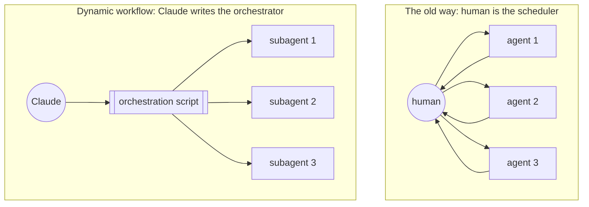
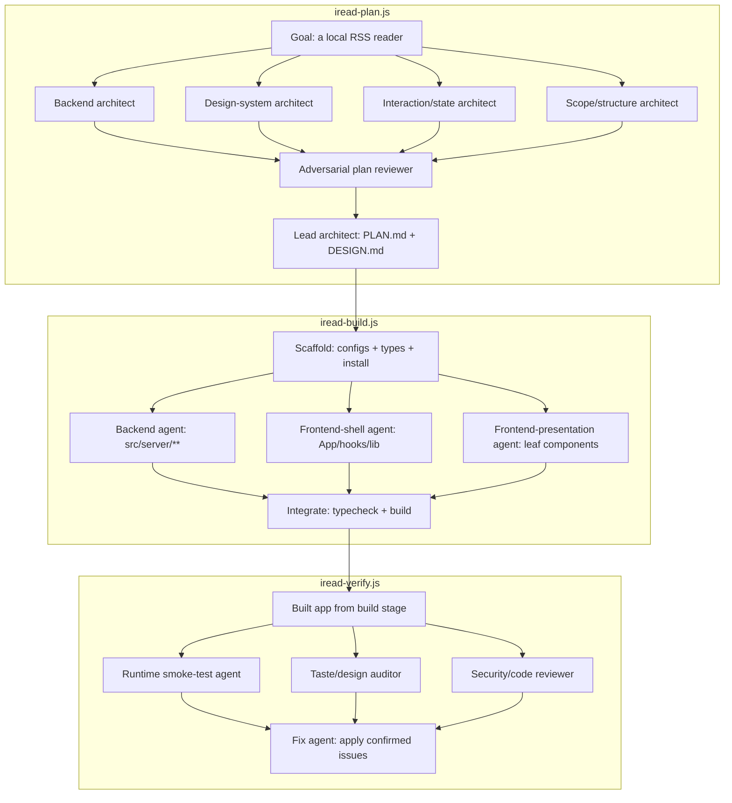

<BilibiliVideo bvid="BV1bSE26cE35" />

<TOCInline fromHeading={1} toHeading={2} toc={props.toc} />

---

## Introduction

When we last wrote about multi-agent work, we ended on a prediction. In the [Vibe Coding to Agent Coding](/blog/ide/ai-vibe-coding-2026) Part III, and again in our [Multi-Agent Parallel Workflow](/blog/tools/multi-agent-parallel) post, we described a setup where the human did the splitting and the launching by hand, and we argued that the next bottleneck to fall would be scheduling — that a specialized AI scheduler would eventually own the middle layer we were carrying ourselves. We even sketched the role arc that came with it: Coder, then Product Manager, then eventually something closer to a CEO who sets direction and lets the org run.

That scheduler arrived. With Claude Code's [dynamic workflows](https://claude.com/blog/a-harness-for-every-task-dynamic-workflows-in-claude-code) and Claude Opus 4.8, the orchestrator is no longer a person sitting between a stack of terminal panes. The orchestrator is itself an agent — one that reads the task, decides how to break it apart, and spawns the fleet that does the work. This post is about what that shift actually looks like in practice, what it fixes, and what it leaves unsolved.

## The Old Way: PLAN.md and Hand-Launched Agents

The manual workflow we used to run had a clear shape, and it worked, but every part of it ran through us. The first step was decomposition by hand: we read the project, broke it into independent pieces, and wrote that breakdown down somewhere durable — usually a TODO list or a `PLAN.md` checked into the repo — so the plan survived past any single conversation. One piece might be research, another implementation, another the docs or tests. The decomposition was ours to get right.

Then came the launching, also by hand. For each bounded mini-job we started a separate agent instance — its own session, its own terminal pane, or its own [Vibe-Kanban](/blog/tools/vibe-kanban-intro) card — and pointed it at exactly one task. To keep concurrent edits from colliding, each agent worked inside its own git worktree, so isolation was a property of the filesystem layout rather than anything the agents negotiated among themselves.

The part that mattered most is that the human *was* the scheduler. We decided which tasks could run in parallel and which had to wait. We decided which model went to which task. We decided when to check on a result, how to integrate the outputs, and how to resolve conflicts when two worktrees disagreed. None of that was automated; we called it "manual" at the time, plainly, because it was. And that was the bottleneck. Every agent had to be started by a person, every handoff passed through a person, and the whole thing had to be stitched back together by the same person sitting in the middle. The work parallelized well, but the coordination did not — it stayed serial, and it stayed on us.

## What Changed: Claude Writes Its Own Harness

The thing that changed is best described with one word from Anthropic's announcement: the **harness**. The harness is the system around the model — how work gets split, which subagents spawn, what tools each one gets, how output is verified, which model handles which step, how the work is isolated, and how the system knows the job is actually done. In the old world this harness was static. You either ran the one default coding harness, or you pre-wrote a workflow with the Agent SDK: write it once, and it ran generically against any input you fed it.

Dynamic workflows move that authoring step to runtime. Faced with a complex, multi-part task, Claude Opus 4.8 now writes its **own** harness on the fly — a short JavaScript orchestration script, custom-built for this one task, that spawns and coordinates a fleet of subagents. You can trigger it just by asking Claude to make a workflow, or you can use the trigger word **`ultracode`** to be sure Claude Code builds one rather than answering inline. That is what we mean when we talk about "ultracode mode" in the rest of this post.

The script is built from three primitives, and the interesting part is how little you need to express almost any orchestration shape. `agent()` spawns a single subagent; you can hand it a JSON schema to get validated structured output back, pick a per-task model, and run it inside an isolated git worktree. `parallel()` fans a batch out concurrently behind a barrier — it waits for every item before moving on. `pipeline()` streams each item through all the stages with no barrier, so fast items don't sit waiting on slow ones. Compose those three and you can describe most coordination patterns you'd otherwise have built by hand.

It's worth being explicit about *why* this is the right move, rather than just running everything in one long conversation. A single context window has three characteristic failure modes on complex, multi-part work. There's **agent laziness**, where an agent quits a multi-step task before finishing all of it. There's **self-preference bias**, where an agent grading its own output is biased toward it. And there's **goal drift**, where the work wanders away from the original target over many turns. Splitting the job across single-purpose subagents, each with a clean context, and having them check each other's work, is what defuses all three.

That structure also has a natural default. Of the [multi-agent coordination patterns](https://claude.com/blog/multi-agent-coordination-patterns) Anthropic describes — generator-verifier, orchestrator-subagent, agent teams, message bus, and shared state — the recommended starting point is **orchestrator-subagent**: one lead agent plans, delegates, and synthesizes, while bounded subagents do independent work and report back. It carries the lowest coordination cost and the simplest context management, which is exactly why it's the shape an auto-generated orchestration script reaches for first. The other patterns — message buses, shared state — exist and matter, but they belong to the harder problem we'll come back to later.

The difference this makes is concrete rather than abstract. Ask a static flow "should we migrate our checkout service to a new vendor" and it runs five generic searches and writes a generic report. A dynamic workflow reads *your* billing code, compares it line by line against the new vendor's docs, prices the move at *your* transaction volume, and spawns a devil's-advocate subagent to argue the strongest case against — a recommendation that's actually about you. The harness stopped being something we configured ahead of time and became something Claude writes for the task in front of it.

## A Real Workflow: Building iread with Three Dynamic Workflows

The clearest way to show what changed is to walk through something we actually built. We wanted **iread**: a small, local, full-stack RSS reader in the spirit of newsboat — Hono on top of the built-in `node:sqlite` for the backend, Vite plus React 18 and Tailwind v4 on the frontend, all managed with pnpm. The notable part is what we *didn't* do. We never hand-split the work, and we never launched a single subagent ourselves. We described the goal, and Claude Code wrote three dynamic-workflow scripts — `iread-plan.js`, `iread-build.js`, and `iread-verify.js`, saved under `.claude/workflows/` — that each spawned and coordinated their own fleet of subagents using `parallel()`, `pipeline()`, and `agent()`. Our job collapsed to describing intent up front and reading structured reports at the phase boundaries. (Each of these is reusable, too: press `s` after a run to save the workflow locally, then reference it from a `SKILL.md` to share it.)

The shape across all three runs is the same orchestrator-subagent pattern from Anthropic's [dynamic workflows](https://code.claude.com/docs/en/workflows) work, and it maps cleanly onto the named coordination patterns we walked through above. The pipeline runs plan → build → verify, and inside each stage the orchestrator fans out:

### Plan

`iread-plan.js` runs in three phases and designs the entire system before a line of code exists. The design phase uses `parallel()` to fan out **four architect subagents at once**, each owning one face of the problem. A backend architect specs the SQLite schema, the feed fetch/parse/sanitize service, the full HTTP API contract, and the exact `src/shared/types.ts`. A design-system architect produces theme tokens for light and dark, a component inventory, and a strict taste discipline — one accent, one radius scale, real loading/empty/error states, and zero em-dashes in UI strings. An interaction/state architect writes the newsboat-style `j`/`k` keyboard map and the react-query plan with optimistic updates. A scope/structure architect draws the MVP feature cut, the full file tree, and the exact `package.json`.

That fan-out is the classic **fan-out and synthesize** pattern, but the interesting move comes next. Before any synthesis, one **adversarial plan reviewer** reads all four documents and goes looking for trouble: integration mismatches between the designs, security holes (SQLi, XSS from untrusted feed HTML, SSRF, OPML XXE), data-integrity bugs, and taste violations. It returns a prioritized must-fix list and a go/no-go verdict. Only then does a single lead-architect agent merge the four designs, apply every must-fix, resolve the conflicts the reviewer surfaced — most importantly making API field names match exactly what the frontend consumes — and write `docs/PLAN.md` and `docs/DESIGN.md` to disk as the single source of truth. We caught design-level security and integration bugs here, before they could become code.

### Build

`iread-build.js` implements that plan to green, again in three phases. A scaffold agent goes first: it writes the config files verbatim from `PLAN.md`, lays down the shared types, `globals.css`, and `index.html`, and runs `pnpm install` until it exits 0, adjusting any pinned version that won't resolve.

The build phase is where the real trick lives. We fan out **three implementer subagents with disjoint file ownership** so they physically cannot collide. The backend agent owns `src/server/**` and nothing else; the frontend-shell agent owns `App.tsx`, the `AppShell`, the hooks, and `lib`; the frontend-presentation agent owns only the leaf components. Each prompt states explicitly what that agent must *not* touch. This is the part worth internalizing: decomposing by clear file boundaries is what lets agents run genuinely in parallel without merge conflicts — no git worktree, no rebase dance, just clean ownership. Then one integrate agent runs `pnpm typecheck` and `pnpm build`, reconciles any interface drift between the shell and presentation components, iterates up to about four rounds, and returns a **structured result** against a JSON schema — `typecheckPasses`, `buildPasses`, `remainingErrors[]`, `filesTouched`, `summary`. That schema is what turns a subagent's report from prose we have to read carefully into data we can check mechanically.

### Verify

The build compiling is not the same as the build working, so `iread-verify.js` exists to prove the thing actually runs and then to fix what doesn't. Its verify phase fans out **three verifier subagents, each returning structured output against its own schema**. A runtime smoke-test agent boots the built production server on an isolated port with a temp DB, curls every endpoint and checks the response shape, runs a headless-browser render check, and confirms the `/api` proxy works under `pnpm dev`. A taste-skill design auditor greps for em-dashes, a wrong (purple) accent, and pure black or white, then confirms every pane has loading, empty, and error states plus basic a11y. An adversarial code-and-security reviewer hunts for real SQLi, XSS, SSRF, dedup, and optimistic-update bugs by reading the code rather than trusting the plan.

This is **generator and verifier** with **adversarial verification** layered on top: the build produced the code, and an independent set of agents tries to break it. The final phase hands all three structured reports to one fix agent, which applies the confirmed high and critical issues, skips the false positives but records them as `deferred` rather than silently dropping them, and re-runs typecheck, build, and a quick API smoke. It returns its own structured result — `fixesApplied[]`, `deferred[]`, and three green-flag booleans confirming that typecheck, build, and the API smoke all pass.

### What this adds up to

Step back and count. Across three runs, Claude orchestrated somewhere between fifteen and twenty subagents: it fanned them out, made them check each other adversarially, validated their output against schemas, and handed clean state from one phase to the next. We mostly described what we wanted and reviewed the structured results where the phases met. The earlier posts on this blog kept circling the same missing piece — an AI scheduler that would carry the workflow so a human didn't have to. It turns out that scheduler is no longer something we configure or hand-wire. It is the thing that wrote the orchestration script.

## The Open Problem: Agents That Talk to Each Other

For all that, everything we have built so far is a variation on one shape. The dynamic workflows in ultracode mode, the [Multi-Agent Parallel Workflow](/blog/tools/multi-agent-parallel), the [Four-Layer Multi-Agent Workflow](/blog/tools/four-layer-multi-agent-workflow) — all of them are the orchestrator-subagent pattern. A central orchestrator funnels every piece of information through itself: each subagent reports up to the lead, phases run behind hard barriers, and a human kicks off each phase in turn — plan, then build, then verify. Information flows up and down the tree, never sideways between peers. This is the right default, and we keep recommending it, but it is worth naming the shape honestly so we can see what it cannot do.

The first thing this shape strains against is the human. Human-in-the-loop is valuable; human-in-*every*-loop does not scale. If every subtask waits for a person to inspect it before the next step can start, the throughput limit of the whole system stops being model quality or token budget and becomes one person's review bandwidth. We wrote about this at length in [AI Agents Should Own What We Used to Own](/blog/tools/ai-agent-own-what-we-owned), and the first fix is the obvious one: let agents own more of their own validation loop. An agent that can open the page through Chrome DevTools MCP and check the UI itself does not need to ping a human after each change. The iread verify workflow is exactly this — the agents test and review their own output rather than handing every diff back across the barrier.

But owning your own validation only removes the human from the inner loop. The harder, still-unsolved frontier is **communication between the agents themselves**. Once several agents are running, the interesting question is no longer how to start them — dynamic workflows answered that — but how to let them talk to each other *asynchronously* without the whole thing dissolving into chaos. Real problems are non-linear. They have partial dependencies, branching exploration, retries, and facts that surface at different moments, and a strict orchestrator funnel forces all of that messiness back through a single point that has to serialize it.

Anthropic's writeup of the [multi-agent coordination patterns](https://claude.com/blog/multi-agent-coordination-patterns) sketches two patterns that point past the central orchestrator. In a **message bus**, agents publish and subscribe to events and talk to each other directly; it is event-driven, and adding a new kind of agent is cheap because nobody has to rewire the orchestrator to know about it. In **shared state**, agents read and write a common store, so the moment one agent discovers something it becomes another agent's input — which fits collaborative research and analysis particularly well. What is striking is how much closer these are to how a human team actually works. People do not route every message through one manager; they talk peer-to-peer, drop a note in a shared doc, and pick things up when they get to them. That maps onto messy real-world systems far better than a manager funnel does.

The honest caveat is that removing the central coordinator is not free, and the failure modes are quieter than the ones it replaces. Message-bus routing can silently drop work when a route is mis-judged — nothing errors, the task just never gets picked up. Shared state invites **reactive loops**, where agents keep responding to one another and burn tokens without ever converging. The fix is to make termination conditions first-class rather than incidental: explicit time and token budgets, convergence thresholds, a definition of done that does not depend on a human noticing the spin. Which is also why Anthropic's own advice, and ours, is to start with the simplest pattern — orchestrator-subagent — and only reach for this machinery when a concrete bottleneck demands it. Peer-to-peer coordination is the next thing to learn, not the thing to lead with.

## Summary

The shape of this work has changed twice. We started by **manually** splitting tasks and hand-launching agents, carrying the whole workflow inside our own heads. Then dynamic workflows automated the orchestration layer itself — the "AI scheduler" the earlier posts kept predicting now writes the orchestration script on its own, which removed the hand-launching but kept the orchestrator funnel in place. The open problem is the next layer down: letting those agents coordinate **among themselves**, asynchronously, the way a human team does, so that multi-agent systems can take on genuinely non-linear work without collapsing back into a human — or a single orchestrator — as the coordination chokepoint. We do not have a clean answer yet, and that is exactly why it is the interesting part.

## Related Posts

- [Vibe Coding to Agent Coding](/blog/ide/ai-vibe-coding-2026)
- [Multi-Agent Parallel Workflow](/blog/tools/multi-agent-parallel)
- [A Four-Layer Multi-Agent Workflow](/blog/tools/four-layer-multi-agent-workflow)
- [AI Agents Should Own What We Used to Own](/blog/tools/ai-agent-own-what-we-owned)
- [Back to Claude Code](/blog/tools/back-to-claude-code)
- [The Better AI IDE](/blog/ide/great-ai-ide)
- [Vibe-Kanban](/blog/tools/vibe-kanban-intro)
- [A harness for every task: dynamic workflows in Claude Code](https://claude.com/blog/a-harness-for-every-task-dynamic-workflows-in-claude-code)
- [Multi-agent coordination patterns](https://claude.com/blog/multi-agent-coordination-patterns)
