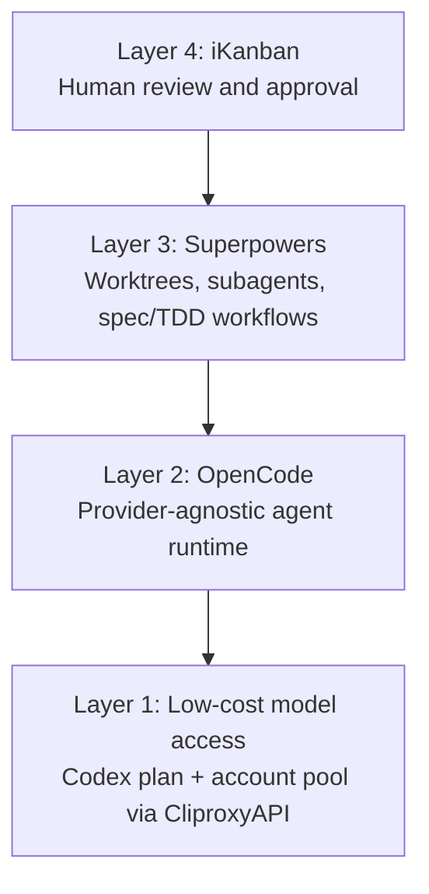

<BilibiliVideo bvid="BV1fzAAzPEQ4" />

<TOCInline fromHeading={1} toHeading={2} toc={props.toc} />

---

## Why We Revisited Multi-Agent Workflows

For a long time, the idea of a real **multi-agent coding workflow** felt attractive but impractical. Running several agents at once usually consumes far more tokens than a single-agent session, so the workflow only works if the cost model also changes. Our budget did not suddenly become larger. What changed was the price-performance ratio: after moving to a cheaper GPT-based Codex access path, the same monthly spending gave us roughly **10 times more usable token budget** than before. That was the turning point that made the experiment worth doing <a href="#ref-1">[1]</a>.

This post is written for readers who are **new to agent coding**. The main point is simple: our workflow is not one tool. It is a stack of four layers. At the bottom is low-cost model access. Above that is a provider-agnostic runtime. Above that is a workflow layer for isolation, planning, and parallel execution. At the top is a review interface where the human decides whether to accept, reject, or rerun the result.

If you have read our earlier posts on [OpenCode](/blog/tools/opencode-cli), [multi-agent parallel work](/blog/tools/multi-agent-parallel), [vibe-kanban](/blog/tools/vibe-kanban-intro), or [the AI-first IDE idea](/blog/ide/great-ai-ide), this article can be read as the next step: the point where those ideas started to fit together into one repeatable system <a href="#ref-2">[2]</a> <a href="#ref-3">[3]</a> <a href="#ref-4">[4]</a> <a href="#ref-5">[5]</a>.

## A Concrete Example: Implement One Feature with the Stack

Suppose the task is to **add OAuth login to a web application**. In a single-agent workflow, one long session usually has to read the codebase, think about the architecture, edit files, run tests, fix failures, and summarize the result. That can work, but it is easy for the session to become slow, expensive, and fragile as the context grows.

In our current workflow, the same feature is split into several bounded jobs. One agent can prepare the implementation plan. Another can create the actual backend changes in an isolated worktree. A third can focus on tests or documentation. During that time, the human does not need to manually coordinate every command. Instead, the human mainly reviews progress, checks diffs, and decides whether a plan is acceptable.

The key change is not only parallelism. It is **structured parallelism**. Each agent has a narrower task, a clearer boundary, and a cleaner execution environment. If one branch goes in the wrong direction, it can be rejected without contaminating the rest of the repository. If a task is independent, it can run for a long time without blocking the whole workflow.

## The Four Layers

The stack only works because each layer solves a different problem. The model layer solves cost. The runtime layer solves provider access. The workflow layer solves decomposition and isolation. The interface layer solves review and decision-making.

## Layer 1: Cheap Enough Tokens to Let Multiple Agents Run

The first layer is the least glamorous but the most important: **budget**. Multi-agent workflows are token-hungry by design. If one agent is already expensive, then three or four agents are not a workflow improvement; they are just a faster way to exhaust your quota.

What made the difference for us was access to a cheaper GPT-based coding plan. In practical terms, a cost level around **15 RMB** for Codex-style usage changed the economics enough that the workflow became testable in daily work. Compared with what we used before, the effective budget felt close to a **10x increase in usable tokens**. That margin matters because it gives room for planning, retries, longer-running tasks, and parallel sessions rather than forcing every interaction into a short single-threaded conversation.

To make that access usable in practice, we needed an **account pool layer**, and we chose **CliproxyAPI** for that role <a href="#ref-1">[1]</a>. The account pool is not the workflow itself, but it is the infrastructure that keeps the workflow economically stable. Without this bottom layer, the upper layers are difficult to sustain.

## Layer 2: OpenCode as the Runtime

The second layer is **OpenCode**, which remains our preferred runtime for agent execution <a href="#ref-2">[2]</a>. We have already introduced it in a separate post, so this article will focus on why it matters inside the stack. The short answer is **provider independence**. OpenCode is not tied to one model vendor, which means the workflow does not collapse when pricing, availability, or model quality changes.

That flexibility matters even more in a multi-agent setup than in a single-agent setup. Different tasks often benefit from different models. A planning task may prefer one model, while a fast implementation task or a cheap review task may prefer another. OpenCode gives one consistent runtime for those agents, so the orchestration layer above it does not need to be rewritten every time the model mix changes.

This is also why OpenCode fits well with an AI-first interface. The agent operates through CLI tools and repository state rather than through a heavy GUI. That makes it easier to compose with worktrees, review tools, and custom workflow logic. In our earlier [OpenCode guide](/blog/tools/opencode-cli), the main point was escaping vendor lock-in. In the current stack, the new point is that **runtime portability is a prerequisite for orchestration**.

## Layer 3: Superpowers for Isolation and Long-Running Parallel Work

The third layer is the part we explored most intensively in the last week: **Superpowers** <a href="#ref-6">[6]</a>. After using it in practice, two capabilities stood out immediately. First, it makes strong use of **git worktrees** to isolate tasks. Second, it can dispatch **parallel subagents** for independent steps. Those two features are exactly what a multi-agent workflow needs when tasks are expected to run for a long time.

Before this layer, much of the scheduling work was manual. We could still run multiple agents, but we had to think carefully about who should do what, when to split tasks, and how to avoid collisions. Superpowers formalizes more of that process. It makes it easier to express a workflow where planning, execution, and verification are separated into different stages instead of being mixed into one large prompt.

Another useful part is that Superpowers supports more structured development styles such as **spec-driven development** and **test-driven development**. That does not magically remove mistakes, but it reduces the chance that an agent starts editing code without a clear target. In practice, this means the workflow spends more effort on defining the task before implementation starts, which usually improves long-running tasks.

The trade-off is real, though. Superpowers can feel **over-engineered for small jobs**. If the task is simple, the extra workflow structure may slow things down rather than speed them up. That is an important limitation to say clearly: the stack is not intended to replace every fast one-shot interaction. It is most useful when the task is large enough that isolation, planning, and review are worth the overhead.

## Layer 4: iKanban as the Human Review Interface

The top layer is our own project, **iKanban** <a href="#ref-7">[7]</a>. This is the interface where the human comes back into the loop. If the lower layers are about generating and organizing work, iKanban is about **reviewing and deciding**. It gives us one place to inspect what the agents did, approve or reject a plan, review command history, and inspect modified files before accepting the result.

This is important because multi-agent systems do not remove the need for human judgment. They increase it. Once several branches or subtasks are moving at once, the human role shifts away from typing code directly and toward **quality control, prioritization, and acceptance decisions**. iKanban is built around that role. Instead of treating the agent as a chat box only, it treats the workflow as something that needs visible state: plans, commands, file changes, and approval actions.

This is also where our earlier thinking about the **AI-first IDE** becomes concrete <a href="#ref-5">[5]</a>. The human no longer needs a large interface for manually performing every programming action. The human mainly needs to express intent and verify results. In that sense, iKanban is less a traditional IDE and more a control surface for agent execution.

## Why the Stack Works Better Than One Big Agent Session

The value of the stack is not that each layer is impressive on its own. The value is that each layer removes one bottleneck from the old workflow. Cheap tokens make parallelism affordable. OpenCode makes model choice portable. Superpowers makes long-running parallel work more structured. iKanban makes review visible and manageable.

Once those pieces are combined, the human role becomes clearer. The human still sets direction, decides what matters, and reviews whether the result is acceptable. But the human no longer needs to manually carry the entire workflow inside one fragile conversation. The work is distributed across layers that each do one job well.

That is also why we do not describe this as a fully autonomous pipeline yet. There is still human review. There are still reruns. There are still cases where a simple task should stay simple. But compared with the earlier stage of manually scheduling agents and watching isolated sessions one by one, this stack is closer to a real operating model for daily use.

## Summary

Our newest multi-agent workflow is best understood as a **four-layer system**. At the bottom, a cheaper Codex-style access path and account pool make the token budget large enough to support multiple agents. Above that, OpenCode provides a provider-agnostic runtime. Above that, Superpowers adds worktree isolation, parallel subagents, and more structured development methods. At the top, iKanban gives the human a place to review, approve, reject, and rerun work.

For readers new to agent coding, the most important lesson is that multi-agent work does not begin with “more agents.” It begins with **better constraints**: affordable tokens, portable runtime, isolated execution, and visible review. Once those conditions are in place, multi-agent work stops feeling like a demo and starts feeling like an actual workflow.

---

## References

<ol>
  <li id="ref-1"><a href="https://help.router-for.me/introduction/what-is-cliproxyapi.html">CliproxyAPI introduction</a> — the account-pool layer used for low-cost access.</li>
  <li id="ref-2"><a href="/blog/tools/opencode-cli">OpenCode: The Open Alternative to Claude Code</a> — our earlier introduction to OpenCode as a provider-agnostic runtime.</li>
  <li id="ref-3"><a href="/blog/tools/multi-agent-parallel">Multi-Agent Parallel Workflow: From Coder to Conductor</a> — our earlier post on parallel agent execution.</li>
  <li id="ref-4"><a href="/blog/tools/vibe-kanban-intro">Vibe-Kanban: Orchestrating Multi-Agent AI Coding Workflows</a> — related background on orchestration and worktrees.</li>
  <li id="ref-5"><a href="/blog/ide/great-ai-ide">The Better AI IDE: Software Should Serve AI First, Then Humans</a> — the interface philosophy behind the review layer.</li>
  <li id="ref-6"><a href="https://github.com/obra/superpowers/blob/main/README.md">Superpowers README</a> — the workflow layer for worktrees, subagents, and structured development.</li>
  <li id="ref-7"><a href="https://github.com/isomoes/ikanban">iKanban</a> — our review interface for plan approval, command history, and file inspection.</li>
</ol>
