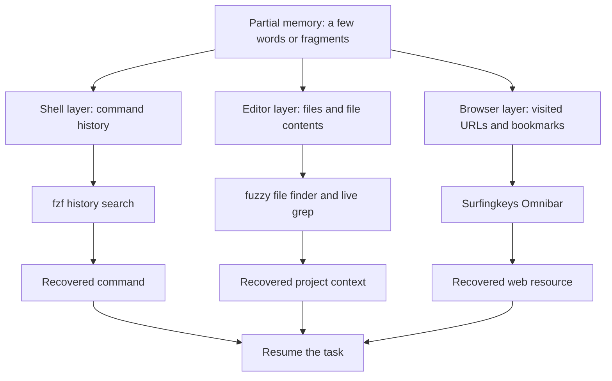

<BilibiliVideo bvid="BV15T8w63EZ8" />

<TOCInline fromHeading={1} toHeading={2} toc={props.toc} />

---

## The New Bottleneck Is Finding Context

AI-assisted development lets us create software and collect information faster than before. An LLM can generate a command, explain an unfamiliar API, locate a useful document, or help us build a new project in minutes. The side effect is that our collection of context also grows much faster: more repositories, more files, more terminal commands, more documentation pages, and more URLs that seemed important when we opened them.

Creating or collecting a resource is therefore only half of the problem. The other half is recovering it when we need it again.

Human memory is not a reliable index for this volume of information. I may remember that I used a long Docker command last week, edited a Neovim configuration file related to fuzzy search, or read a useful page about AI-agent tooling. Remembering the exact command, path, filename, or URL is much harder. Manually browsing directories, scrolling through shell history, or reopening browser tabs adds friction to work that should have been reusable.

What I usually remember is not the exact identifier but a few fragments:

- part of a command, such as `compose`, `agent`, and `up`
- part of a filename, such as `fuzzy` or `workflow`
- a phrase inside a file, such as `human in every loop`
- a topic or domain from a previously visited page

That makes **fuzzy finding** a better match for human memory than exact lookup. Instead of asking me to remember the resource, the system lets me describe the small part I still remember and ranks the likely results.

## The Ideal: One Searchable Resource Index

The first solution that comes to mind is a single index. Every useful resource would be added to it, and one fuzzy search interface would return the best match whether the target was a local file, a shell command, or a remote URL.

Such an index would also be valuable to AI agents. If the index were exposed through shell tools, an agent could search the same resources I search, inspect the selected files, and update the resources it is allowed to modify. In that sense, the agent could partially **see what I have seen** rather than starting every task from an empty context window.

This post does not go deeply into agent integration. The important point here is that a text-based, command-accessible retrieval layer can serve both humans and agents. A shell command that searches an index is useful to me interactively, but it can also become a tool inside an agent workflow.

The practical problem is that I do not currently have one command or one index that covers everything across local and remote resources. Commands live in shell history. Project knowledge lives in filenames and file contents. Web resources live in browser history and bookmarks. Each application already has part of the data, but the data is distributed.

Instead of waiting for a perfect universal index, I use **several smaller indexes at the layers where the information already exists**.



This is not a single technical index, but it behaves like one workflow: **remember fragments, fuzzy-search the correct layer, then reuse the result**.

## Layer 1: Search Commands from Zsh History

Long shell commands are expensive to reconstruct. They often contain several flags, paths, ports, environment variables, or subcommands. Even when a command worked before, typing it again from memory creates opportunities for small mistakes.

Zsh history provides the index. In my `~/.zshrc`, I keep the history in a persistent file:

```zsh
HISTFILE="$HOME/.histfile"
```

I then use `fzf` to search that history interactively. A typical setup enables fuzzy history search from the shell, often through `Ctrl-R`. The exact integration can vary, but the interaction is consistent:

1. Press `Ctrl-R`.
2. Type a few fragments from the old command.
3. Select the best-ranked result.
4. Edit it on the command line before executing it.

For example, suppose I previously ran:

```bash
docker compose -f compose/agentsview/compose.yml up -d
```

Weeks later, I may only remember that it was a Compose command for `agentsview`. Searching for fragments such as:

```text
compose agent up
```

is enough for `fzf` to narrow the history to the relevant command. The result returns to the prompt, where I can reuse it directly or change the compose file, service, or flags.

The editing step matters. History search is not only a faster way to repeat commands; it is a way to recover a known-good structure and adapt it. This is especially useful for long commands that differ by only one path, target, or option.

Shell history also produces a useful record for an AI agent. When the history is stored as text and searchable through shell tools, an authorized agent can inspect how a task was previously performed instead of inventing a new command from scratch. History may contain sensitive arguments, however, so access and secret handling still need to be treated carefully.

## Layer 2: Search Project Files and Content in Neovim

The next layer is the editor. Here, I need to answer two different questions:

1. **Which file am I trying to open?**
2. **Which file contains the idea or implementation I remember?**

These questions need different indexes. A fuzzy file finder searches paths and filenames, while content search scans the text inside files. My Neovim configuration under `~/.config/nvim` uses an `fzf`-based interface for both operations.

### Example: finding a file by an incomplete name

Suppose a project contains this file:

```text
data/blog/en/tools/fuzzy-finding-everything.mdx
```

I do not need to remember the complete directory tree. Opening the file finder and entering fragments such as:

```text
fuzzy everything
```

can rank the intended file above unrelated results. This works especially well in large repositories because the query can combine fragments from different parts of the path.

### Example: finding context inside files

Sometimes I remember the idea but not the filename. For example, I may remember writing about removing the human from “every loop,” but I do not remember which AI-agent article contains that phrase. A live content search for:

```text
human every loop
```

can lead back to the relevant post and exact line.

This distinction is important:

- use **file search** when you remember something about the path or filename
- use **content search** when you remember a phrase, symbol, configuration value, or implementation detail

Together, these searches turn the repository into a recoverable working memory. The editor is no longer only where I modify files; it is also the index for project context.

This layer is naturally compatible with coding agents. Files and text search are already among the most common shell-accessible agent tools. If both the human and agent operate on the same repository, a path or phrase found through fuzzy search can become precise context for the next instruction: “open this file,” “update this section,” or “find the configuration related to this result.”

## Layer 3: Search Previously Seen URLs with Surfingkeys

Many resources never become local files. Documentation, issue threads, reference implementations, videos, and discussions remain in the browser. Bookmarking every potentially useful page requires too much manual organization, while keeping every page open creates an unmanageable tab collection.

Browser history is already an index of what I have seen. [Surfingkeys](/blog/tools/surfingkeys-intro) makes that index accessible through a keyboard-driven Omnibar.

In the default Surfingkeys workflow, pressing `t` opens the Omnibar for searching URLs from history and bookmarks. For example, I may remember reading a page about Chrome DevTools and AI-agent verification but forget the title and URL. Entering fragments such as:

```text
chrome devtools agent
```

can recover the visited page without requiring an exact match.

The same approach works for frequently revisited project dashboards, GitHub repositories, documentation pages, and web applications. Instead of deciding in advance which pages deserve a carefully organized bookmark, I can search the history generated by normal browsing and promote only the most important resources to bookmarks later.

Surfingkeys gives the browser the same basic retrieval pattern as the terminal and editor:

- open the search interface with the keyboard
- type the fragments that remain in memory
- inspect the ranked candidates
- open the selected resource

The data source is different, but the mental model is the same.

## Three Small Indexes Cover Most of My Workflow

These three layers cover different forms of information:

| Layer   | Existing index             | What I remember                   | What I recover                 |
| ------- | -------------------------- | --------------------------------- | ------------------------------ |
| Shell   | Zsh history file           | command fragments                 | reusable command line          |
| Neovim  | project filenames and text | path fragments or phrases         | local file and project context |
| Browser | history and bookmarks      | title, topic, or domain fragments | previously visited URL         |

In my current workflow, these layers cover roughly **90 percent of the resources I need to recover regularly**. This is a personal estimate rather than a benchmark, but it explains why the method is useful: it addresses the main places where my working context accumulates without requiring a new database or a large knowledge-management system.

The setup also avoids excessive manual classification. I do not need to assign a category to every command, file, or page. The shell records commands, the repository stores files, and the browser records visits. Fuzzy search is added on top of those existing collections.

## What This Approach Does Not Solve

A layered index is a practical temporary solution, not a complete information system.

The information remains distributed. I still need to know whether a missing resource is most likely a command, a local file, or a page. Search quality also depends on what was recorded: private browsing may not preserve a URL, shell history settings may drop a command, and generated or ignored files may not appear in an editor search.

There are also resources outside these three layers: messages, PDFs, screenshots, notes, remote files, agent sessions, and facts that exist only in human memory. Some of them can be indexed with similar tools, but adding more independent search interfaces eventually recreates the fragmentation problem at a larger scale.

Security is another boundary. Shell histories can contain tokens or sensitive arguments. Browser histories reveal browsing activity. Project indexes may include private source code. Making these resources accessible to an AI agent should therefore be explicit and scoped, not automatic.

The longer-term direction may be a unified resource index that combines local and remote sources, preserves provenance, respects permissions, and exposes a command-line interface for both humans and agents. The layered workflow described here is useful precisely because that complete system does not yet exist in my setup.

## Conclusion: Build Retrieval Around Partial Memory

The amount of information around software development is increasing faster in the LLM era. AI helps us generate code and collect context quickly, but that advantage weakens if we cannot recover what we created or found.

Fuzzy finding works because it matches how memory actually behaves. I often forget exact paths, commands, and URLs, but I retain a few words, concepts, or fragments. A good retrieval system should accept those fragments instead of demanding perfect recall.

For now, I use three layers:

- Zsh history plus `fzf` for commands
- an `fzf`-based Neovim workflow for filenames and file contents
- Surfingkeys for browser history, bookmarks, and URLs

The tools are separate, but the habit is unified: **leave a searchable trace, remember only a fragment, and let fuzzy matching recover the resource**. That small change makes previous work easier to reuse, reduces repeated searching, and creates a context layer that can eventually be shared—with appropriate permissions—with AI agents as well.

---

## Related Posts

- [**Surfingkeys: Transform Your Browser into a Vim-Powered Navigation Machine**](/blog/tools/surfingkeys-intro)
- [**One Year with Arch Linux: From Terminal Minimalism to Browser-First Workflows**](/blog/misc/one-year-arch-linux-browser-workflow)
- [**AI Agents Should Own What We Used to Own**](/blog/tools/ai-agent-own-what-we-owned)
- [**My Arch Linux Dotfiles in 2026: Rebuilt Around AI Agents**](/blog/misc/arch-linux-dotfiles-2026)
