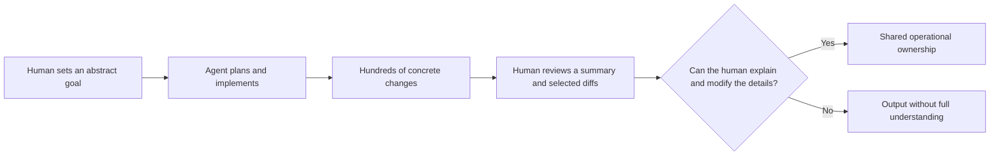
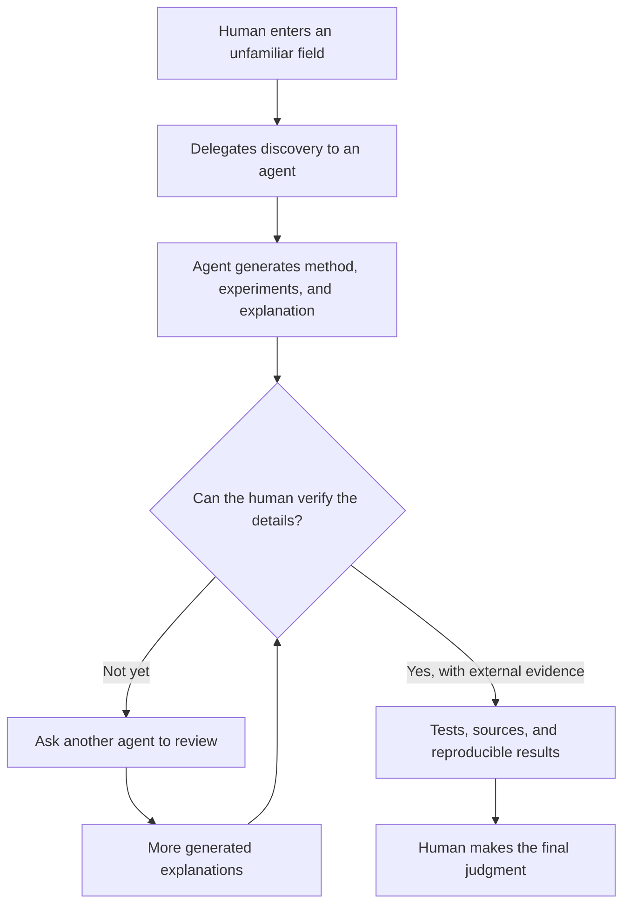
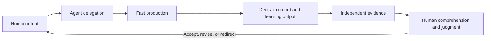

<BilibiliVideo bvid="BV1XVtG6FECm" />

<TOCInline fromHeading={1} toHeading={2} toc={props.toc} />

---

## Introduction

In an earlier post, we argued that [AI agents should own more of the work humans used to own](/blog/tools/ai-agent-own-what-we-owned). If an agent can implement a feature, inspect the result, run tests, correct its mistakes, and return only after closing its local loop, then the human no longer has to supervise every intermediate step. This makes long-running and parallel agent workflows possible.

We have now pushed that idea much further. With a **Claude Code 20x plan**, a **GPT 20x plan**, [dynamic workflows](/blog/tools/dynamic-workflows), and multi-agent execution, we can give an abstract goal once and let agents work for several hours—sometimes close to half a day. We have also configured tools and reusable skills for specialized jobs such as software development, paper research, and technical writing. A single prompt can start a workflow that plans, delegates, implements, tests, and revises while we focus elsewhere.

The output is real. We can see the tokens consumed, commits created, issues fixed, features proposed, and experiments completed. In terms of production capacity, the system is far beyond what we could achieve by manually writing every line.

But that success has exposed a harder question:

> **If the AI is ours, is its ability really ours?**

Our recent experience suggests a more careful answer. AI agents can extend what we are able to produce, but their output does not automatically become our knowledge, understanding, or judgment. When generation becomes faster than absorption, the agent may extend the project while the human behind it becomes less able to explain, verify, or change what was produced.

## The Hard Feeling Behind High Token Usage

Every day, the usage dashboard gives us a clear measure of activity. A high-level goal expands into a large amount of generated work. The repository accumulates commits. Bugs disappear. New functions appear. From the outside, this looks like a direct extension of human ability: we stated the intent, and the system delivered the implementation.

What we actually gained, however, was uneven.

We learned that an AI agent **can implement** a certain feature. We did not necessarily learn how that feature works at a deeper level, why one method was chosen over another, which alternatives were rejected, or what assumptions the final implementation depends on. That information often remains somewhere inside the session history, the code, or the diff. We can recover it by talking with the agent, reviewing the changes, and asking why each important decision was made.

In practice, we often do not.

Review requires attention, and the agent has already made progress on the next task. It is tempting to accept a passing test suite and move forward. We begin asking ourselves: **if the agent can already do this, do we still need to study it?** For many low-level or repetitive tasks, the honest answer may be no. We do not need to memorize every API or manually reproduce every generated line.

The problem is not that we delegate. The problem is that delegation can quietly become a habit of **not learning, not questioning, and not remaining curious**. Because the agent succeeds so often, we begin to treat its ability as unlimited. Confidence in the tool turns into dependence on the tool, and dependence gradually reduces our motivation to inspect the details.

At that point, the AI is producing more, but we are absorbing less.

## Generation Speed Is Not Understanding Speed

This imbalance becomes obvious during large maintenance tasks. We recently asked an agent to update a dependency. The work ran for about an hour and changed more than **500 files**. The agent could search the repository, select a migration strategy, apply edits, fix resulting errors, and continue until the project reached an acceptable state.

We could not read 500 changed files at the same speed.

We also could not fully reconstruct every strategy the agent used or inspect every consequence before the next task began. The agent's generation speed exceeded our review speed, and its operational scope exceeded the level at which we could maintain line-by-line control.

This creates an **abstraction gap**:

At the top level, we still lead the direction. We choose the goal, constraints, and acceptance criteria. At the bottom level, however, we may no longer be able to change one important line confidently without asking the same agent for help. The system remains under our account and inside our repository, but parts of it have moved beyond our practical control.

This is not necessarily a failure. Modern software already depends on abstractions that no single developer understands completely. We use operating systems, compilers, frameworks, and libraries without reading every implementation. AI adds another abstraction layer—but unlike a stable library, it can generate a new and unfamiliar abstraction every hour. The volume and rate of change make this layer harder to inspect.

So commit count, token usage, and files changed are measures of **throughput**, not measures of human understanding. More output does not prove that our own technical ability grew by the same amount.

## The Discovery and Verification Paradox

The risk becomes larger when we ask agents to work in a field we have never studied.

In familiar software work, we can usually verify at least part of the result. We know the expected behavior, can run tests, inspect the architecture, and recognize suspicious decisions. Even if the agent writes more code than we can review line by line, we have a mental model against which to judge it.

In a discovery task, that mental model may not exist. We ask the agent to explore an unfamiliar method precisely because we do not yet know the field. The agent then chooses components, implements an approach, runs experiments, and writes a clear summary. But the summary is also generated by the agent. If it omits a limitation, misinterprets evidence, or presents an engineering combination as a novel method, we may not have enough knowledge to notice.

This creates a verification paradox:

1. We delegate because we do not know the field.
2. Because we do not know the field, we cannot deeply review the delegated work.
3. We ask the agent to explain or verify its result.
4. The new explanation is generated by the same class of system whose reliability is in question.
5. Independent verification may require as much time as learning the field ourselves.

More agent calls can improve verification through independent reviewers, adversarial checks, and repeated experiments. Our [dynamic workflow](/blog/tools/dynamic-workflows) already uses separate generator and verifier agents for this reason. But regeneration is not the same as evidence, and agreement among agents is not proof that a claim is correct.

The less we know about the domain, the more convincing a fluent final answer can appear—and the less capable we may be of testing it.

## Why Research and Paper Writing Expose the Boundary

Scientific work makes this limitation especially visible. AI agents are already useful for searching papers, implementing baselines, running experiments, organizing results, editing prose, and adapting text to a template. Our [Claude Code configuration](/blog/tools/claude-code-config) uses specialized agents, MCP tools, and reusable workflows for many of these jobs. This can accelerate research and writing substantially.

But a paper is not only a report that says, “we used this method and achieved this result.” It also needs to answer harder questions:

- Why was this method chosen?
- Which alternatives were considered, and why were they rejected?
- Is the contribution genuinely novel, a new combination of known ideas, or mainly an engineering improvement?
- Which evidence supports each claim?
- What is the central scientific story?
- How should that story change for different journals or audiences?
- Which figures reveal the method clearly rather than merely decorating the result?
- Does the reasoning remain coherent from the problem statement to the conclusion?

An agent can generate plausible answers to all of these questions. That is not the same as possessing a reliable scientific position.

We have seen agents produce better experimental results through code generation and rapid iteration. We have not seen equally strong public evidence that autonomous research agents can consistently turn those results into the best scientific argument for different journals. They can struggle with the total logic of a paper, figure design, novelty boundaries, and strict adherence to local writing rules. Once weak logic enters the prefix context, later sections may polish and reinforce it instead of challenging it.

This is where more tokens and longer runtimes stop being an automatic advantage. As we noted when rethinking our workflow after provider restrictions, [more agents, more tokens, and longer runtimes do not necessarily produce more useful work](/blog/tools/ai-workflow-after-claude-ban). They can also generate more material than a researcher can meaningfully evaluate.

Even the strongest models available to us have boundaries. They are powerful implementers and accelerators, but that does not make autonomous research judgment a solved problem.

## Output Capacity Is Not Human Ability

We can now separate several ideas that are easy to mix together:

| What the AI extends            | What does not transfer automatically                      |
| ------------------------------ | --------------------------------------------------------- |
| Number of tasks we can attempt | Understanding of every implementation                     |
| Speed of code generation       | Ability to maintain the code independently                |
| Breadth of initial exploration | Domain expertise needed to judge the exploration          |
| Volume of experiments          | Confidence that the experiment answers the right question |
| Speed of drafting              | Ownership of the paper's scientific logic                 |
| Availability of explanations   | Motivation and ability to think without the agent         |

AI clearly extends our **capacity to act**. With enough tools, context, and tokens, one person can initiate work that previously required much more time or a larger team. This is a real extension of leverage.

But the agent's full ability is not automatically our ability. Ability belongs to us only to the extent that we can use the result with judgment: understand the critical assumptions, verify the evidence, recognize failure, explain the decision, and intervene when the context changes.

A useful distinction is:

> **AI output is ours by possession. AI capability becomes ours only through comprehension, verification, and judgment.**

Without those, we own the files but not necessarily the knowledge behind them.

## Rethinking the Workflow

The answer is not to return to writing every line manually. That would discard the real value of long-running agents. The goal is to keep delegation while preventing the human from disappearing from the intellectual process.

A healthy loop does not place the human inside every implementation step. It brings the human back at the points where ownership is created: decisions, evidence, learning, and judgment.

### 1. Decide what must remain human-owned

Before launching a long workflow, identify the decisions we must still be able to explain. In software, this may include architecture, security boundaries, data models, and irreversible migrations. In research, it includes the research question, method rationale, novelty claim, evidence chain, and paper narrative.

The agent can help develop these decisions, but it should not silently become their only owner.

### 2. Review decisions, not every generated line

A 500-file diff may be impossible to inspect line by line. The solution is not to skip review entirely, but to require a decision record: migration strategy, alternatives, assumptions, risky files, generated files, test evidence, and unresolved concerns. We can then sample high-risk changes and inspect interfaces rather than pretending to read everything equally.

### 3. Make learning an explicit output

A long-running task should return more than code or prose. It should also produce an explanation designed for the human who must own the result: what changed, why it changed, what was learned, what remains uncertain, and which concepts deserve deeper study.

If learning is not part of the requested output, throughput will usually consume all available attention.

### 4. Use independent evidence, not only agent agreement

Verifier agents are valuable, but important claims should terminate in observable evidence: tests, benchmarks, source papers, reproducible experiments, or direct inspection. Another generated summary can guide verification; it cannot replace it.

### 5. Keep some work inside our own cognitive loop

If every difficult task is immediately delegated, curiosity weakens. We need deliberate places where we still read the paper, trace the code path, design the figure, or write the argument ourselves. This is not because manual work is always more efficient. It is because the ability to think, question, and form a position grows only when it is exercised.

## Conclusion

Long-running AI agents have crossed an important threshold for us. With high-token plans, specialized tools, reusable skills, dynamic workflows, and multiple agents, one prompt can now initiate hours of productive work. The system can create commits, fix issues, propose functions, migrate dependencies, run experiments, and draft papers at a scale that genuinely extends what one person can produce.

But production is only one part of ability.

When agents generate faster than we can absorb, the relationship can reverse. Instead of the AI extending our understanding, we become operators of an output stream we cannot fully review. We retain abstract control while losing detailed control. In unfamiliar fields, we may not even know how to verify the polished final result. In research, this gap appears in the hardest parts: method choice, novelty, evidence, figures, journal framing, and the logic connecting the whole paper.

So our answer has changed. **AI ability can extend our ability, but it does not become ours automatically.** It becomes ours only when the workflow preserves human comprehension, independent verification, and the motivation to think. Otherwise, the agent's capacity remains external: powerful, useful, and owned by us in a technical sense, but not truly part of what we ourselves know how to do.

The next challenge is therefore not simply to make agents run longer. It is to design workflows in which agents can produce at machine speed without leaving human understanding behind.

---

## Related Posts and Resources

- [**AI Agents Should Own What We Used to Own**](/blog/tools/ai-agent-own-what-we-owned)
- [**From Manual Task Splitting to Dynamic Workflows**](/blog/tools/dynamic-workflows)
- [**Multi-Agent Parallel Workflow: From Coder to Conductor**](/blog/tools/multi-agent-parallel)
- [**Vibe Coding to Agent Coding**](/blog/ide/ai-vibe-coding-2026)
- [**How to Choose a Token Plan for AI Agent Coding**](/blog/tools/ai-agent-token-plan)
- [**Claude Code Configuration Guide**](/blog/tools/claude-code-config)
- [**A Harness for Every Task: Dynamic Workflows in Claude Code**](https://claude.com/blog/a-harness-for-every-task-dynamic-workflows-in-claude-code)
- [**Multi-Agent Coordination Patterns**](https://claude.com/blog/multi-agent-coordination-patterns)
