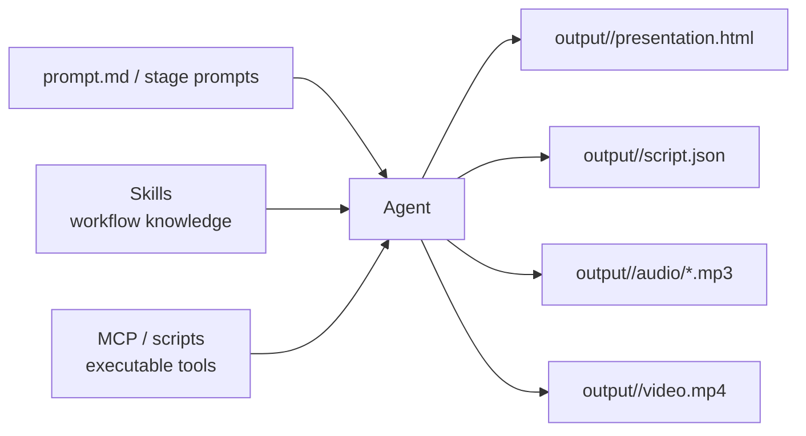

<BilibiliVideo bvid="BV1CFXpBKEZ3" />

<TOCInline fromHeading={1} toHeading={2} toc={props.toc} />

---

## Why md2video Matters

Most software is still designed with a human operator in mind. We build a GUI for clicking, or a CLI for typing, or an SDK for programmers to wire into another system. [**md2video**](https://github.com/isomoes-video/md2video) starts from a different assumption: in many workflows, the primary operator is now an **AI agent**. That shift sounds small at first, but it changes what the software should accept as input, how it should expose its capabilities, and how a workspace should be organized.

In md2video, the first-class input is not a settings panel and not a Python SDK. It is a **prompt file** such as `prompt.md`, together with stage-specific prompts in the repository. The prompt tells the agent what artifact to create, where to place it, and how each stage should behave. In other words, the repo is designed less like a traditional app and more like an **agent workspace** with explicit instructions, bounded outputs, and reusable automation.

That is why I think this project represents more than a small media tool. It points to a new software shape that is becoming more important in the current AI era: software built for **agent execution first**, with humans reviewing direction and results rather than manually driving every step. We already know that **skills** can package knowledge and workflow rules, while **MCP-style tool access** can package executable capabilities. The missing piece is a workspace that lets those two parts meet around a concrete task.

## Skills + MCP + Workspace

The practical question is simple: **how do we let packaged knowledge and packaged tools work together in one place?** md2video is one answer. The repository provides prompt files that define each stage, a reveal.js skill that defines how presentation output should be structured, and helper scripts that perform audio and video assembly. The agent does not need to guess the workflow from scratch because the repo already contains the instructions, the tool boundaries, and the output contract.

This matters because an agent is strongest when it can see the full working surface. A skill can explain how to design the slides. A tool can generate TTS audio or assemble a final video. The workspace ties them together, keeps the artifacts in one output directory, and gives the agent enough structure to move from planning to execution without losing context.

Seen this way, md2video is not only about video generation. It is a compact example of **agent-native software architecture**. The software does not assume that the human will click through every stage. Instead, it assumes the agent can read instructions, call tools, create files, and keep the workspace consistent from start to finish.

## From GUI and CLI to CUI

There is a second shift behind this project. For many AI workflows, the main interface is no longer a traditional GUI and not even a classic CLI. The main interface is now the **chat loop** itself, where the user expresses intent in natural language and the agent decides which prompts, files, and tools to use. I usually think about this as **CUI: Chat User Interface**.

That does not mean GUI and CLI disappear. They still matter, especially for inspection, debugging, and direct control. But in agent-heavy workflows, they are no longer the only front door. A chat session can now act as the orchestration layer that connects human intent, repository context, reusable skills, and executable tools.

md2video fits that pattern well. A human can say, in effect, “turn this markdown source into a narrated video,” while the agent translates that request into a sequence of bounded steps. The CUI becomes the place where intent is declared, while the repository remains the place where the actual workflow contract lives. That split is useful because it keeps the interface flexible without making the execution path vague.

## How md2video Turns Markdown into Video

At the project level, md2video stays intentionally simple. It takes source content such as `source.md` or direct text input, then moves through a staged pipeline defined by prompt files in the repo. The first stage uses [`prompts/plan-prompt.md`](https://github.com/isomoes-video/md2video/blob/main/prompts/plan-prompt.md) to create a reveal.js presentation workspace under `output/<presentation-slug>/`. That workspace contains `presentation.html`, `styles.css`, `script.json`, and an exported `output.pdf` with one slide per page.

The second stage uses [`prompts/tts-prompt.md`](https://github.com/isomoes-video/md2video/blob/main/prompts/tts-prompt.md) to read `script.json` and generate one narration MP3 per slide. The third stage uses [`prompts/combine-prompt.md`](https://github.com/isomoes-video/md2video/blob/main/prompts/combine-prompt.md) to map each PDF page to its matching MP3, then assemble the final `video.mp4`. There is also an optional [`prompts/script2intro-prompt.md`](https://github.com/isomoes-video/md2video/blob/main/prompts/script2intro-prompt.md) step that generates a concise intro text from the narration script.

The flow is straightforward:

1. Start with markdown or other source content.
2. Ask the agent to use the planning prompt to build the slide deck and narration script.
3. Review the generated workspace.
4. Ask the agent to generate slide-by-slide narration audio.
5. Ask the agent to combine slide visuals and audio into `video.mp4`.

What makes this interesting is not only the output. It is the fact that the whole workflow is organized around **files the agent can understand and produce**. Markdown becomes slides, slides become narration units, narration units become audio files, and those files become the final video. Each stage is explicit, reviewable, and compatible with agent execution.

## A Small Project That Shows a Bigger Direction

md2video is a concise project, but the idea behind it is larger than the repository itself. It suggests that future software may often be delivered not only as apps and libraries, but also as **agent workspaces**: prompt entry points, reusable skills, tool access, strict output contracts, and a human-in-the-loop chat interface on top. That combination gives the agent enough structure to do real work without turning the workflow into a black box.

If you want a short description of the project, it is this: **md2video turns markdown-based source content into a narrated slide video through an agent-first, prompt-driven workflow**. If you want the broader takeaway, it is this: software is starting to evolve from GUI and CLI toward **CUI plus workspace**, where the human gives intent and the agent executes against well-defined artifacts. For the current AI software landscape, that feels less like a side experiment and more like an early preview of a new default.
