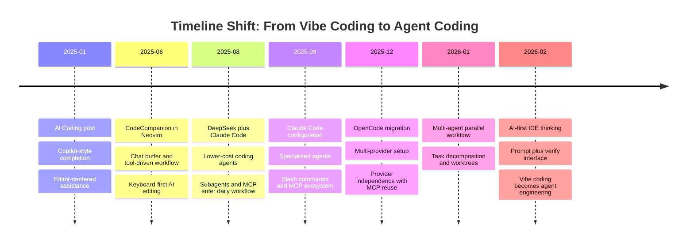
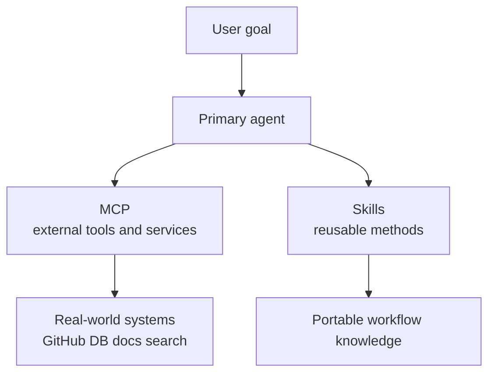
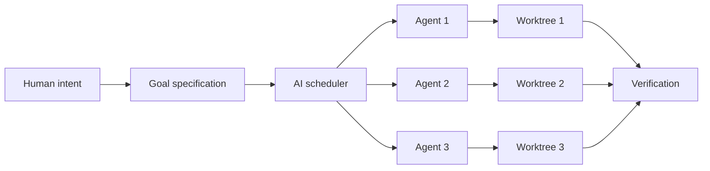

<BilibiliVideo bvid="BV1FpPZztE2t" />

<TOCInline fromHeading={1} toHeading={2} toc={props.toc} />

---

## 引言

从 2025 年 1 月到 2026 年 3 月，工作流逐渐从 vibe coding 转向 agent coding。在更早的阶段，核心价值主要是速度：更快完成、更容易写 prompt，以及一种更松散的“让模型产出代码”的方式。十五个月之后，重心已经转移到了 agents、worktrees、编排和 review 上。人的角色并没有消失，但变得更明确地偏向工程：定义意图、提供约束、塑造系统，并验证结果。

这篇文章围绕工作流本身的三个变化展开。第一，vibe coding 逐渐变成 **agent coding**，其中实现不再被视为自由生成，而是边界清晰的任务执行。第二，通过 **MCP** 和 **skills**，agent 的能力得到了扩展，让它可以连接外部系统并加载可复用的方法。第三，软件工作开始向**多个 agent 同时运行**迁移，这又把人的角色从直接实现者转变为编排者、审查者和工程决策者。

## 第一部分：由 Agent 来编码

当第一篇 [AI Coding](/zh/blog/ide/ai-code) 文章在 2025 年 1 月发布时，主导性的思维模型仍然深受 GitHub Copilot 影响。AI 被看作编辑器内的一个助手：它补全函数、把注释扩展成代码，并帮助减少重复劳动。即便文章中已经提到了更强的推理模型和 RAG 风格的工作流，真正掌控节奏的人依然主要是人类。那正是 vibe coding 的起点：自然语言意图、轻量委托和快速迭代，但还不是一个完全工程化的 agent 工作流。

那个阶段依然重要，因为它改变了“正常开发工作”到底意味着什么。开发者不再逐行手写所有代码，而是开始用自然语言描述意图，并审查以更小 diff 呈现的生成结果。[Continue](https://docs.continue.dev/customize/overview) 插件很好地体现了这种转变：模型提供商、上下文提供器、slash commands 和 tool calling，其实都已经在暗示编程会变得更对话式、更可组合。看上去像是一个更强的编辑器插件，实际上却是 agent 工作流的开端。

在 2025 年期间，工作流持续向终端迁移，并朝着更强控制力的方向发展。在 [Neovim metting AI (CodeCompanion)](/zh/blog/misc/neovim-ai) 一文中，AI 支持进入了以键盘为核心的编辑环境，带来了 chat buffers、inline editing 和 tool-driven agents。在 [DeepSeek Meets Claude Code](/zh/blog/tools/deepseek-claude-code) 一文中，讨论重心则从简单补全转向成本、工具使用和系统集成。到 [My 2025 Big Changes](/zh/blog/misc/change-2025) 写成时，核心经验其实已经非常清楚：从 VSCode + Copilot 走向 Neovim + OpenCode，本质上是一条走向简洁、控制力和 provider independence 的路径。

也正是在这里，_vibe coding_ 这个词开始变得更准确。它并不只是“随意地让 AI 生成代码”。它描述的是一种转变：开发者不再把“打字”当作主要工作单位，而是开始通过自然语言意图委托实现。但更关键的是下一步：一旦这种工作流变得可靠，vibe coding 就会硬化成 agent coding，其中任务、工具、边界与验证都会以更加明确的工程方式来处理。

这第一阶段的终点其实很简单：执行单位不再是人手敲下的一行代码，而是由 agent 执行的任务。到了这个阶段，工作流就不再只是“凭感觉写代码”，而是通过 agents 进行工程。只要接受了这点，后面的问题就顺理成章：怎样扩展 agent？如果一个 agent 不够，又会发生什么？

## 第二部分：用 MCP 和 Skills 扩展 Agent

如果第一阶段是让 agent 来写代码，那么第二阶段就是扩展 agent 的能力。在实践里，最显眼的两个构件就是 **MCP** 和 **skills**。MCP 通过连接外部工具与服务，扩展了 agent 能_做什么_。Skills 则通过打包可复用的方法、工作流与最佳实践，扩展了 agent _知道如何做什么_。两者结合，推动 AI coding 超越单纯的 prompt engineering，走向一个模块化生态。

### MCP：把 agent 连接到世界

在 [Mastering Claude Code](/zh/blog/tools/claude-code-config) 中，真正的转折点不只是 prompt 写得更好，而是通过 **Model Context Protocol** 集成了外部能力。有了 MCP，agent 就不再局限于本地 prompt 和本地文件树；它可以通过统一接口访问研究数据库、GitHub 仓库以及其他外部服务。那篇文章中的 `all-in-mcp` 配置让学术搜索变得切实可用，而 [OpenCode](/zh/blog/tools/opencode-cli) 又表明，这种模式在跨 provider 迁移后仍然成立。

MCP 在 2025 年末到 2026 年初之所以变得如此重要，一个原因是其周边生态的快速增长。[mcpservers.org](https://mcpservers.org/) 这个目录如今已经追踪了数千个公开发布的 MCP servers，覆盖 **development**、**search**、**database**、**cloud service**、**version control** 和 **web scraping** 等类别。写作本文时，该站点列出的总数已超过 **6,500** 个，其中 **development** 类超过 **2,100** 个，**search** 类超过 **500** 个。这个规模改变了 AI tooling 的含义：我们不再要求一个模型“知道一切”，而是越来越多地赋予它在正确时机调用正确外部能力的能力。

| MCP server                                                                                          | 典型角色 | 为什么在 AI 编程中有用 |
| --------------------------------------------------------------------------------------------------- | -------- | ---------------------- |
| [Context7](https://mcpservers.org/servers/upstash/context7-mcp)                                     | 文档检索 | 在实现过程中检索最新的库和框架文档 |
| [Playwright](https://mcpservers.org/servers/microsoft/playwright-mcp)                               | 浏览器自动化 | 让 agents 测试 UI 流程、点击页面并验证行为 |
| [Chrome DevTools MCP](https://mcpservers.org/servers/github-com-chromedevtools-chrome-devtools-mcp) | 前端检查 | 提供实时浏览器调试、DOM 检查和性能分析 |
| [Next.js DevTools MCP](https://mcpservers.org/servers/vercel/next-devtools-mcp)                     | 框架专属开发 | 为 Next.js 项目和应用调试提供更有针对性的工具 |
| [all-in-mcp](https://github.com/jiahaoxiang2000/all-in-mcp)                                         | 学术与 GitHub 工作流 | 本博客用于论文搜索和仓库上下文的自定义工具栈 |

### Skills：按需加载的可复用行为

最新加入的部分是 **skills**。本博客更早的文章其实已经开始走向可复用的 agents 和 slash commands，但最近的 OpenCode 文档又增加了一层更清晰的封装：skill 是一个可复用的 `SKILL.md` 定义，可以从仓库或全局配置中被发现，并且只在相关时加载。实际效果是，反复出现的知识不再必须塞进一个巨大的 system prompt，也不需要复制到每个 agent 定义里。

这个想法也正在成长为一个独立生态。[skills.sh](https://skills.sh/) 自称是开放的 agent-skills 生态，并追踪了跨多个客户端的可复用 skills，包括 Claude Code、OpenCode、Codex、Cursor、Gemini、GitHub Copilot、Cline、Goose、VS Code 和 Windsurf。站点上的排行榜说明，skills 已经不再只是一个小众配置技巧，而是逐渐成为过程性知识的可移植封装格式：前端规则、框架最佳实践、调试方法、浏览器工作流、文档生成、部署步骤以及 code-review 习惯，都可以作为可安装单元来分发。

这是一个技术细节很小、但对工作流后果很大的变化。Skill 的主要作用并不是增加新的外部工具，而是增加一种可复用的方法。这种分离让 AI 系统更容易维护，因为工作流变得更可组合：一个 agent 可以只在需要时加载 release skill、documentation skill 或 deployment skill。如果说 MCP 把 agents 连接到工具，那么 skills 就是把 agents 连接到可复用的操作知识。

| Skill                                                                                                 | 来源 | 典型角色 | 为什么常用 |
| ----------------------------------------------------------------------------------------------------- | ---- | -------- | ---------- |
| [find-skills](https://skills.sh/vercel-labs/skills/find-skills)                                       | Vercel Labs | Skill discovery | 帮助 agents 为新任务定位并安装合适的 skill |
| [vercel-react-best-practices](https://skills.sh/vercel-labs/agent-skills/vercel-react-best-practices) | Vercel Labs | React guidance | 将实用的 React 模式编码成适合 agent 驱动实现的规则 |
| [subagent-driven-development](https://skills.sh/obra/superpowers/subagent-driven-development)         | Obra | Task decomposition | 强化本文讨论的专用 agent 工作流 |
| [using-git-worktrees](https://skills.sh/obra/superpowers/using-git-worktrees)                         | Obra | Parallel isolation | 适合需要独立分支的多 agent 工作流 |
| [mcp-builder](https://skills.sh/anthropics/skills/mcp-builder)                                        | Anthropic | MCP authoring | 当下一步不是使用 MCP server 而是构建一个时非常有用 |

## 第三部分：多个 Agent 同时运行

第三次转变开始于：一个 agent 不再是自然的工作单位。在[多 Agent 并行工作流](/zh/blog/tools/multi-agent-parallel)中，关键思想并不只是速度，而是**分解**。一旦一个项目被拆分成相互独立的部分，多个 agent 就可以同时工作。一个做研究，一个做实现，另一个负责文档或测试准备。这会把软件工作从单线程交互，变成一个协调运作的系统。

围绕这一变化的工具，在 [Vibe-Kanban](/zh/blog/tools/vibe-kanban-intro) 中体现得更清楚：它使用隔离的 git worktrees 和可视化调度器来协调并发运行。不再由一个助手会话承载整个任务，而是给每个 agent 分配一个边界清晰的上下文和自己的执行空间。这种隔离很重要，因为没有边界的并发很快就会制造冲突。Worktrees、独立会话和明确的任务分配，使并行工作变得可审查，而不是混乱。

这也改变了界面。传统 IDE 是为一个直接点击、浏览、编辑、调试的人而设计的。AI 优先工具则假设机器会通过 CLI 命令完成大多数操作，而人类主要负责写 prompt 和审查结果。这就是为什么 [The Better AI IDE](/zh/blog/ide/great-ai-ide) 中讨论的双栏模型如此有说服力：一个 pane 负责意图，一个 pane 负责验证，其余一切都退居次要位置。

因此，人的角色再次发生变化。在第一阶段，人类在辅助下编码；第二阶段，人类操作一个更强的 agent；到了第三阶段，人类成为多个 agents 的协调者：拆解工作、分配上下文、审查结果、整合输出。下一步很可能是由 AI scheduler 自动处理更多中间层工作，但即使在那之前，实践中的经验也已经很清楚：**保持工作流模块化**。使用像 [OpenCode](/zh/blog/tools/opencode-cli) 这样的 provider-agnostic runtime，通过 Git 和 diff 保持上下文可移植，只在确实有用时才通过 MCP 连接外部系统，把可复用 know-how 放进 skills 而不是到处复制 prompts，并在可能时使用 worktrees 隔离并行工作。这就是 agent coding 的工程形态。

## 结语

从 2025 年 1 月到 2026 年 3 月，工作流经历了三个明显阶段。第一，vibe coding 成熟为 agent coding，实现从人类打字转向边界明确的 agent 执行。第二，agent 的能力通过 MCP 和 skills 得到扩展。第三，工作流从单个 agent 发展为多个 agent 并行运行。贯穿这些文章的方向是一致的：更少手工操作、更清晰抽象，以及更强调意图、架构和 review。

从这个意义上说，vibe coding 不是终点，而是入口。更成熟的形式是 agent coding：一种围绕任务定义、工具集成、模块化工作流和验证来组织工程工作的方式。这些系统越成熟，就越需要认真思考架构、任务边界、接口和 review。这很可能就是 2026 年 AI-native 软件开发真正的工作内容。

---

## 相关文章

- [AI 编程](/zh/blog/ide/ai-code)
- [Neovim metting AI (CodeCompanion)](/zh/blog/misc/neovim-ai)
- [DeepSeek Meets Claude Code](/zh/blog/tools/deepseek-claude-code)
- [Claude Code Subagents](/zh/blog/misc/claude-subagent)
- [Mastering Claude Code](/zh/blog/tools/claude-code-config)
- [OpenCode: The Open Alternative](/zh/blog/tools/opencode-cli)
- [Multi-Agent Parallel Workflow](/zh/blog/tools/multi-agent-parallel)
- [Vibe-Kanban](/zh/blog/tools/vibe-kanban-intro)
- [The Better AI IDE](/zh/blog/ide/great-ai-ide)
- [My 2025 Big Changes](/zh/blog/misc/change-2025)
