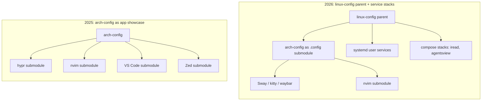

<BilibiliVideo bvid="BV1yLTM6SE82" />

<TOCInline fromHeading={1} toHeading={2} toc={props.toc} />

---

一年前，我发布了 [我的 Arch Linux Dotfiles](/zh/blog/misc/arch-linux-dotfiles)，介绍了截至 2025-07-30 时的 [arch-config 仓库](https://github.com/isomoes/arch-config)。说实话，那篇文章更像是一次“陈列”。它列出了编辑器、窗口管理器、浏览器和 163 个软件包，把这个仓库描述成一套通过日常使用不断打磨出来的个人工具箱。它隐含的信息是：配置本身*就是*工作——每个应用调得越用心，系统就越好。

经过一年的日常使用，这个仓库已经面目全非，而它之所以不同，原因并不在于审美。我工作的中心，已经从“敲键盘”转移到了“监督 AI agent”，配置也随之改变。这篇文章按顺序做三件事：梳理真正发生变化的时间线，用具体的对比把当前 2026 年的配置和 2025 年的快照放在一起，并解释为什么 agent 阶段几乎重塑了一切。

## 时间线：自 2025 年以来发生了什么

从 2025 年 4 月到 2026 年 6 月，这个仓库一共有 363 次提交。与其逐一罗列，不如把这段历史读成一连串阶段，每个阶段都是一次关于“控制权应该放在哪里”的小赌注。

### 起点：Hyprland、Fish，以及一份早期的 CLAUDE.md

这个仓库诞生于一台搭配 Apple 外设的桌面上，围绕 Hyprland、Fish 和 Waybar 这套技术栈，也就是最初那篇 [Arch Linux 配置](/zh/blog/misc/arch-linux)所描述的时代。在短暂试验过 Tritanopia 浅色方案后，主题很快定在了 Catppuccin Macchiato 深色，终端是 kitty，而 Surfingkeys 在 2025 年 6 月时就已经到位。编辑器的故事在这段早期（到 2025 年年中）达到顶峰：Neovim、VS Code 和 Zed 都作为各自独立的 git submodule 携带，并且为 VS Code 的 Vim 模拟快捷键投入了不少精力。事后看来，有一个细节很重要：一份 `CLAUDE.md` 仓库说明在 2025-05-26 被加入。在工作流围绕 agent 构建起来之前，agent 就已经在场了。

### 窗口管理器的反复折腾，以及 7 月的快照

2025 年年中，窗口管理器的实验开始认真展开：在 Hyprland 之外加入了 River 试用，终端从 kitty 换成了 foot，qutebrowser 作为键盘驱动的浏览器登场，而最初的 Caps/Esc 互换也演变成了基于 xremap 的完整 CapsLock 导航。这正是 [旧的 dotfiles 文章](/zh/blog/misc/arch-linux-dotfiles)和 [五月到七月的旅程](/zh/blog/misc/arch-linux-may-july-journey)所记录的状态：Hyprland 加 River，foot 作为终端，用 Firefox 和 qutebrowser 浏览网页，并在其上叠加 Surfingkeys。

### 给 agent 搭起脚手架，并把 shell 上移到上游

从 2025 年 8 月底开始，agent 相关的工作以手写 shell 函数的形式起步：`claude-deepseek`、`claude-kimi`、`claude-bigmodel`，每一个都把 Claude 指向一个不同的廉价服务商，同时还有第一个 `.claude` submodule。shell 的变化也发生在这里。从 Fish 迁移到 Zsh、再到 Oh My Zsh 的过程，根本没有发生在 `arch-config` 里，而是发生在一个新建的父仓库 [linux-config](https://github.com/isomoes/linux-config) 中，它创建于 2025-09-24。从此以后，shell 存放在上游的 `linux-config` 里，而 `arch-config` 则专注于桌面配置。

### 绕道 Niri，最终落定 Sway

2025 年年底，窗口管理器的问题终于尘埃落定。River 成为主力，搭配 Alacritty 的 Niri 试验只进行了一天就被回退，配置在 2025-11-19 落定到了 Sway。终端回到了 kitty，这次还把 Neovim 接入作为 scrollback 分页器。编辑器是悄悄收敛的，而不是某个决定的结果：VS Code 和 Zed 的 submodule 停止更新，只剩下 Neovim 作为唯一仍在积极维护的编辑器。这一段的回顾版本写在 [我在 2025 年的三次重大变化](/zh/blog/misc/change-2025)里。

### OpenCode、改名，以及 agent 服务

整个冬天和春天，agent 工具从 shell 函数逐渐成熟为带有多服务商后端的 [OpenCode](/zh/blog/tools/opencode-cli) submodule，在早先的 DeepSeek、KIMI 和 GLM 之外又加入了 MIMO 和 volcengine。编排方式先是转向一个 vibe-kanban runner，随后转向拆分为 direct 和 proxy 两个服务的 `ikanban` 服务器，并在各服务商前面加上一个 `cli-proxy-api` 网关。GitHub 账号在 2026-01-30 从 jiahaoxiang2000 改名为 isomoes，这迫使各项用户服务变得与路径无关。浏览器也果断迁移到了 Chrome 加 Surfingkeys，这一转变我记录在 [使用 Arch Linux 一年后](/zh/blog/misc/one-year-arch-linux-browser-workflow)中，也在 [最适合 AI agent 编码的操作系统](/zh/blog/misc/best-os-ai-agent-coding)里提到过。

### 回到 Claude Code，以及 compose 栈

最后一个阶段从 2026 年 5 月开始，把日常主力 [换回 Claude Code](/zh/blog/tools/back-to-claude-code)。这次回归最干净的标志，是对 kitty 做了一行调整，让 Shift+Enter 在 tmux 下的 Claude Code 中表现正常。围绕它还有 kitty 的 `font_size 20`、Sway 的整数缩放 2.0，以及一份为 Wayland 调优的 `chrome-flags.conf`。agent 编排被收拢进 systemd 用户服务，随后 `iread` 和 `agentsview` 被打包成 Docker Compose 栈，两者都绑定到 localhost。这个阶段在 2026-06-28 收尾：README 重新打上 isomoes 的品牌，并移除了如今已经多余的 `CLAUDE.md`，这一切都处在父仓库 `linux-config` 加子仓库 `arch-config` 的结构之下。

## 对比：2025 年快照 vs. 2026 年配置

把这条时间线当作一次“前后对照”来读，变化的轮廓就更清晰了。几乎每一层都被替换过，而这些替换都指向同一个方向。

| 层 | 2025（七月快照） | 2026（当前） |
| --- | --- | --- |
| Shell | Fish | Zsh 加 Oh My Zsh，位于 `linux-config` |
| 窗口管理器 | Hyprland，外加 River | Sway（Hyprland、River、Niri 现已成为遗留配置） |
| 终端 | foot（kitty 也在） | kitty（CSI-u Shift+Enter、nvim scrollback 分页器、字号 20、缩放 2.0） |
| 编辑器 | Neovim + VS Code + Zed，三个 submodule | Neovim 积极维护；VS Code 和 Zed 的 submodule 仍在但已陈旧 |
| 浏览器 | Firefox + qutebrowser + Surfingkeys | Chrome + Surfingkeys |
| 状态栏 | Waybar + i3bar-river + i3status-rust | Waybar |
| 服务层 | 无 | 12 个 systemd 用户服务 + Docker Compose 栈 |
| 仓库架构 | 单一 `arch-config`，编辑器配置大量依赖 submodule | `linux-config` 作为父仓库，`arch-config` 作为 `.config` submodule |
| 显式安装的软件包 | 163 | 190（168 个原生 + 22 个 AUR） |

有几个单元格需要的是诚实，而不是一个干净的对勾。编辑器那一行是最明显的例子。README 读起来好像 Neovim 是唯一的编辑器，但 `Code/User` 和 `zed` 这两项仍然留在 `.gitmodules` 里；它们只是在 2025 年年中到年末之间停止了更新（Zed 在 7 月，VS Code 在 9 月初）。收敛到 Neovim 是既成事实，而不是一次刻意的移除，那些失效的 submodule 仍然躺在目录树里。窗口管理器也是一样：README 直白地写着“遗留配置（River、Hyprland 等）仍保留在仓库中，但已不再积极使用”。这个仓库并没有变小，而是有了一个清晰的活跃核心，外面包裹着一圈惰性的历史。

真正全新的东西只有两个：服务层和仓库拆分，而最好把它们看成同一次架构动作。

在 2025 年，仓库的结构是关于*编辑器*的。真正重要的 submodule 是 VS Code、Zed 和 Neovim 的配置仓库，Hyprland 的配置也以同样的方式携带。这套架构是为“独立地调校许多应用”而优化的。

在 2026 年，结构是关于*服务*的。`arch-config` 如今是 `linux-config` 父仓库的 `.config` submodule，而上游的 Zsh shell 就保存在父仓库里。在 `arch-config` 内部，一个 `compose/` 目录存放着两套自托管的栈。`compose/iread` 运行一个由 SQLite 和一份 OPML 文件支撑的 RSS 与 Atom 阅读器，绑定在 `127.0.0.1:9999`。`compose/agentsview` 运行一个只读查看器，它挂载 Claude、Codex 和 OpenCode 的会话目录，并在 `127.0.0.1:8585` 暴露出来。两者都被刻意限制为仅 localhost，而不向局域网暴露。围绕它们的是十二个 systemd 用户服务，包括 `iagent`、`ipaper`、`iread`、`agentsview`、`ikanban`、`ikanban-proxy`、`vibe-kanban`、`cli-proxy-api` 网关、`xremap`、一个鼠标手势服务，以及两条 SSH 隧道。软件包数量增长得很温和，从 163 到 190，这是较小的那部分故事。更大的那部分是：一个配置仓库如今会附带运行中的服务。

## 为什么会变：agent 接管了方向盘

对这一切最诚实的解释，是“谁在干活”发生了转移。

在 2025 年的配置里，敲键盘的人是我。每一个窗口管理器快捷键、每一份编辑器 keymap、每一处终端调整，其回报都与我的双手在这些工具里花费的小时数成正比。当我自己就是运行时的时候，一套三编辑器的配置是说得通的。花一周时间去调 VS Code 的 Vim 模拟是一笔合理的交易，因为我会在它里面花上数百个小时。

这个前提已经不再成立。正如我在 [浏览器优先工作流那篇文章](/zh/blog/misc/one-year-arch-linux-browser-workflow)里描述的，在许多任务上，agent 现在占据了大部分工作时间。当一个 agent 在规划、编辑、运行工具、等待审查时，我的角色不是持续敲键盘，而是监督：比较、批准、重定向。一旦如此，对“敲键盘的那层表面”做微调的价值就下降了，而一个稳定、可预测、能让 agent 在其中运行的底座的价值则上升了。配置随之改变，从“个人应用陈列”转向“为 agent 监督式工作服务的精简底座”。

当前配置里每一个具体选择都由此而来。Sway 不再被指望去承担我的生产力；它只是一个为浏览器和终端服务的、稳定而无聊的容器——这恰恰是你希望在长时间运行的 agent 会话底下拥有的东西。kitty 是为一项具体工作而调的，即在 tmux 下运行 Claude Code，这也是为什么会有 CSI-u Shift+Enter 修复和 Neovim scrollback 分页器，而不是一场宽泛的终端美学折腾。Chrome 加 Surfingkeys 是浏览器中一切东西的统一键盘层，包括各种 agent 控制界面，这样我就不必为每个 Web 应用单独重建模态导航。

编辑器收缩到 Neovim，是因为维护三套编辑器配置，意味着把精力花在一个我越来越少触碰的表面上；陈旧的 VS Code 和 Zed submodule 就是这个决定看得见的残留物。这些自托管服务在设计上就紧挨着 agent：`agentsview` 以只读方式观察 agent 会话，`ikanban` 和 `ipaper` 用于审查和研究 agent 的工作，而 `iread` 让阅读输入持续流入。把其中最新的几个打包成绑定到 localhost 的 Docker Compose 栈，正是让它们成为配置中可复现的一部分，而不是临时拼凑的进程。

这些权衡是真实存在的，值得直说。这套配置严重依赖 Web 技术栈，也就意味着随之而来的网络依赖和被削弱的本地所有权；[浏览器优先那篇文章](/zh/blog/misc/one-year-arch-linux-browser-workflow)详细讨论了这条边界。它现在还依赖 Docker 和自托管，比起一个装满纯配置文件的目录，这意味着更多活动部件，即便每套栈都仅限 localhost。而且这个仓库依然背着自己的历史作为冗余负担：遗留的 River、Hyprland、Niri、foot 和 Fish 配置，加上陈旧的编辑器 submodule，都是我选择保留而非清理的杂物。一个会运行服务的配置，要想一眼看懂，比一个只存储设置的配置更难。

我接受这些代价，因为它们与如今工作实际的分布方式相吻合。这仍然是我一直以来追求的同一种哲学——*更少、更统一的控制*——只不过事实证明，统一的控制在一个精心选择的层里，比分散在许多独立的层里更容易实现。一年前，正确的问题是如何调好每一个我会敲进去的工具。今天，正确的问题是：什么样的稳定、精简的环境，最能让 agent 去敲键盘、而我来监督。这个仓库就是第二个问题的答案，这也是为什么它不再像一年前我写过的那个。
