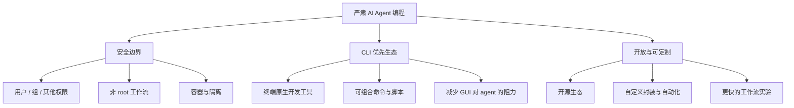

<BilibiliVideo bvid="BV1gGQQBoELw" />

<TOCInline fromHeading={1} toHeading={2} toc={props.toc} />

---

## Agent 时代，操作系统的问题已经变了

很长一段时间里，开发者选择操作系统，主要是在选择更好的**人类界面**。大家比较的是桌面精致度、应用生态、驱动支持，以及日常使用是否顺手。但到了 **AI agent coding** 时代，最核心的问题已经变了。更重要的已经不是“哪个系统更适合我去点击操作”，而是 **“哪个系统能给 agent 提供更安全、更可组合、更可自动化的执行环境？”**

从这个角度看，Linux 比其他选择更贴合这种工作流。这并不是说 Linux 完美无缺，也不是说每个开发者都应该立刻迁移。更准确的说法是：**如果你是认真在做 agent-driven coding，Linux 目前提供了最好的基础环境**。它的安全边界更清晰，软件生态更自然地偏向 CLI，而它开放的设计也更容易让系统随着新型 agent 工作流一起演化 <a href="#ref-1">[1]</a> <a href="#ref-2">[2]</a>。

这个判断其实也延续了我们前面几篇文章的方向。在 [《更好的 AI IDE》](/zh/blog/ide/great-ai-ide) 中，我们提出软件应该**先服务 AI，再服务人类**。在 [OpenCode 介绍](/zh/blog/tools/opencode-cli) 和 [四层多 agent 工作流](/zh/blog/tools/four-layer-multi-agent-workflow) 里，我们也从工具层面表达了类似的观点：agent 最适合通过仓库、终端和结构化自动化来工作，而不是依赖大型 GUI 界面 <a href="#ref-3">[3]</a> <a href="#ref-4">[4]</a> <a href="#ref-5">[5]</a>。如果把这个问题继续下沉到操作系统层，Linux 恰好就是最贴近这种模型的环境。

## 严肃的 Agent 编程到底需要什么

严肃的 agent 工作流并不只是“更会营销的自动补全”。一旦 agent 开始读文件、改代码、跑测试、安装依赖、启动进程、协调多步骤任务，操作系统本身就会成为工作流的一部分。从实践上看，这意味着 OS 至少要在三个方面足够强。

第一，它需要有**清晰的安全边界**。Agent 之所以有价值，正是因为它能够执行动作，但这也意味着它必须有明确的权限范围。第二，它需要提供一个**CLI-first 的软件环境**，因为 agent 天然更适合通过命令工作，而不是通过像素和按钮工作。第三，它必须保持**开放和可定制**，因为 agent 时代还在快速变化，工作流演进的速度远快于厂商预设的桌面抽象。

Linux 在这三点上都很强。这也是为什么在 agent 时代，它比过去传统 IDE 时代更值得被重新讨论。

## 为什么 Linux 更适合 Agent 工作流

上面的图概括了本文的核心论点。Linux 之所以“更适合”，不是因为某一个单独特性，而是因为**三种优势会相互强化**。安全边界让 agent 更容易被约束，CLI 工具让工作流更容易被编排，而开放性则让整套系统能随着工作流变化继续演进。

## 原因一：Linux 为 Agent 执行提供了更好的安全边界

第一点是**安全性**。Linux 建立在一个简单、古老、但至今仍然非常有用的权限模型上：每个文件和目录都属于某个用户和某个组，而访问权限则被划分为 **user、group、other** 三个范围 <a href="#ref-1">[1]</a>。这个模型并不新鲜，但当一个 agent 被允许进入真实工作环境执行任务时，这种显式边界反而非常重要。

一个 AI coding agent 本来就不应该轻易拥有整台机器的无限权限。在 Linux 环境下，人们更容易按“作用域”来思考：哪个用户拥有这个仓库，哪些目录可写，哪些进程属于哪个账号，哪些操作必须提升权限。Linux 并不会自动让系统变安全，但它确实让系统更容易被理解、被推理。如果你希望 agent 被限制在某个仓库、某个工作区，或者某个服务账号里，Linux 天然就给出了表达这些边界的方式。

Linux 还受益于围绕它发展出来的一整套隔离机制。容器、namespaces、cgroups、chroot、按用户划分的服务，以及虚拟机，都与 Linux 世界天然契合 <a href="#ref-2">[2]</a> <a href="#ref-6">[6]</a>。落到实践里，这意味着你可以把 agent 放进**边界明确的环境**里运行，而不是把整台桌面机器当成一整块没有分层的执行表面。当一个 agent 被限制在 worktree、容器，或者非特权用户账号中时，误操作更容易被控制，恶意行为也更难扩散。

这里还有一个更深的架构问题。传统桌面软件常常默认“操作者是可信的人类，并且始终在线盯着每一步”。而 agent 工作流打破了这个前提。如果系统要代表用户执行更长的动作链路，那么 **权限粒度和隔离质量的重要性，就会超过视觉层面的便利性**。

## 原因二：Linux 拥有最自然的 CLI 生态，最适合 Agent

第二点是日常使用中最明显的一点：**Linux 拥有最强的 CLI-first 软件生态**。Agent 的工作方式并不像人类使用桌面那样。它们不会真正从层层菜单、浮动工具栏或者精致的拖拽交互中获益。它们更适合的是：工具暴露出清晰的文本接口、可组合的命令，以及机器可读的输出。

这也是为什么随着 agent coding 的兴起，`git`、`rg`、`fd`、`fzf`、`sed`、`jq`、`tmux`、`docker`、`pytest` 以及各种构建系统 CLI 变得更重要。这些工具原本就是严肃终端开发的骨架，而到了 agent 时代，它们只会变得更核心。人类可能会喜欢这些工具的 GUI 包装层，但 agent 通常并不需要。很多时候，这类包装层只是额外的间接层。

这也正是我们之前提出“理想的 AI IDE 应该专注于 **prompting 和 verifying**，而不是继续往工作流上堆更多界面外壳”的关键原因 <a href="#ref-3">[3]</a>。在 Linux 上，这种模型会显得格外自然，因为操作系统本身早就把终端当作一等公民。整个生态里有大量工具本来就是为了被串联、被脚本化、被记录、被检查、被重复运行而设计的。这正是 agent 所需要的。

一个很有意思的近期例子是 [CLI Anything](https://github.com/HKUDS/CLI-Anything)。这个项目试图把复杂软件操作转成 agent 更容易调用的 **CLI wrapper** <a href="#ref-7">[7]</a>。它背后的思路其实很有代表性：当软件过于 UI-heavy 时，人们的一种反应是再包一层命令行接口，让 agent 可以更自然地使用。这恰恰说明了一件事：在 agent 时代，很多漂亮的 UI 并不是优势，反而可能是**翻译成本**。

这当然不是说 UI 没有价值。人类依然需要审查、引导和批准结果。但从 agent 的角度看，复杂 GUI 往往更像负担，而不是优势。Linux 特别突出的地方就在于，它的大量文化、工具和开发实践，本来就是围绕**文本接口、管道、脚本和自动化**建立起来的。

## 原因三：Linux 更开放，因此 Agent 工作流演化得更快

第三点是**开放性**。Linux 不只是一个内核，或者一个桌面选择，它还是更广泛开源生态的一部分。这个生态鼓励人们去查看、修改和重新组合系统。之所以这一点重要，是因为 agent coding 仍然处于很早期的阶段。今天看似标准的工作流，可能一年后就显得不完整了。在一个快速变化的环境里，开放系统天然更容易适应变化。

这一点我们已经在自己的工作流里看到了。OpenCode 给我们 provider-agnostic 的 runtime；Superpowers 提供 worktree、结构化规划和并行执行；iKanban 则提供一个围绕 prompting 与 verification 设计的审查界面，而不是沿用传统 IDE 习惯 <a href="#ref-4">[4]</a> <a href="#ref-5">[5]</a>。这些东西都不依赖某个单一厂商来规定“正确的体验”应该长什么样。正因为外围生态足够开放，我们才能把这些组件重新组合成适合自己的工作流。

这种开放性也会继续影响操作系统层。对于 Linux 来说，定制 shell、终端、compositor、service manager、包管理器，以及开发环境，本来就是常态。我们在之前的 [NixOS 之旅](/zh/blog/misc/nixos-config-journey) 里也写过，Linux 最终不只是一个运行应用的平台，而是一个可以**声明并复现整个环境**的平台 <a href="#ref-8">[8]</a>。当机器的“使用者”里开始包含 agent 时，这种能力就显得更重要了。

落到实践上，结论也很直接：当 agent 工作流需要新的抽象层时，Linux 给了它们更快出现的空间。你可以加 wrapper、daemon、脚本、容器、编排层、审查界面，以及权限控制，而不必等待某个平台所有者先批准这条路线。在一个连工作流本身都还在被发明的时代，这种灵活性本身就是很大的优势。

## 为什么这比桌面精致度更重要

这篇文章其实可以被压缩成一句话：agent 时代改变了“最佳操作系统”的评判标准。如果主要操作者是人类，那么桌面精致度、应用设计和生态便利性自然会主导讨论。但如果主要操作者越来越像是一个**由人类监督的 AI agent**，那么真正重要的指标就会转向权限清晰度、自动化质量和系统可组合性。

也正因为如此，Linux 在今天看起来会比过去那些桌面中心的比较里更强。那些曾经被看作“只有 power user 才在意”的特性，反而正是 agent 最需要的东西。一个 shell-friendly 的环境、明确的进程和文件边界、可脚本化的工具、可复现的系统配置，以及开放的自定义能力，在软件工作逐渐通过 prompt 和自动化委托出去之后，都会变得更加有价值。

这也是为什么 Linux 会和更广义的 keyboard-first、AI-first 工作流如此契合。回看我们之前关于 IDE 演进和终端中心工具链的文章，会发现一个反复出现的趋势：更少的 GUI 层、更直接的控制、更清晰的工具边界。Linux 之所以特别适合这个方向，不是因为它突然变了，而是因为它几十年来一直就在为这种工作方式优化。

## 一个必要的限制：适合严肃工作流，不等于适合所有人

当然，限制也必须说清楚。这篇文章**不是**在说 Linux 自动就是每个人、每个团队、每种计算场景的最佳选择。很多用户更在意商业桌面应用、硬件支持、游戏体验、办公软件，或者一个更平滑的默认系统体验。这些需求都是真实存在的，也完全可能盖过 agent-centric 的考虑。

本文更窄、更实际的判断只是：**对于严肃的 AI/agent 编程工作流，Linux 目前是最合适的选择**。如果你的日常工作越来越依赖 agent 去读仓库、调用工具、跑测试、管理分支、在隔离环境里工作，并参与结构化自动化，那么 Linux 会给这种开发方式提供最连贯的基础。它与 agent 的真实工作方式更贴近。

这个区分很重要，因为它让结论落在事实上，而不是落在意识形态上。Linux 在这里胜出，不是因为信仰，而是因为工作流已经变了。

## 总结

在 agent coding 时代，我们应该换一种方式来问“操作系统该怎么选”。真正的问题不再是哪个平台在传统桌面比较里最舒适，而是哪个平台最能支持**安全、可脚本化、agent-driven 的执行**。在这个问题上，Linux 的答案最强。

原因可以归结为三点。第一，Linux 拥有更清晰的**安全与权限边界**，这对于 agent 直接操作文件和进程尤其重要。第二，Linux 拥有最成熟的 **CLI-first 生态**，而这种生态比 GUI-heavy 软件更符合 coding agent 的自然工作方式。第三，Linux 更**开放、可定制**，因此当 agent 工作流继续演化时，它更容易随之调整。

所以，如果你的目标是严肃的 AI coding，而不是泛消费级的使用便利，那么 Linux 就不只是开发者的怀旧偏好。它恰好是那个在设计假设上最符合 agent 时代的操作系统。🐧

---

## 参考资料

<ol>
  <li id="ref-1"><a href="https://man7.org/linux/man-pages/man1/chmod.1.html">Linux chmod manual</a> —— Unix 风格文件权限控制的背景资料。</li>
  <li id="ref-2"><a href="https://man7.org/linux/man-pages/man7/namespaces.7.html">Linux namespaces manual</a> —— 容器与沙箱所依赖的进程与资源隔离机制。</li>
  <li id="ref-3"><a href="/zh/blog/ide/great-ai-ide">更好的 AI IDE：软件应先服务 AI，再服务人类</a> —— 我们此前关于 AI-first、CLI-centered 界面的论述。</li>
  <li id="ref-4"><a href="/zh/blog/tools/opencode-cli">OpenCode：Claude Code 的开放替代方案</a> —— 为什么 provider-agnostic runtime 对 agent 工作流重要。</li>
  <li id="ref-5"><a href="/zh/blog/tools/four-layer-multi-agent-workflow">终于在预算内跑起来的四层多 Agent 工作流</a> —— 我们最近关于多 agent 执行、隔离与审查的工作流总结。</li>
  <li id="ref-6"><a href="https://systemd.io/CONTAINER_INTERFACE/">systemd container interface documentation</a> —— Linux 原生隔离与服务边界环境的一个例子。</li>
  <li id="ref-7"><a href="https://github.com/HKUDS/CLI-Anything">CLI Anything</a> —— 一个把复杂应用操作封装成 CLI 接口供 agent 调用的项目。</li>
  <li id="ref-8"><a href="/zh/blog/misc/nixos-config-journey">从 Ubuntu 到 NixOS：一段完整的配置管理之旅</a> —— 我们此前关于可声明、可复现 Linux 环境的文章。</li>
</ol>
