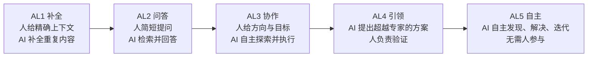
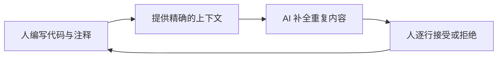
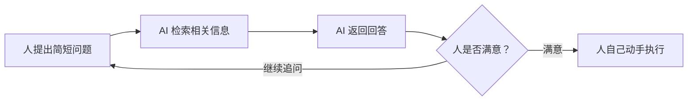
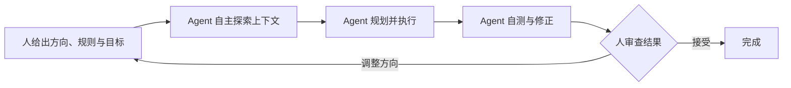
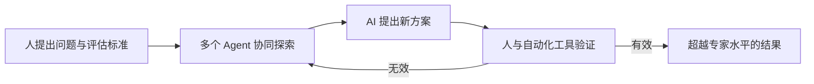
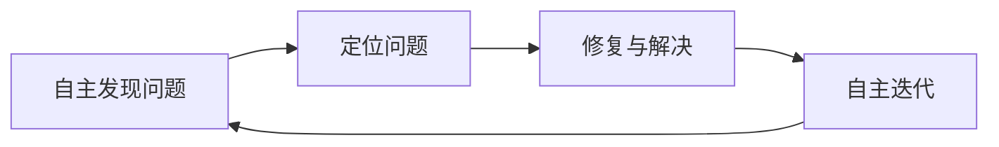

<BilibiliVideo bvid="BV11DhR61ECC" />

[在 Bilibili 上观看视频](https://www.bilibili.com/video/BV11DhR61ECC/)

<TOCInline fromHeading={1} toHeading={2} toc={props.toc} />

---

## 引言

这两年，我们在博客里记录了很多 AI 工具的变化：从 [GitHub Copilot 的代码补全](/zh/blog/ide/ai-code)，到网页里的对话助手，再到 [Claude Code](/zh/blog/tools/claude-code-config)、[OpenCode](/zh/blog/tools/opencode-cli) 这类可以自己读文件、跑命令的 agent，以及后来的[多 agent 并行](/zh/blog/tools/multi-agent-parallel)和 [dynamic workflows](/zh/blog/tools/dynamic-workflows)。每一次变化都很具体，但放在一起看时，我们一直缺少一个统一的坐标系，来回答一个简单的问题：**现在的 AI 到底处在哪个阶段？**

现有的分类方案并不少。有的按模型能力划分，例如 OpenAI 提出的从 Chatbots、Reasoners 到 Agents、Innovators、Organizations 的五级路线；有的按通用智能的程度和广度划分，例如 Google DeepMind 的 _Levels of AGI_。这些框架各有侧重，但往往与具体的模型、技术路线或评测方式绑定，很难从一个足够大的角度，把补全工具、聊天助手、coding agent、多 agent 系统同时装进去。

自动驾驶的分级提供了另一个思路。SAE 把驾驶自动化分为 L0 到 L5，它**不关心**车用的是激光雷达还是纯视觉，也不关心模型结构，只关心一件事：**在驾驶这项任务中，人和系统分别承担了多少责任。** 如果我们也采用这种“只看最终效果、不看技术细节”的视角，就可以把 AI Agent 的能力分为 **AL1 到 AL5**，并把过去几年的各种产品形态都放进同一张图里。

从左到右，AI 承担的部分越来越多，人的角色则从“写代码的人”逐渐变成“提问的人”“给方向的人”“做验证的人”，最后在 AL5 中完全退出。下面我们先对照一下自动驾驶的分级，再逐层展开。

## 从自动驾驶借来的坐标系

自动驾驶分级的核心，是**驾驶责任的转移**。L1 和 L2 中，人始终是驾驶员，系统只是辅助；L3 中，系统可以在特定条件下接管驾驶，但人必须随时准备接手；L4 在限定场景内不再需要人；L5 则在任何场景下都不需要人。

AI Agent 的分级也可以用同样的方式来理解，只是把“驾驶”换成“完成一项知识工作”，把“责任”换成“谁提供上下文、谁决定方向、谁判断结果”。

| 等级 | 自动驾驶（SAE） | AI Agent（AL）   | 谁提供上下文   | 谁决定方向      | 典型形态                       |
| ---- | --------------- | ---------------- | -------------- | --------------- | ------------------------------ |
| L1   | 驾驶辅助        | 补全工具         | 人，且必须精确 | 人              | Copilot 代码补全               |
| L2   | 部分自动化      | 问答助手         | 人给出简短提问 | 人              | 网页对话、聊天助手             |
| L3   | 有条件自动化    | 自主探索的协作者 | AI 自己探索    | 人              | Claude Code、OpenCode 等 agent |
| L4   | 高度自动化      | 方案的引领者     | AI 自己探索    | AI 主导，人验证 | 少数领域中的多 agent 研究系统  |
| L5   | 完全自动化      | 完全自主         | AI             | AI              | 尚未出现                       |

有一点需要说明：这里的划分不追求严格的边界。AL2 与 AL3 之间就存在一段模糊地带，某些产品也可能同时具备多个等级的特征。分级的价值不在于给每个工具贴一个精确的标签，而在于帮助我们看清**人在整个协作过程中的位置**。

## AL1：需要精确上下文的补全工具

AL1 的代表，是 2021 年前后的 GitHub Copilot。我们在 [AI 编程](/zh/blog/ide/ai-code)一文中回顾过，早期的 Copilot 更像一个**智能代码片段生成器**：我们写下函数签名或一行注释，它补全后面的实现。

这一层级的关键特征是：**AI 完全依赖我们给出的上下文。** 它看到的是光标附近的代码、当前文件，以及我们刚刚写下的注释。只有当上下文足够明确时，它才能补出正确的内容，而它补出的通常也是那些重复性、模式化的部分，例如样板代码、相似的分支或常见的算法实现。

在 AL1 中，人仍然是真正的“驾驶员”。我们决定写什么、怎么写，AI 只是让手上的动作更快一些。我们在 [VSCode 加上 Neovim](/zh/blog/ide/vscode-neovim) 中描述的 Copilot 补全体验，就是这一层级的典型状态。

## AL2：根据简短提问检索信息的问答助手

到了 AL2，交互方式从“补全”变成了“对话”。我们不再需要写出精确的上下文，只需要给出一个**较短的提问**，AI 就可以返回与问题最相关的信息。它回答的往往是我们不太熟悉、但相对通用的内容：某个 API 怎么用、某个概念是什么意思、某段报错可能是什么原因。

从产品形态来看，AL2 对应的是网页对话。我们在 [NextChat 接入 DeepSeek R1](/zh/blog/misc/chat-deepseek) 中搭建的本地聊天客户端，以及 [Neovim 中的 CodeCompanion](/zh/blog/misc/neovim-ai) 聊天缓冲区，都属于这一类。换到非编程场景也是一样：假设我们有一个网店，可以让 AI 客服回答“店里有哪些商品”“每件商品的价格是多少”。

AL2 的局限同样清楚：**它没有自主发现的过程。** 它回答的是我们问的问题，不会主动去查看代码仓库、运行命令，或者追踪一个问题背后的其他线索。回答之后，真正的执行仍然由人完成。

## AL3：给出方向后自主探索的协作者

AL3 是今天大多数人所处的状态，也是我们日常工作的主要状态。

在这一层级，我们只需给出一个**比较简短的提示**，agent 就会自己去探索：读取相关文件、搜索代码、查阅文档，找到与提示最相关的上下文。然后，它会根据这些上下文，结合我们给出的规则与目标去执行任务，并尝试把一个边界明确的任务完整做完。我们在 [从 Vibe Coding 到 Agent Coding](/zh/blog/ide/ai-vibe-coding-2026) 中记录的，正是从 AL2 走向 AL3 的这段转变。

从我们的使用经验来看，AL3 的成功率已经处在一个比较高的水平：一般任务在 **50% 以上**，如果使用最好的模型，可以达到 **70% 到 80%**。不过，这个成功率有一个前提：**我们自己对这件事有充分的了解。** 通常的情况是，我们脑子里已经有一个完整的想法，知道这件事该往哪个方向做、大致分几步，然后把方向和过程描述给 agent，由它来完成实现。

围绕这一层级，我们已经做了很多工作流上的尝试：用 [Claude Code 的配置、subagents 与 MCP](/zh/blog/tools/claude-code-config) 扩展 agent 的能力，用 [多 agent 并行](/zh/blog/tools/multi-agent-parallel) 提升吞吐量，用 [dynamic workflows](/zh/blog/tools/dynamic-workflows) 让 Claude 自己编排一支 agent 队伍，以及尝试[让 agent 接管更多原本由人承担的验证循环](/zh/blog/tools/ai-agent-own-what-we-owned)。我们也发现，[同一个模型换一个 harness，表现也会不同](/zh/blog/tools/model-harness-fit)，这说明 AL3 的能力不只来自模型本身，也来自它的运行环境。

但 AL3 有一个明显的边界：**它的自主发现，必须建立在人给出方向和目标之后。**

如果我们让 AL3 级别的 agent 自己去选方向、做决策，它会倾向于选择**训练数据中最多、最常规的方案**。对于常见的工程任务，这通常没有问题，甚至是优点；但如果任务要求新颖性或创新性，例如提出一个新的研究方法，或者设计一个没有先例的架构，AL3 就很难处理好。我们在 [如果我们拥有 AI，我们也拥有它的能力吗？](/zh/blog/tools/is-ai-ability-really-our-ability) 中讨论过类似的现象：agent 可以快速实现 baselines、运行实验，但在方法选择、创新边界和论文整体逻辑上，仍然需要人来判断。

所以，AL3 的角色始终是一个**协作者**，而不是引领者，也不是 leader。方向感仍然来自人。

## AL4：提出超越人类专家方案的引领者

AL4 与 AL3 的根本区别，在于**方案由谁主导**。

在 AL4 中，AI 可以给出超出人类专家水平的方案：这些方案是我们自己想不到的，甚至领域专家也给不出来的，而且经过验证，它们确实有效。此时，在整个人机协作的过程中，**AI 给出的方案占据主导地位**，人的角色则转向提出问题、提供验证手段，以及判断结果是否成立。

目前，AL4 只在少数领域出现了一些成果。数学和算法领域是最典型的例子：这些问题复杂度很高，但结果可以被严格验证。例如 Google DeepMind 的 [AlphaEvolve](https://deepmind.google/discover/blog/alphaevolve-a-gemini-powered-coding-agent-for-designing-advanced-algorithms/) 通过多个模型与自动化评估器的循环，在部分矩阵乘法和数学构造问题上找到了优于已知结果的解。这类系统的共同点是**多 agent 协同加上可自动验证的目标**，而这也恰好解释了为什么 AL4 目前只在少数领域出现。

AL4 也让验证问题变得更尖锐。当 AI 的方案超出了人的理解范围，我们如何确认它是对的？我们之前讨论过的[探索与验证悖论](/zh/blog/tools/is-ai-ability-really-our-ability)在这里会更加明显：数学和算法可以依靠证明或 benchmark，但在很多缺少客观评估标准的领域，AL4 还很难落地。

## AL5：完全不需要人参与的自主系统

AL5 是这条路径的终点：**把人从整个流程中移除。**

在 AL5 中，系统不需要人给方向，也不需要人做审核。它自己发现问题、自己定位问题、自己修复问题，然后持续自主地迭代下去。

需要区分的是，我们在 [AI Agent 应该接管那些原本由我们自己承担的部分](/zh/blog/tools/ai-agent-own-what-we-owned) 中提出的方向，**并不是 AL5**。那篇文章的主张是把人从每个任务的内部循环里拿掉，但人仍然保留最终批准、拒绝分支和重写目标的权力，这更接近于一个验证能力更强的 AL3。AL5 则意味着连这一层外部循环也不再需要人。

就目前来看，AL5 还没有真正出现。

## 总结

回到开头的问题：**现在的 AI 处在哪个阶段？**

如果只看最终效果和人机分工，今天的主流状态是 **AL3**：人给出方向和目标，agent 自主探索上下文并完成执行，在我们熟悉的任务上已经有相当高的成功率。AL1 和 AL2 已经成为日常工具的一部分；AL4 在数学、算法等可以严格验证的领域出现了少量成果；AL5 仍然是一个尚未抵达的终点。

| 等级 | 人的角色   | AI 的角色              | 当前状态             |
| ---- | ---------- | ---------------------- | -------------------- |
| AL1  | 写代码的人 | 补全重复内容           | 已普及               |
| AL2  | 提问的人   | 检索并回答             | 已普及               |
| AL3  | 给方向的人 | 自主探索与执行的协作者 | 主流，成功率 50%~80% |
| AL4  | 做验证的人 | 提出方案的引领者       | 少数可验证领域中出现 |
| AL5  | 不再参与   | 完全自主               | 尚未出现             |

这套分级对我们自己的启发是：从 AL3 走向 AL4，关键不只是模型更强、token 更多，而是 **AI 能否在没有人给方向的情况下，选择一条非常规但正确的路径，并且有办法证明它是对的**。在那之前，人在协作中的价值，主要体现在给出方向、判断创新性，以及验证结果。

---

## 相关文章与资源

- [**AI 编程**](/zh/blog/ide/ai-code)
- [**VSCode 加上 Neovim：终极编辑器组合**](/zh/blog/ide/vscode-neovim)
- [**使用 DeepSeek R1 的 NextChat**](/zh/blog/misc/chat-deepseek)
- [**从 Vibe Coding 到 Agent Coding**](/zh/blog/ide/ai-vibe-coding-2026)
- [**多 Agent 并行工作流：从写代码的人到指挥调度者**](/zh/blog/tools/multi-agent-parallel)
- [**从手动拆任务到 Dynamic Workflows**](/zh/blog/tools/dynamic-workflows)
- [**AI Agent 应该接管那些原本由我们自己承担的部分**](/zh/blog/tools/ai-agent-own-what-we-owned)
- [**如果我们拥有 AI，我们也拥有它的能力吗？**](/zh/blog/tools/is-ai-ability-really-our-ability)
- [**同一个模型，换个 Harness，为什么表现会变？**](/zh/blog/tools/model-harness-fit)
- [**SAE J3016：驾驶自动化等级**](https://www.sae.org/standards/content/j3016_202104/)
- [**Levels of AGI: Operationalizing Progress on the Path to AGI**](https://arxiv.org/abs/2311.02462)
- [**AlphaEvolve：用于设计高级算法的 Gemini 驱动编程 Agent**](https://deepmind.google/discover/blog/alphaevolve-a-gemini-powered-coding-agent-for-designing-advanced-algorithms/)
