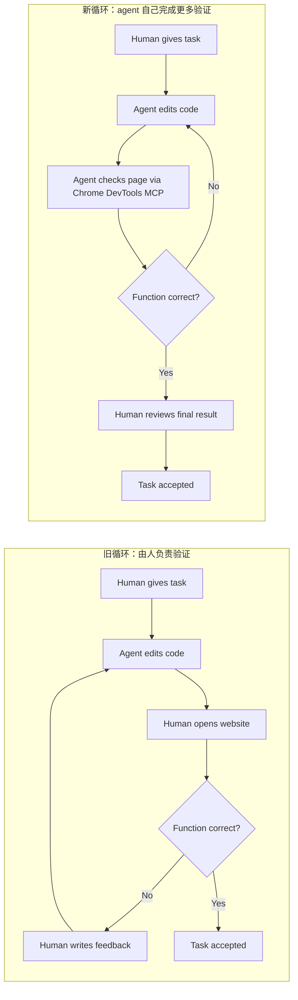

<BilibiliVideo bvid="BV1XUddBpEQ7" />

<TOCInline fromHeading={1} toHeading={2} toc={props.toc} />

---

## 引言

过去两年里，**vibe coding 的演化速度非常快**。最早那一阶段，主要还是 Copilot 式的辅助：ask mode、自动补全，以及编辑器里比较短的对话式帮助。再往后，工作流开始走向 **auto mode**，最后进一步走到 **agent mode**。这时模型做的事情已经不只是“给建议”，而是会读文件、改代码、跑命令，并尝试把一个边界明确的任务完整做完。

伴随这个变化，agent 能拿到的 **context** 也越来越多。它可以读更大的代码库、检查 diff、加载可复用的 skills、通过 MCP 调外部工具，看到的任务表面已经比早期 coding assistant 丰富很多。在单 agent 场景里，这种能力已经足够有用：人给出意图，agent 负责实现，人再判断结果是否可以接受。

这种 **human-in-the-loop** 模式，依然是 vibe coding 里最关键的思想之一。对于一个 agent 处理一个任务，这往往是合理设计。人负责给方向，最后再做判断。问题在于，这套逻辑**并不能自然扩展到真正的多 agent 系统**。

如果每个任务、每个子任务、每个 session 都要求人回来手动检查结果，下一步才能继续，那么整个系统的吞吐上限就不再由模型质量或 token 预算决定，而是由**一个人的审查带宽**决定。

所以我现在越来越觉得，下一步更重要的方向是：**不是把人从整个系统里拿掉，而是尽量把人从每个内部循环里拿掉，只要 agent 自己有能力完成验证**。人的监督依然重要，人的最终批准依然重要。但如果我们想让 agent 处理长时间任务，想让多 agent 系统真正并行起来，就必须更明确地走向一种 **anti-human-in-loop for each task/session** 的设计。

## 到处都要 Human-In-The-Loop 的问题

在现在常见的 vibe coding 工作流里，人通常会反复扮演同一个角色：

- 让 agent 去实现某个功能
- 自己检查结果看起来对不对
- 再给一轮反馈
- 让 agent 继续修改
- 重复这个过程，直到结果足够好

这套循环之所以成立，是因为很多软件任务并不能只靠“代码已经生成出来了”就判断完成，真正负责判断的是人类。但这也意味着，agent 其实并没有真正做完任务。它只是交出了一版结果，然后停下来等待人类判断，才能继续下一步。

对单个功能来说，这当然还能接受。但对 **多 agent 工作流** 来说，这会在另一个维度上变得昂贵。哪怕你已经有足够的 token，也能同时跑多个 agent，它们仍然会在同一个地方停住：都需要同一个人告诉它们“能不能继续”。

所以我认为，更实际的目标并不是抽象意义上的“完全自治”，而是一个更窄、也更有用的目标：**在 agent 实际能观察的领域里，让它自己承担更多验证循环**。一旦做到这一点，人类就不需要盯着每一次小迭代。人的工作可以往更高层移动：接受这个功能、拒绝这个分支、重跑任务，或者重新改写目标。

这件事很重要，因为它会把 agent 从一个“聊天式 coding assistant”，推进成一个更像工作流引擎的东西，能够持续处理更长时间的任务。

## 以网站开发为例

前端和网站开发，最能直观看出这种差别。

在旧循环里，流程通常是这样的：你让 agent 改代码，等它改完，自己打开网页看 UI，判断功能是不是对的、页面是不是坏了，然后再把这一轮反馈发回给 agent。换句话说，agent 虽然在写代码，但**功能是否正确**这一层判断，仍然是人类自己承担。

这种方式当然有价值，但也让 agent 永远停留在一个**不完整的开发循环**里。它会写，但它不会真正“看见”。它无法确认布局有没有坏掉，交互是不是能正常工作，最后页面呈现出来的行为是不是符合任务要求。

一旦我们给 agent 加上 **Chrome DevTools MCP** 这样的工具，情况就开始变化了。agent 可以自己打开运行中的页面，检查 DOM，观察布局状态，读取错误信息，并判断当前实现的功能是否真的达到了预期。这并不意味着 agent 就不会犯错，但它确实开始能**自己闭合更多循环**了。

这带来的变化不只是更方便，而是改变了什么样的任务可以被放着自己跑。

在第一种循环里，人类始终位于每一次迭代内部；而在第二种循环里，人被往外移了一层，变成**完成一个局部闭环之后的审查者**，而不是每一轮修正都要亲自驱动的人。

这正是让长时间 agent 任务更实际的关键。如果 agent 能自己实现、自己检查、自己修正、自己重试，而不是每一个小步骤都等着人类回来处理，那么这个任务就更容易被放心放在那里跑。再进一步，一旦任务可以这样运行，**多 agent 并行执行也会变得现实得多**。多个 agent 可以更长时间地独立工作，因为它们不会都堵在“等同一个人看中间状态”这个点上。

## 不是把人从系统里拿掉，而是把人从内部循环里拿掉

这里需要说得很准确。我**不是**在说人类已经不重要了。人仍然负责设定目标、定义约束、判断优先级，并做最终验收。在很多任务里，人也依然提供产品判断，而这类判断现在的工具还远远不能完全替代。

我真正想说的是：当 agent 已经有足够工具去直接观察结果时，人类不应该还被迫参与**每一个局部修正循环**。

这也是为什么 MCP 在实践里如此重要。它的意义不只是“给 agent 接更多工具”，而是让 agent 能够**看见自己行为造成的后果**。一个没有观察能力的 coding agent，很多时候仍然只是代码生成加猜测；而一个拥有浏览器检查、测试执行、文档检索和结构化工作流的 agent，才开始更像一个边界明确的自治 worker。

对多 agent 系统来说，这个区别尤其关键。如果每个子任务在每轮迭代里都还要求人类检查，那么多加几个 agent，只会等于多制造几次让同一个人停下来审查的机会。但如果 agent 能接管更多自己的局部循环，那么同一个人就可以监督更多并行工作。

这也是我理解里“AI agents should own what we used to own”的实际含义：它们应该越来越多地接手那些原本需要人类持续微观参与的部分，尤其是**局部验证与重试循环**。

## 现在什么场景已经比较适合

按照我们现在的经验，适合范围其实已经比较清楚。

对于**一个中等复杂度任务**，如果 agent 拿到足够上下文，也有足够工具去实现和验证结果，那么一个 agent 往往已经能做得很好。对于**多个相互独立的任务**，并行 agents 也已经很有效，只要每个任务边界足够清晰，而且具备一定局部自治能力，不会频繁卡在等人类反馈上。

下一步真正更难的问题是通信。当多个 agent 同时运行时，更困难的问题已经不只是“怎么把它们启动起来”，而是**怎么让它们进行异步通信**，同时又不把整个流程搞乱。因为很多真实问题不是线性的，它们会包含部分依赖、分支探索、重试，以及不同时间点出现的新信息。

我觉得这是接下来最值得认真学习的东西。我们已经知道，一个 agent 可以处理边界明确的任务；也已经知道，多个独立任务可以并行起来。下一道门槛，是怎样让多 agent 系统异步交换有用状态，让整个工作流可以更高效地处理复杂、非线性的问题，而不是又退回到由人类手工做所有协调。

## 总结

这里最大的结论其实很简单：**human-in-the-loop 依然有价值，但 human-in-every-loop 不具备可扩展性。** 前者适合单 agent 的 vibe coding，后者一旦放到多 agent 系统里，就会立刻变成人类自己成为瓶颈。

网站开发的例子把这件事说明得很具体。在旧工作流里，人类需要反复打开页面、测试功能、再告诉 agent 哪里不对；而有了 **Chrome DevTools MCP** 之后，agent 开始可以自己观察结果、自己修正实现，然后只在局部循环已经接近完成时再回到人类这里。

所以我认为，agent coding 的下一阶段，不只是更强的模型，也不只是更大的 context window，而是一次**循环所有权的转移**。当 agent 能接手越来越多边界明确的验证循环时，人类就不再频繁成为瓶颈，长时间运行任务和并行多 agent 工作流也才会真正变得可行。

就目前来看，这种模式已经很适合一个 agent 处理一个中等复杂度任务，也适合多个独立任务并行推进。而再下一步，就是去学习怎样构建**异步 agent 通信**，让多 agent 系统能更高效地面对复杂、非线性的工作。

---

## 相关文章

- [**从 Vibe Coding 到 Agent Coding：我们构建软件方式的 15 个月转变**](/zh/blog/ide/ai-vibe-coding-2026)
- [**多 Agent 并行工作流：从写代码的人到指挥调度者**](/zh/blog/tools/multi-agent-parallel)
- [**终于在预算内跑起来的四层多 Agent 工作流**](/zh/blog/tools/four-layer-multi-agent-workflow)
- [**更好的 AI IDE：软件应先服务 AI，再服务人类**](/zh/blog/ide/great-ai-ide)
- [**OpenCode：Claude Code 的开源替代方案**](/zh/blog/tools/opencode-cli)
