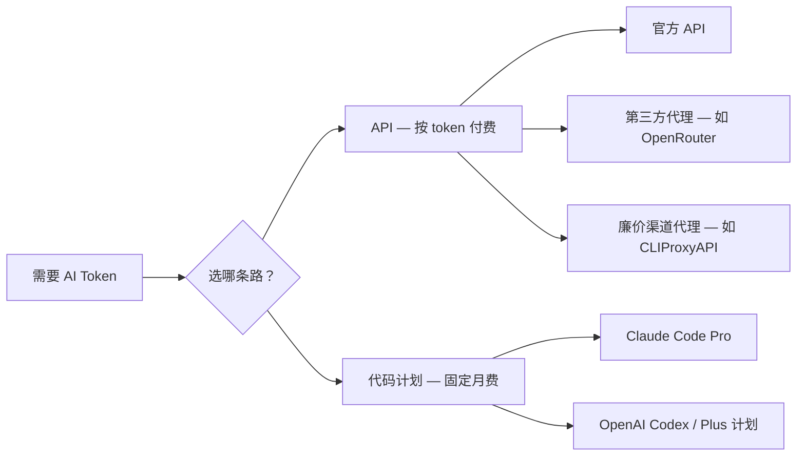

<BilibiliVideo bvid="BV1nCXrBSE5d" />

<TOCInline fromHeading={1} toHeading={2} toc={props.toc} />

---

## Token 预算才是真正的瓶颈

关于 AI 编程工具的讨论，大多集中在模型质量、IDE 集成或使用哪个 agent 框架。但真正决定工作流是否可持续的，是一个更简单的问题：**你能负担多少次 prompt？**

一次复杂的 agent 会话——模型读取文件、修改代码、运行测试、反复迭代——消耗的 token 远比普通对话多得多。如果单次会话成本太高，你会不由自主地调整行为：缩短 prompt、减少重试、放弃并行。这种无声的妥协，悄悄抹平了 agent 本应带来的生产力提升。

获取这些 token 有两条根本不同的路径。一是 **API 路线**，按消耗的 token 付费；二是**代码计划路线**，支付固定月费并获得使用配额。两者有着不同的经济逻辑，选择哪条路取决于你实际的工作方式。

## 两条主要路径

在比较价格之前，先理解两种方式的结构差异。

**API 访问**是按量计费的。你只为实际使用的 token 付费，没有消费上限，也没有使用量上限。这对不规律、低频使用很合适，但 agent 跑长会话时成本会快速攀升，唯一的限制是你的钱包。

**代码计划**（订阅制编程配额）的逻辑正好相反。你支付固定月费，提供商给你一个固定的 token 或请求预算，通常带有基于时间窗口的频率限制——例如每 5 小时或每周滚动上限。单 token 成本远低于 API 定价，但总可用量是有边界的。

## 路径一：API 访问

### 官方 API

最直接的入口是从模型提供商处申请 API key。Anthropic、OpenAI 和 Google 都提供这种方式。优点是稳定可靠、功能完整；缺点是贵。

对于独立开发者来说——那种迭代式、探索性的 agent 会话，模型读代码库、起草修改、循环几轮——单次有意义的任务大约花费 **1–3 美元**。如果 agent 连续跑一个小时，总费用轻松到 5–15 美元。以官方 API 费率作为日常工作流，成本很难持续承担。

官方 API 还有区域访问的问题。在某些地区，直接使用官方 API 需要额外的网络基础设施，增加了摩擦，也让稳定访问变得不那么确定。

### 第三方代理 API

知名的替代方案是 [OpenRouter](https://openrouter.ai/) 这类**多模型聚合代理**，通过单个 API endpoint 汇聚多家提供商的访问。OpenRouter 的吸引力在于广度：Claude、GPT、Gemini 等在一个 key 下都能用，切换零成本。正如我们在 [OpenRouter 成本分析](https://github.com/isomoes/opencode-config/blob/main/docs/openrouter.md) 中描述的，对于想把简单任务路由到便宜模型的工作负载，这个方案很有用。

但 OpenRouter 对顶级模型仍然按完整 API 费率计价。token 成本并没有实质性降低，而且额外的路由层有时会增加延迟。

### 廉价渠道代理（CLIProxyAPI 等）

第三种方式正在变得越来越实用：通过代理把请求路由到比标准商业 API 便宜很多的提供商渠道。[CLIProxyAPI](https://github.com/router-for-me/CLIProxyAPI) 就是这一模式的典型项目。它将模型访问（包括当前的 Claude Sonnet 4.6 等模型）代理到价格**比官方 API 便宜 10–30 倍**的渠道，让原本负担不起的长时间 agent 会话变成可行选项。

需要诚实地说明代价：这些代理渠道**不受官方支持**，随时可能关闭，稳定性无法保证。如果使用方式被检测为违反服务条款，还存在账号封禁风险。对于以成本为首要约束的探索性或实验性工作，这仍然值得尝试。但对于生产或连续性专业使用，稳定性风险是真实存在的。

API 选项的实用对比：

| 选项 | 相对成本 | 稳定性 | 区域访问 | 备注 |
|---|---|---|---|---|
| 官方 API | 基准 | 高 | 受区域限制 | 复杂任务约 $1–3 |
| OpenRouter | 约等于基准 | 高 | 覆盖更广 | 多模型，同价位 |
| CLIProxyAPI（代理） | 便宜 10–30 倍 | 低 | 取决于渠道 | 非官方，有关闭风险 |

## 路径二：代码计划

代码计划是 AI 实验室专门针对编程工具使用场景推出的订阅产品。目前最常用的两种是 Anthropic 的 **Claude Code Pro** 和 OpenAI Plus 计划中包含的 **Codex 使用权**。

### Claude Code Pro

Claude Code Pro 每月 **\$20**（约 140 RMB）。该订阅包含约等于 $140 API 价值的 token 预算，纸面上兑换比例相当不错。计划提供完整的 Claude Code 功能——子 agent 支持、MCP 集成等，具体配置方法参见我们的 [Claude Code 配置指南](/blog/tools/claude-code-config)。

约束在于频率限制。使用量受滚动时间窗口管控，会影响你在某个小时或某一天能多密集地运行并行 agent。对于专注于单任务的单 agent 工作流，配额通常够用。对于多 agent 并行工作流——多个 agent 同时运行的那种，就像我们在[多 agent 并行文章](/blog/tools/multi-agent-parallel)中描述的——会更快触达频率上限，有效 token 预算感觉更小。

Claude 模型的 token 单价也大约是同等 GPT 模型的 **2 倍**，意味着同样的钱能买到的 token 更少。

### OpenAI Codex（Plus 计划）

OpenAI Plus 计划每月 **\$20**（按当前汇率约 40 RMB，具体因地区和支付方式而异），提供包含 GPT 系 agent 的 Codex 编程工作流访问权限。根据我们的本地测试，以标准 API 价格估算，在 Codex 上持续跑一个月大约等值 **$320** 的 API 消耗——这意味着 Plus 计划在相同名义价格下，提供的 token 量显著多于 Claude Code Pro。

我们测量到的具体数字：同样是每月 \$20 的支出，Codex 提供约 **\$320** 的 API 等效 token 价值，而 Claude Code Pro 提供约 **\$140**，仅 token 量就相差 **2.3 倍**。再加上 Claude 模型每 token 约贵 **1.5 倍**，两项叠加后，Codex 在多 agent 场景下的综合成本优势约为 **2.3 × 1.5 ≈ 5 倍**。

正如我们在[四层多 agent 工作流文章](/blog/tools/four-layer-multi-agent-workflow)中描述的，CLIProxyAPI 这类工具还可以作为账号池层来平滑单个订阅固有的频率限制，不过这会增加运维复杂度。

### 代码计划对比

| 计划 | 月费 | 等效 Token 价值 | 频率限制 | 适合场景 |
|---|---|---|---|---|
| Claude Code Pro | $20（≈140 RMB） | ~$140 API 等值 | 有，滚动时间窗口 | 专注单 agent 的工作流 |
| OpenAI Plus（Codex） | $20（≈40 RMB*） | ~$320 API 等值 | 有，滚动时间窗口 | 多 agent、高 token 量场景 |

*各地区定价不同，请以当前实际价格为准。

## 我们的建议

从这些对比中浮现出来的画面相当清晰，尽管没有一个选项是完美的。

**官方 API 是重度 agent 使用中最贵的路径。** 每次复杂会话 $1–3，持续的日常工作流对独立开发者来说难以为继。只有极低频、极少量的使用场景，且需要有保障的稳定性时，才是合适的选择。

**OpenRouter 这类第三方代理**并没有解决重度使用的成本问题。它扩展了模型选择范围，降低了区域访问摩擦，但 token 单价仍与官方 API 处于同一档位。

**廉价渠道代理**解决了成本问题，但引入了稳定性问题。如果工作流需要不间断访问，且无法承受服务中断，这条路不适合作为主要路径。如果你在实验、原型开发，或者愿意以偶尔中断换取大幅降低的成本，它可以作为合理的补充手段。

**代码计划是持续 AI agent 工作的实用基准。** 固定月费、附带配额、与专用工具（Claude Code 或 Codex）深度集成，让工作流感觉稳定可预期。

在 Claude Code Pro 和 Codex Plus 计划之间的选择，取决于你在构建什么：

- **以 Claude Code 为中心的单 agent 工作流**，能充分利用其子 agent 架构、自定义 agent、MCP 集成和完整配置生态，Claude Code Pro 是合适的选择。

- **需要同时运行多个 agent、维持高 token 量、控制成本的多 agent 工作流**，更适合通过 Plus 计划使用 Codex。在相同支出下约 5 倍的成本优势是关键，当 token 预算是瓶颈时，这个差距至关重要。

这正是我们在[四层工作流文章](/blog/tools/four-layer-multi-agent-workflow)中得出的模式：廉价的模型访问是整个技术栈底层的基础，让上面的一切都能持续运行。对于多 agent 并行工作，这目前意味着在纯粹的经济性考量下选择 GPT Codex 而非 Claude——不是因为 Claude 差，而是在需要量的时候，同样的钱能走更远。

---

## 相关资源

- [**DeepSeek 与 Claude Code**](/blog/tools/deepseek-claude-code) — 用 DeepSeek 运行 Claude Code，API 成本降低 68 倍
- [**Claude Code 配置指南**](/blog/tools/claude-code-config) — 包含 agent、命令与 MCP 的完整 Claude Code 配置
- [**多 Agent 并行工作流**](/blog/tools/multi-agent-parallel) — 如何用 vibe-kanban 组织并行 agent 工作
- [**四层多 Agent 工作流**](/blog/tools/four-layer-multi-agent-workflow) — 我们当前兼顾预算的多 agent 技术栈
- [**OpenRouter 成本分析**](https://github.com/isomoes/opencode-config/blob/main/docs/openrouter.md) — Claude Code Pro 与 OpenRouter 详细对比
- [**CLIProxyAPI**](https://github.com/router-for-me/CLIProxyAPI) — 廉价渠道模型访问代理工具
