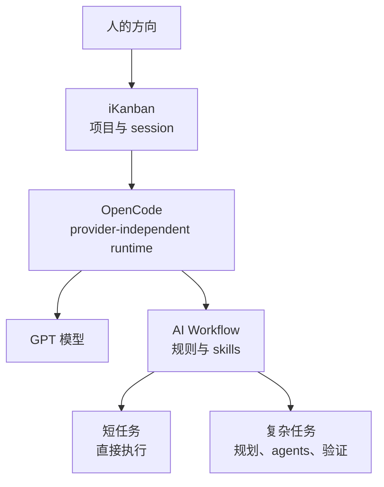
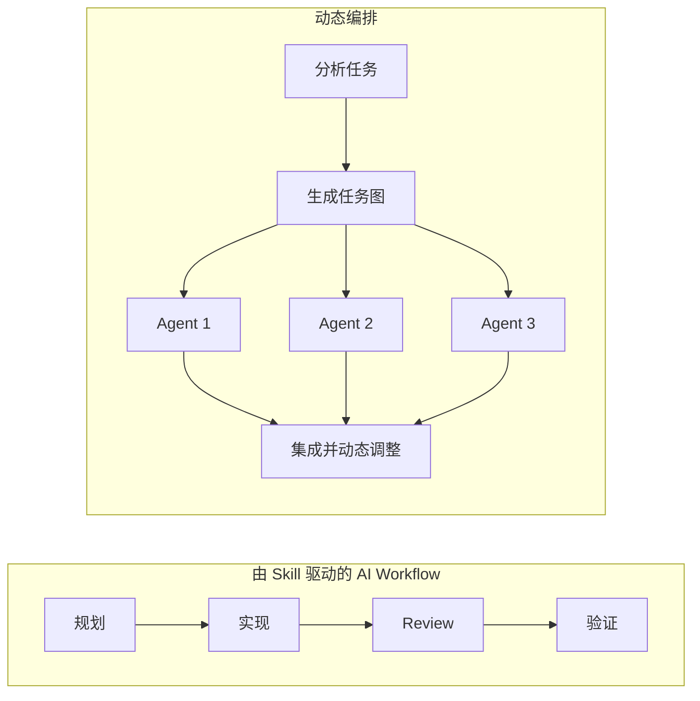

<BilibiliVideo bvid="BV1Hegv6AE1E" />

<TOCInline fromHeading={1} toHeading={2} toc={props.toc} />

---

## 我们提前为这次故障做过准备

我们已经有一段时间没有写日常 AI coding 工作流了。这次重新动笔，不是因为一次计划内的升级，而是因为 Claude 账号被封，我们突然无法再使用 Claude 模型。

这件事甚至有一点熟悉得好笑。模型访问方式变化、账号策略收紧，一套看起来很稳定的工作流可能一夜之间就不能用了。不过这一次，工作并没有因此全部停摆。此前几天，我们已经把 **GPT 加 OpenCode** 重新作为主要工作方式之一。Claude 消失之后，我们失去了一款重要模型和一部分高级编排能力，但没有失去围绕模型搭起来的整套操作系统。

这正是本文想讨论的区别。所谓有韧性的 AI 工作流，并不意味着所有 provider 都可以无差别互换。模型并不相同，它们原生 runtime 的能力也不相同。韧性真正意味着：当其中一层消失时，剩下的层仍然能让有价值的工作继续进行。

这也是我们在 [《OpenCode：Claude Code 的开源替代》](/zh/blog/tools/opencode-cli) 中提出的 provider-independent 思路所经历的一次真实测试。当时，避免 vendor lock-in 更多是一种架构偏好。账号被封之后，它变成了实际的运行要求。

## 现在仍然能运行的工作流

目前的备用方案由三个实际部分组成：

- **OpenCode 和 GPT** 提供模型 runtime。
- **iKanban** 管理分布在不同项目中的 session。
- 基于 Superpowers 思路的 **AI Workflow**，通过可复用的规则和 skill 处理规划、实现、调试、review 和验证。

它们分别解决不同的问题。OpenCode 让 runtime 不必绑定单一 provider。iKanban 让我们能看到并控制散落在多个仓库中的工作。AI Workflow 则让每个 session 都遵循可复用的工程过程，而不是依赖一份过度膨胀的大 prompt。

### 用 iKanban 管理跨项目工作

iKanban 最有价值的场景，是管理单位不再是一个 task，而是**来自不同项目的多个 session**。一个仓库可以在更新文档，另一个仓库里的 agent 同时实现功能，第三个 session 则在调查 bug。通过同一个界面，我们可以看见这组工作，而不必把所有内容塞进同一段对话或同一个终端窗口。

这是 session 层面的并行。每个项目保留自己的 context 和仓库状态，人则可以在它们之间切换，给出方向并 review 结果。iKanban 不会自动理解复杂任务内部的所有依赖，但它不再让“当前正在看的这一个 agent”成为工作量的上限。

### 用 AI Workflow 处理短任务和长任务

在 session 内部，我们使用一组现在统一称为 **AI Workflow** 的规则和 skill。它基于 [Superpowers](https://github.com/obra/superpowers) 的思路：修改之前先理解问题，任务范围足够大时先写计划，隔离相互独立的实现工作，系统化地调试，并且在宣布完成之前进行验证。

关键在于这些行为是模块化的。小任务不应该被迫走完一套长任务流程，它可以使用短路径：检查、修改、验证。大任务则可以分别加载规划、测试驱动开发、subagent 调度、代码 review 和最终验证。于是同一套基础既可以处理五分钟的修复，也可以支撑跨越多个 session 的工作。

与“给自动 scheduler 一条 prompt”相比，这种方式没有那么惊艳，但它更容易迁移。规则和 skill 都是普通的仓库资产。OpenCode 可以加载它们，agent 可以组合它们，而且模型发生变化时，这套过程比藏在某个厂商 runtime 内部的行为更容易保留下来。

## Claude Dynamic Workflows 消失后，我们失去了什么

备用方案可以工作，但它并不等同于此前在 Claude Code 中使用的配置。账号被封之前，我们会把 **ultracode 和 dynamic workflows** 用在一部分最复杂的任务上。正如 [《从手动拆任务到 Dynamic Workflows》](/zh/blog/tools/dynamic-workflows) 所写，Claude 可以分析一个高层方向，为当前任务生成专用的编排 harness，启动多个专业 agent，并让整个任务持续运行数小时。

它改变了交互循环。我们不必反复停下来检查下一步，再补一条 prompt。一个方向可以直接扩展为计划、并行实现队伍、对抗式 review、集成和验证。scheduler 会在运行时根据任务调整 workflow，而不是让我们提前选择每一个 skill 和阶段。

目前的 AI Workflow 还无法复现这种程度的自动化，它有两个相互关联的弱点。

第一，Superpowers 风格的流程仍然比较**线性**。规划结束后才进入执行，执行结束后才进入 review，review 结束后再做最终验证。独立 task 的确可以交给多个 subagent 并行运行，但顶层过程仍然倾向于沿着预定义顺序前进。一旦某个阶段很慢，整个任务都会在它后面等待。

第二，大量始终可见的规则会形成一个**过重的 harness**。更多指令并不一定让 agent 更强。它们会消耗 context、争夺注意力，并让模型变得更保守、更机械。workflow 在形式上更可靠了，却可能失去针对当前问题灵活调整的能力。

这里的差异不只是“串行还是并行”，而是**预定义 workflow 和运行时调度**之间的差异。skill 描述经过验证的工作方法，而 dynamic orchestrator 负责判断当前任务需要哪些方法、应该如何组合，以及哪些部分可以同时运行。

## 下一步：让调度能力可以移植

眼前的工程问题已经很清楚：保留 AI Workflow 的纪律性，但不要强迫每个复杂任务都走一条线性路径，也不要把所有指令塞进同一个巨大 context。

社区已经开始探索如何在厂商官方 roadmap 之外构建更高层的 agent 调度。这一点很重要，因为 orchestration 不应该等到 OpenCode core 合并某一种特定的 dynamic-workflow 设计才能出现。事实上，把整套能力直接放进 core runtime，可能本来就是错误的边界。

我们现在的判断是：**高层调度应该作为 plugin 存在**，下层则由 skill 提供可复用的执行方法。plugin 可以检查任务、生成依赖图、以高并行度 dispatch 相互独立的 agent、观察结果，并决定下一步行动。skill 继续保持小而专注：规划、调试、前端 review、测试驱动开发、验证等等。我们的 [opencode-config 仓库](https://github.com/isomoes/opencode-config) 展示了如何在实践中构建和组织这些 OpenCode plugin、skill、agent 与 workflow rule。

这样的分层有几个优势：

- OpenCode core 可以继续作为通用 agent runtime，而不必吸收所有 workflow 偏好。
- scheduler 可以比 runtime 的发布周期更快地演进。
- 用户不需要更换工具，就可以选择简单的线性流程或动态流程。
- skill 可以继续跨 agent、跨 provider 移植。
- 调度策略和模型能力可以相互独立地改进。

> [!WARNING]
> 更多 agent、更多 token 和更长的运行时间，并不自动意味着完成了更多有价值的工作，两者之间不是线性关系。一个拆分不合理的任务可能让许多 agent 忙上几个小时，最后只得到重复调研、相互冲突的修改，或者反复执行的验证循环。只有当并行真正缩短关键路径或提高输出质量时，它才有价值；资源消耗本身不是生产力指标。

目标不是逐行复刻 Claude 的某一个功能，而是找回我们失去的关键特性：**一个方向应该能够转化为持续数小时、可以动态调整并且高度并行的工作**，同时仍然保留明确的边界与验证。

## 简化 iKanban，而不是继续往里面堆功能

这次调整也会影响 iKanban。早期版本曾尝试把 kanban board 本身做成内置产品功能。从项目名字来看，这似乎很自然，但它混合了两种不同的职责：管理 session，以及决定 agent 应该如何组织工作。

我们现在准备移除旧的内置 kanban 功能。iKanban 真正有用的核心，是多项目和多 session 管理：启动工作、观察过程、稍后返回，并 review 最终结果。具体的 task board 或编排模式属于 workflow policy，更适合通过 **plugin 或 skill** 集成，在 agent 真正需要时才加载。

这是一个更小的产品边界，但也更容易扩展。iKanban 不需要预测未来的每一种协调模式，只需要暴露足够的 session 状态和控制能力，让 plugin 与 agent 在它周围构建这些模式。

这里还有一个更普遍的结论：并不是每一种有用的 agent pattern 都应该成为宿主应用中永久的一等功能。如果一种行为可以独立加载、组合、替换和改进，那么 plugin 或 skill 往往是更好的抽象。

## 更换模型不应该等于重置工作流

失去 Claude 的代价仍然很大。dynamic workflow 的体验领先于目前的备用方案，尤其是在需要激进并行调度的长任务上。假装 GPT 加 OpenCode 可以完全等价替代，只会掩盖我们现在最需要解决的问题。

但这件事也证明此前的投入并没有浪费。GPT 和 OpenCode 保住了 runtime，iKanban 让多个项目仍然可管理，AI Workflow 则保存了短任务和长任务都会用到的方法。系统发生了降级，但没有崩溃。

下一步是补上 orchestration 的差距：减少线性执行，保持 skill 小而专注，并把自适应调度移到可移植的 plugin 层。我们也希望国内模型能继续同时提高能力、降低价格。更强的低成本模型生态，可以让更多人真正使用 multi-agent workflow、尝试新的协调模式，再把改进反馈给社区。

目标并不是忠于 Claude、GPT、OpenCode 或任何一个框架。目标是建立一套工作流：当其中一个突然消失时，它仍然可以继续前进；当我们想改进它时，也不必等待某个厂商决定什么功能应该进入自己的 roadmap。

---

## 相关文章

- [从手动拆任务到 Dynamic Workflows](/zh/blog/tools/dynamic-workflows)
- [一个终于装得下预算的四层多 Agent 工作流](/zh/blog/tools/four-layer-multi-agent-workflow)
- [OpenCode：Claude Code 的开源替代](/zh/blog/tools/opencode-cli)
- [回到 Claude Code](/zh/blog/tools/back-to-claude-code)
- [多 Agent 并行工作流：从程序员到指挥者](/zh/blog/tools/multi-agent-parallel)
- [更好的 AI IDE](/zh/blog/ide/great-ai-ide)
- [我们的 OpenCode 配置与插件](https://github.com/isomoes/opencode-config)
