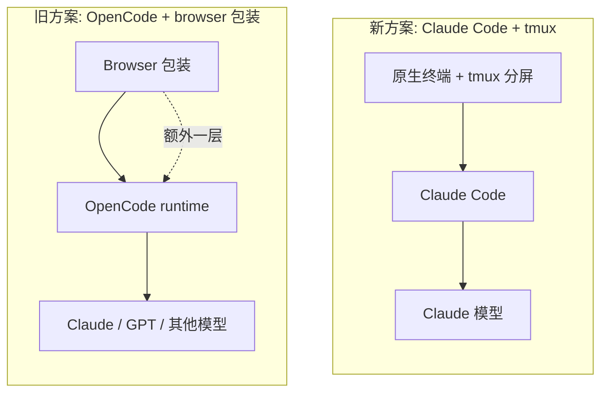

<BilibiliVideo bvid="BV1Fr5T6bEMQ" />

<TOCInline fromHeading={1} toHeading={2} toc={props.toc} />

---

## 这篇文章存在的原因

过去几个月，我们大部分 agent coding 的工作都跑在 [**OpenCode**](/blog/tools/opencode-cli) 之上。不只是在用它，我们还围绕它做了不少东西：用于 review 的 [**iKanban**](https://github.com/isomoes/ikanban)、用于研究流程的 **iPaper**、一些 agent 和插件，组成了我们 [四层多 agent 工作流](/blog/tools/four-layer-multi-agent-workflow) 的形态，同时在 DeepSeek、KIMI-K2、Qwen-Code、GLM-4.6 和 GPT 系列之间做了不少多 provider 的实验。**provider-agnostic runtime** 本身就是目的：哪个模型变贵或受限，都可以换掉，不必重建工作流。

这些投入是真实的，价值也仍然在。但日常主力已经切回了 **Claude Code**。这篇文章是这件事的诚实版本，写给那些和我们一样押注在 provider-agnostic 栈上、正在怀疑当初的取舍是否还成立的人。

## 模型层面：为什么 Claude 重新成为重点

第一个原因最简单：模型质量。

横向跑了多家 provider 之后，我们目前的实际判断是：**国内的开源权重模型和托管模型，目前还不到我们可以用来做主力的水平**。它们在特定窄场景里作为便宜补充很好用，进步也很快，但还不足以承担那些 tool-heavy、长会话的 agent coding 工作。

有一段时间，**GPT-5.5 的表现确实很强**，强到让 multi-provider 这个故事本身看起来是完整的。然后 OpenAI 收紧了账号安全策略。具体机制不重要，结果是：在相同的实际成本下，GPT-5.5 不再是我们最合算的选择，对比关系反过来了。在真实任务上一对一比较，**Claude Opus 4.6 和 4.7** 在相同价位下的综合表现更好。

这一翻转发生之后，问题就不再是“该把请求路由到哪个 provider”，而变成了：**既然真正吃力的活我们需要 Claude，那把 Claude 跑起来的最干净的方式是什么。**

## Runtime 层面：让 Claude 走 OpenCode 的代价

如果答案是“OpenCode + Anthropic API”，这篇文章就没必要存在了。问题在于，**通过 OpenCode 用好 Claude，并不是一个免费的选择**。

实践中只有两条路，每一条都有我们一开始并没有完全承认的代价。

**路径 A —— 通过 OpenCode 直连 Claude API。** 这条路是能跑的，但也是 agent 重度使用里最贵的路径。我们在 [《如何为 AI Agent Coding 选择 token 套餐》](/blog/tools/ai-agent-token-plan) 里详细分析过，复杂会话 \$1–3 一次的成本，注定让它只能是 fallback，而不是日常基线。

**路径 B —— 通过 OpenCode 调用 Claude Code 的订阅额度。** 社区已经收敛出了一些可行的做法，确实能跑起来。问题在于这种做法**并不在 Claude Code 套餐被允许的使用范围之内**，封号风险是真实存在的。我们在 GPT 那边刚刚经历过账号安全策略收紧带来的连锁反应，再把日常工作流建在一条明确违反服务条款的路径上，是那种平时看起来一切正常、直到出事那天为止都没问题的基础。

当我们真正需要的模型是 Claude 时，这两条路都不算干净的答案。

## Cache 层面：一个不那么显眼但持续在收税的问题

上面那一部分是看得见的成本。还有一个更不显眼、但在一周量级的真实使用中更要命的问题：**prefix cache 命中率。**

Claude 的计费模型会奖励请求开头复用一段稳定的 prefix。系统提示、工具定义，加上会话前半段，构成了 cache key。当某次请求和最近的请求 prefix 一致时，那一段就按命中价计费，便宜很多；不一致时，prefix 上的每个 token 都按完整 input 价重新算一遍。

Claude Code 本身就是围绕这一点设计的：系统提示稳定、工具定义稳定，同一个 session 里大部分轮次都能命中前缀缓存。OpenCode 是另一套程序，**它的系统提示不一样、工具定义不一样、序列化方式也不一样**——这意味着一个 Claude 模型通过 OpenCode 调用时，它无法复用 Claude Code 本来的 prefix cache；而在 OpenCode 内部，前缀对配置变化的敏感程度也比我们一开始注意到的要高。

最后的结果是：在 OpenCode 上跑 Claude Code 订阅，我们**触达周用量上限的速度明显更快**。我们并没有产出更多有用 token，只是在更多 token 上付了完整 prefix 的价。把这件事认真测过之后，多 provider runtime 看起来就不再是“中立基础设施”，而更像是一笔按使用量持续征收的 cache 税。

## 接口层面：browser 包装实验

另一件事是我们在 OpenCode 之上做的一个实验：把它包在 browser 里。出发点是把我们在 [《Better AI IDE》](/blog/ide/great-ai-ide) 里描述的 AI-first 接口想法做成具体东西——一个基于浏览器的控制面板，可以并行管理多个 OpenCode session，并提供比终端更丰富的状态展示。

这是一个有趣的方向，做的过程本身也不亏。但诚实地讲，这个 browser 包装并**没有带来多 session 管理上的本质改进**。相比一个组织得当的终端环境，提升是真实的但很小，代价却是另外一层复杂度：要让 browser 进程活着、出问题时多一层要 debug 的栈、并且离底层 agent 更远一点。

当整个栈的其他部分也在重新评估时，“有意思但没带来质变”这种理由不足以保留一个自制的接口层。**简单更划算。**

替换方案是有意更克制的：**原生终端加 tmux**，靠分屏实现多面板、多 session 的 agent 执行，不再额外维护一层接口。我们放弃了一部分浏览器实验承诺过的视觉表达能力，但换回了一开始让终端用起来很舒服的那种简单——同样重要的是，不再扛着一块**没付得起房租**的基础设施。

## 这对四层栈意味着什么

这并不是对之前“四层结构”的否定。骨架仍然成立：底层便宜的模型接入、中间的 runtime、上面的 workflow 层、最上面的 review 接口。变的是每一层里具体被谁占据，而答案现在更靠近常规一些。

- **Layer 1（模型接入）：** Claude Code 订阅，按官方设计的方式使用。
- **Layer 2（runtime）：** Claude Code 本身，取代 OpenCode。
- **Layer 3（workflow）：** subagent、skill、[Claude Code 配置](/blog/tools/claude-code-config)——同样的 workflow 理念，只是放在了为它设计的 runtime 上。
- **Layer 4（review）：** iKanban 依旧好用，并且它和下面跑的是哪个 runtime 没有绑定关系。

我们在 OpenCode 里做的东西并没有作废。agent、command、MCP 配线、workflow 习惯，都能平滑迁回——[OpenCode 那篇文章](/blog/tools/opencode-cli) 里那张迁移对照表，是可以反向用的。

## 从 OpenCode 这段经历里我们要带走什么

有两件事值得明确保留。

第一，**provider-agnostic 这个直觉本身没有错。** 厂商锁定的风险是真实存在的；这篇文章存在本身——日常工作流要因为价格和政策的变化而在 runtime 之间迁移——就是证据。我们并不是在主张永远绑死一家 provider，只是在说：**就目前而言，最干净的路径走 Claude Code。**

第二，**我们做出的那些工具**——iKanban 做 review、iPaper 做研究、那些插件、那些多 agent 模式——它们本来就不是 OpenCode 专属的，是贴着 runtime 边缘的工具，所以它们继续做自己的事。如果模型版图再变一次，下一次再迁回去的成本，会比这次低。

## 总结

简单版本是这样：**我们想用的模型是 Claude。** 把它走 OpenCode，要么直接更贵（API 路径），要么有封号风险（订阅路径）；在此之上，OpenCode 和 Claude Code 之间的 prefix cache 失配会让周配额消耗得更快。browser 包装实验有意思，但没有给出足以支撑它复杂度的多 session 价值，换回原生终端加 tmux 让整套设置回到不用想就能维护的状态。

四层心智模型仍然成立，只是中间的 runtime 换成了另一个 runtime。我们围绕旧 runtime 做的东西能平滑迁过来，而工作流现在比一个月前更简单了。

---

## 相关阅读

- [**OpenCode：Claude Code 的开源替代**](/blog/tools/opencode-cli)
- [**Claude Code 配置指南**](/blog/tools/claude-code-config)
- [**如何为 AI Agent Coding 选择 token 套餐**](/blog/tools/ai-agent-token-plan)
- [**一个终于装得下预算的四层多 agent 工作流**](/blog/tools/four-layer-multi-agent-workflow)
- [**AI Agent 应该接管那些原本由我们自己承担的部分**](/blog/tools/ai-agent-own-what-we-owned)
- [**Better AI IDE：软件应当先服务 AI，再服务人**](/blog/ide/great-ai-ide)
