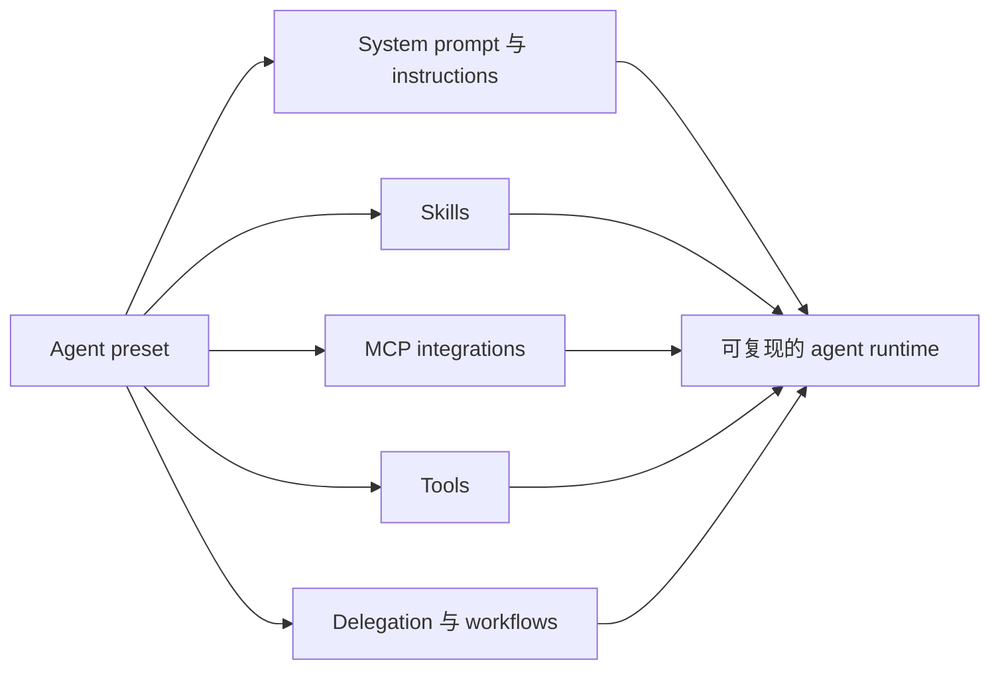

<BilibiliVideo bvid="BV1LLbe6wEcr" />

<TOCInline fromHeading={1} toHeading={2} toc={props.toc} />

---

## 让我们开始尝试 DSH 的那句话

最初吸引我们尝试 [**DeepSeek Harness**](https://github.com/deepseek-ai/deepseek-harness) 的，不是模型 benchmark，也不是一张很长的功能列表，而是仓库介绍中的一句话：**“Everything is a Plugin.”**

这也是我们一直在 OpenCode v2 中关注的方向：把过去固定在 runtime 内部的能力移到 plugin，包括原本看起来理所当然属于“内置功能”的部分。更小的 core 加上可以替换的能力很有吸引力，因为 agent runtime 变化得太快。模型会变化，provider 会消失，workflow 的思路也会继续演进。如果每一次实验都需要 fork core，runtime 很快就会变得难以维护；如果能力本身就是 package，我们就可以添加、移除、替换并组合它。

这个时间点也刚好对应了我们使用 coding agent 方式的变化。新模型可以处理要求更高、更复杂的任务，但这些任务往往也会运行更久。等待一个 session 完成，同时什么都不做，对模型和人都不是高效的使用方式。因此，我们大部分 agent coding 时间已经转向**跨多个 workspace 同时运行多个 session**。此前我们已经在 OpenCode v2 上尝试了这个方向，并且很喜欢这种体验。

DeepSeek V4 Pro 到来前后，DSH 也以 preview 的形式发布。我们最初下载它，只是想看看另一个 runtime 如何实现相似的 plugin-first 思路。这次简单试用很快变成了对 [iKanban](https://github.com/isomoes/ikanban) 的一次重写。

## 一个把 Harness 展示出来的 Web 界面

我们对 DSH 的第一印象来自它的 Web 界面：简洁、克制，而且非常容易检查。

Chat view 和 review view 展示的内容远不只是最终对话。对于每一次发送到 LLM server 的请求，我们可以检查组装完成的 system prompt、tool definition、注入的 context，以及真正面向模型的 messages。agent 运行时，tool call 和结果也会持续显示在 trajectory 中。DSH 没有把模型外面的 harness 当成黑盒，而是让组装后的请求本身变得可读。

这一点对开发 agent system 很重要。很多意外结果并不是模型本身造成的，而是 harness 出了问题：某条 instruction 被注入两次、tool schema 与预期不同、skill 没有加载，或者 context 以错误顺序进入请求。在许多 runtime 中，定位这些问题需要翻日志和猜测；在 DSH 中，其中很大一部分可以直接在浏览器里 review，几乎可以随着 agent 运行逐行观察。

Pi 也许可以通过 runtime 暴露相似的底层信息，但此前我们没有见过另一个 agent harness 用 Web UI 把完整请求路径展示得如此直接。DSH 展示的不只是 agent 的回答，还包括产生这个回答的系统。

## 为什么在 DSH 上重写 iKanban

当时，我们正在让 iKanban 迁移并适配 OpenCode v2。旧实现已经积累了太多 UI 和集成代码，我们本来就准备围绕更清晰的边界重写它。

看到 DSH 之后，一个问题变得很自然：如果 DSH 已经提供 session、workspace、storage、transport、model route、tool 和 plugin runtime，为什么还要把这些部分全部重写一次？

于是，我们不再把 iKanban 当成另一个独立的 agent runtime，而是把它重写成一个**面向键盘操作的 DSH Web application bundle**。DSH 负责底层 harness，iKanban 则改变交互界面，并补上我们管理多个项目和 session 所需要的 workflow。

现在的 package 可以安装到独立 profile 中：

```bash
dsh plugin --profile ikanban add @isomoes/dsh-ikanban --registry=https://registry.npmjs.org
dsh --profile ikanban
```

这个边界缩小了需要自行实现的范围。我们不再需要自行设计 agent loop、session protocol、plugin loader 或 tool transport，而可以专注于 iKanban 真正要解决的事情：快速启动工作，在项目之间移动，观察长时间运行的 session，并 review 最终结果。

## 让偏鼠标的 UI 适合键盘操作

这次重写并非没有摩擦。我们是键盘用户，而原始 Web UI 中很多操作都需要使用指针。对于 multi-session 界面来说，如果创建 session、删除或归档 session、切换 mode、选择 model 都要经过多层可视控件，操作很快就会变慢。

从 [iKanban 0.4.0](https://github.com/isomoes/ikanban/blob/main/CHANGELOG.md#040) 开始，我们的大部分工作都集中在这个交互层。我们建立了统一的 **UI command system**，并把高频操作注册进去：创建和归档 session、选择 mode 和 model、打开 settings、切换 agent preset，以及在 workspace 中导航。同一个 action 可以同时服务 slash command、command palette、popup selector 和快捷键，而不是让每个 UI feature 各自实现一套控制路径。

这里再次体现了 plugin 架构的帮助。一个 command contribution 不需要了解完整应用，它只需向共享 service 注册能力，再由当前 UI surface 决定如何展示。于是，键盘支持不再是一组零散的 event handler，而变成了 composition。

## 最意外的收获：组合能力

最能说服我们的优势，出现在 iKanban 与一个无关 plugin 组合时：[**dsh-codex-auth**](https://github.com/suntianc/dsh-codex-auth)。

我们的 [iKanban profile](https://github.com/isomoes/dsh-config/blob/main/profiles/ikanban/package.json) 本质上只是一个声明 dependencies 和 bundle list 的 package。下面是一个只保留本文相关 plugin 的简化片段：

```json
{
  "dependencies": {
    "@isomoes/dsh-ikanban": "^0.4.7",
    "dsh-codex-auth": "^0.1.0"
  },
  "dsh": {
    "profile": {
      "bundles": ["@deepseek-ai/dsh-base", "@isomoes/dsh-ikanban", "dsh-codex-auth"]
    }
  }
}
```

`dsh-codex-auth` 同时提供 host behavior 和原生 settings section。我们不需要把它的 provider 逻辑复制进 iKanban，也不需要为它增加专门的集成页面。声明 package dependency 并组合它的 bundle 之后，LLM route 可以在 host 层工作，它的 UI 也会自然出现在我们重写后的界面中。

这才是 **“Everything is a Plugin”** 在实践中的含义。Plugin 并不是挂在应用边缘、彼此隔离的 extension。它们可以贡献 service、model route、tool、command、settings 和 browser UI，再通过共享 contract 完成组合。host 和 interface 都可以获得一项新能力，而两个项目都不需要吸收对方的源代码。

## Immutability 很有价值，但它会改变 UX

DSH 的原始 session event log 刻意采用 append-only、event-oriented 的设计。我们理解其中的原因。模型可见的 action 一旦 committed，保留原始记录会让重建更加可靠，也可以防止被编辑过的过去与已经执行的 tool call 悄悄产生冲突。DSH 可以在 session surface 执行 replace，让被遮蔽的记录不再进入后续模型请求，同时继续保留底层 events。这种分离减少了很大一类状态错误。

但它也改变了交互设计。在 agent 工作中，我们有时想编辑较早的一条 user message，并把重新运行作为一个连续的 UI 操作。当前 DSH Web surface 还没有提供这样的 edit-and-rerun workflow。在 iKanban 中，我们把体验实现为 **fork and replace**：在一个已完成 turn 的位置 fork session，从新分支继续，再 archive 旧 session，让替换过程在 workspace 中尽量自然。

Conversation history 可以这样处理，但 working tree 是另一个问题。Fork session 不会为此前修改过的文件创建 snapshot，因此回到对话中的过去，并不会让 repository 同时回到匹配的状态。OpenCode 在这里可以提供更完整的 revert 体验。在 DSH 中，如果希望文件和对话一起后退，用户仍然需要 Git 或其他 snapshot 机制。

这不是一个很小的 UI 遗漏，而是一条重要边界。Immutable transcript 保存 agent 看过什么、做过什么；filesystem snapshot 保存它执行这些操作时所在的世界。完整 rewind 需要同时拥有两者。

## Project-Level Configuration 仍然需要补齐

第二个缺口出现在我们把 DSH 用到已有项目时。

大部分成熟的 agent runtime 都支持某种 project-local startup configuration。进入 repository 时，可以自动加载项目自己的 instructions、skills、MCP servers 和其他 capabilities。这样，每个项目都可以携带 agent 所需的环境，而不必让每个用户在 global config 中重新搭建一次。

DSH 已经可以通过 filesystem skill plugin 很好地处理 project skill，但 project-level MCP loading 还没有为我们提供同样完整的 workflow。MCP 是 Codex、Claude Code、Pi 以及 plugin-based runtime 中最常见的扩展机制之一，如果每个 DSH 配置都要手动重建 server definition，就很难继续复用旧项目。

因此，我们为 iKanban 实现了一个 opt-in 的 **project MCP plugin**。它从 session 的准确 working directory 读取 `.mcp.json`，并通过 agent preset 加载，而不是进入 global host capability layer。我们刻意让它保持 opt-in，因为 repository-local MCP config 可能启动进程或连接外部服务，只应该在可信项目中启用。

这解决了眼前的问题，但也反映出 DSH 当前的成熟度。一些常见 runtime feature 还没有形成完整、打磨好的内置 workflow。架构允许我们实现它们，但用户仍然可能需要自行组合或补上缺失部分。

## 把 Agent Preset 当作环境管理

更值得关注的长期答案，是 DSH 的 **agent preset** system。

Preset 不只是保存过的 model choice，而是一个 agent 的完整 Cordis composition。它可以定义 system prompt、instructions、skills、MCP integration、tools、delegation backends，以及其他决定 agent 能做什么的 plugins。每个 session 选择一个 preset，这个 composition 在 agent 的整个运行周期中保持稳定。

这让 preset 更像 npm、Cargo 或 pip 这样的 package 与 dependency manager，而不是普通 settings page。软件项目通过 manifest、lockfile 和 packages 复现 development environment；DSH preset 则通过 plugins 声明可复现的 **agent runtime environment**。



这个边界比一份很长的 global configuration 更符合工程化思路。我们可以为短修改建立 minimal preset，为 research 建立另一个，再为长时间 coding task 准备带有 project MCP 和 subagent 的 preset。由于各部分本身都是 package 和 Cordis row，整个 composition 可以被检查、版本化、复制和独立修改。

它现在还没有自动 project configuration 那么方便，但长期看可能是更好的基础。DSH 没有要求一个 runtime 内置所有可能的 agent behavior，而是提供了一套 package system，让我们组装真正需要的 runtime。

## 一个有潜力的 Preview，但还不是稳定默认选项

DSH 的架构很有吸引力，但 preview 阶段仍然存在实质性的 workflow 缺口。

优势是真实存在的。Web UI 让面向模型的完整请求路径变得异常透明；Cordis architecture 让 host service 和 browser surface 可以组合，而不是把所有 extension 都限制在狭窄的 sidebar API 中；agent preset 把 prompt、skill、tool 和 MCP 变成可复现的环境。最重要的是，这套系统为 agent runtime 实验留下了空间，而不只是让我们配置一个固定产品。

缺点也同样真实。作为 preview，它还没有成熟 coding-agent tool 那么稳定和完整。一些普通 workflow，尤其是 project-level configuration 和能够同步 filesystem 的 session rewind，仍然需要自行实现。Immutability 避免了很多错误，但也让熟悉的 edit-and-rerun 交互更难设计。高度模块化的系统还会要求用户和 plugin author 理解更多架构。

对我们来说，这个交换仍然值得。在 DSH 上重写 iKanban，让我们移除了大量 runtime code，专注 multi-workspace 和 multi-session 交互，并且可以组合 Codex authentication 这样的能力，而不必把它 hard-code 到自己的应用中。

值得关注 DSH 的原因，不是它已经拥有所有功能，而是它的核心抽象为缺失功能提供了干净的落点。如果 ecosystem 可以在不破坏这些 composition boundary 的前提下继续成长，**“Everything is a Plugin”** 就不只是 slogan。它可以让 agent runtime 变得可复现、可检查，也更容易承载那些原本需要再次完整 fork 才能进行的实验。

---

## 相关文章与资源

- [当 Claude 突然消失：围绕 OpenCode 重建我们的 AI 工作流](/zh/blog/tools/ai-workflow-after-claude-ban)
- [OpenCode：Claude Code 的开源替代](/zh/blog/tools/opencode-cli)
- [Vibe-Kanban：编排多 Agent AI Coding 工作流](/zh/blog/tools/vibe-kanban-intro)
- [更好的 AI IDE：软件应该先服务 AI，再服务人](/zh/blog/ide/great-ai-ide)
- [DeepSeek Harness GitHub 仓库](https://github.com/deepseek-ai/deepseek-harness)
- [iKanban GitHub 仓库](https://github.com/isomoes/ikanban)
- [我们的 DSH profile 配置](https://github.com/isomoes/dsh-config/blob/main/profiles/ikanban/package.json)
