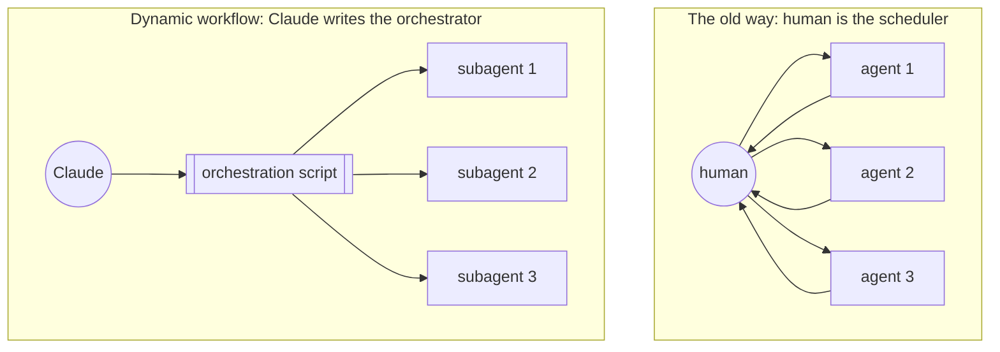
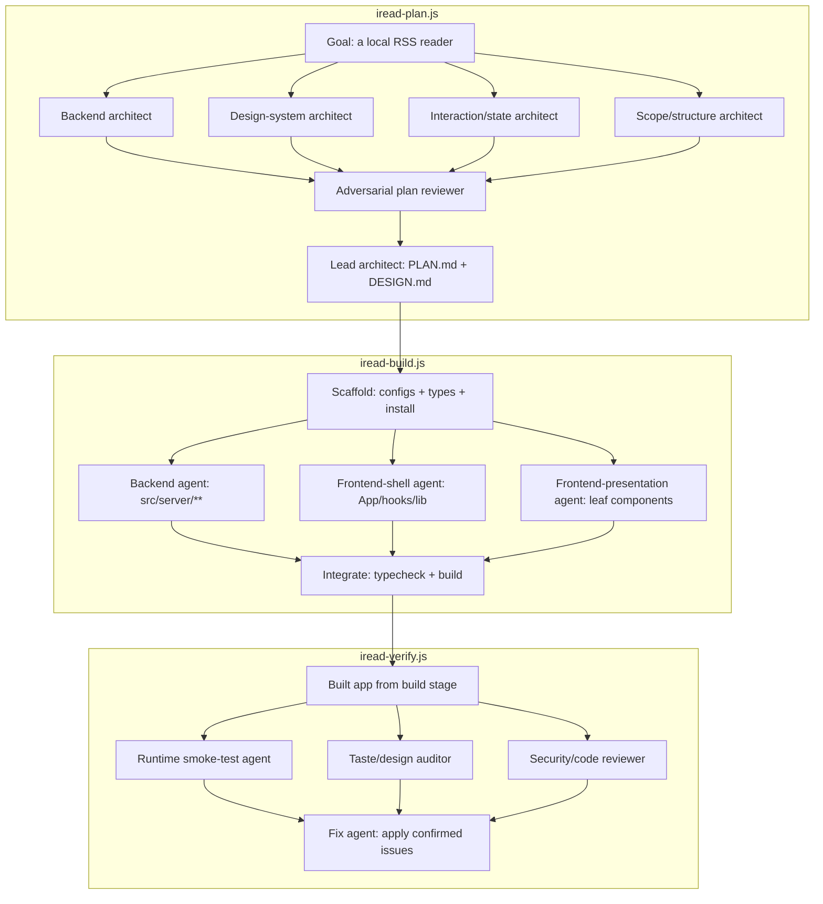

<BilibiliVideo bvid="BV1bSE26cE35" />

<TOCInline fromHeading={1} toHeading={2} toc={props.toc} />

---

## 引言

上一次我们写多 agent 协作时，结尾留下了一个预测。在 [Vibe Coding 到 Agent Coding](/zh/blog/ide/ai-vibe-coding-2026) 的第三部分里，以及后来那篇 [多 Agent 并行工作流](/zh/blog/tools/multi-agent-parallel) 中，我们描述过这样一套方案：由人来手动做拆分、手动做启动，而我们当时认为，下一个会倒下的瓶颈就是调度——一个专门负责调度的 AI scheduler，最终会接管那一层我们自己一直扛在身上的中间层。我们甚至顺手勾勒了随之而来的角色演进：先是 Coder，再是 Product Manager，最后变成某种更接近 CEO 的角色——只定方向，然后让整个组织自己运转。

那个 scheduler 真的来了。借助 Claude Code 的 [dynamic workflows](https://claude.com/blog/a-harness-for-every-task-dynamic-workflows-in-claude-code)（动态工作流）和 Claude Opus 4.8，orchestrator（编排者）不再是一个坐在一堆终端窗口之间的人。orchestrator 本身就是一个 agent——它读取任务，决定如何把任务拆开，再 spawn 出一支真正干活的 agent 队伍。这篇文章想谈的，就是这次转变在实践中究竟是什么样子、它解决了什么、又留下了什么没有解决。

## 旧做法：PLAN.md 与手动启动的 Agent

我们过去运行的那套手动工作流有清晰的形状，它确实能用，但它的每一个环节都要经过我们自己。第一步是手动拆解：我们读项目，把它拆成相互独立的若干块，再把这份拆解写到某个能持久保存的地方——通常是一份 TODO 列表，或者一份提交进仓库的 `PLAN.md`——好让这个计划能活过任何一次单独的对话。一块可能是调研，另一块是实现，再一块是文档或测试。拆解对不对，是我们自己的责任。

接下来是启动，同样靠手动。对每一个边界清晰的小任务，我们都开一个独立的 agent 实例——它有自己的 session、自己的终端窗口，或者自己的一张 [Vibe-Kanban](/zh/blog/tools/vibe-kanban-intro) 卡片——然后让它只盯着一个任务。为了让并发的编辑不会互相撞车，每个 agent 都在自己独立的 git worktree 里工作，于是隔离成了文件系统布局的一个属性，而不是 agent 之间彼此协商出来的东西。

最关键的一点是：人**就是**那个 scheduler。我们决定哪些任务可以并行、哪些必须等待。我们决定哪个模型分给哪个任务。我们决定什么时候去查看一个结果、怎么整合各路输出、当两个 worktree 出现分歧时又该如何解决冲突。这些都没有被自动化；我们当时坦白地把它叫作“手动”，因为它本来就是手动的。而这就是瓶颈所在。每个 agent 都得由人去启动，每一次交接都要经过人，整件事最后还得由那个坐在正中间的同一个人重新缝合起来。任务本身并行得很好，但协调没有——它依旧是串行的，而且依旧压在我们身上。

## 变化所在：Claude 自己写出 Harness

真正变了的东西，用 Anthropic 公告里的一个词来描述最贴切：**harness**（运行框架）。harness 就是围绕模型的那套系统——任务怎么拆、spawn 出哪些 subagent、每个 subagent 拿到什么工具、输出如何验证、哪一步用哪个模型、工作如何隔离，以及系统怎么知道任务真的做完了。在旧世界里，这个 harness 是静态的。你要么跑那个默认的编码 harness，要么用 Agent SDK 预先写好一个 workflow：写一次，然后它就能泛化地跑在你喂进去的任何输入上。

dynamic workflows 把“撰写 harness”这一步搬到了运行时。面对一个复杂的、由多个部分组成的任务，Claude Opus 4.8 现在会即时写出**它自己的** harness——一段简短的 JavaScript 编排脚本，为这一个任务量身定制，负责 spawn 并协调一整支 subagent 队伍。你只要让 Claude 做一个 workflow 就能触发它，或者用触发词 **`ultracode`** 来确保 Claude Code 去构建一个，而不是直接内联回答。这就是本文后面提到“ultracode 模式”时所指的东西。

这段脚本由三个原语搭起来，而真正有意思的是：你几乎不需要表达多少东西，就能描述出几乎任何一种编排形状。`agent()` spawn 出单个 subagent；你可以给它一份 JSON schema 来拿回经过校验的结构化输出，为这一个任务挑一个模型，并让它在一个隔离的 git worktree 里运行。`parallel()` 把一批任务并发地铺开，但在后面立一道屏障(barrier)——它会等齐每一项再往下走。`pipeline()` 则让每一项流过所有阶段，中间不设屏障，这样跑得快的项就不必干等着慢的项。把这三个组合起来，你就能描述出大多数原本要靠手工搭建的协调模式。

值得明确说说**为什么**这才是正确的做法，而不是把所有事情塞进一段很长的对话里跑。在复杂的、多部分的任务上，单个 context window 有三种典型的失败模式。一种是 **agent laziness**(agent 偷懒），agent 在多步任务还没全部做完时就提前收手。一种是 **self-preference bias**（自我偏好偏差），agent 给自己的输出打分时会偏向自己。还有一种是 **goal drift**（目标漂移），工作在一轮又一轮之后慢慢偏离了最初的目标。把任务拆给各个单一职责、各自拥有干净 context 的 subagent，再让它们互相检查彼此的成果，这三种问题就都被化解掉了。

这种结构也有一个天然的默认选项。在 Anthropic 描述的 [multi-agent coordination patterns](https://claude.com/blog/multi-agent-coordination-patterns)（多 agent 协调模式）里——generator-verifier、orchestrator-subagent、agent teams、message bus、shared state——推荐的起点是 **orchestrator-subagent**：一个 lead agent 负责规划、分派和综合，而各个边界清晰的 subagent 各自独立干活、再汇报回来。它的协调成本最低，context 管理也最简单，这正是一份自动生成的编排脚本会首先伸手去抓的形状。其他几种模式——message bus、shared state——确实存在、也确实重要，但它们属于我们后面会回头来谈的那个更难的问题。

这带来的差别是具体的，而不是抽象的。问一个静态流程“我们该不该把结账服务迁移到一个新供应商”，它会跑五个泛泛的搜索，然后写一份泛泛的报告。而一个 dynamic workflow 会去读**你自己的**计费代码，逐行对照新供应商的文档，按**你自己的**交易量给这次迁移算账，还会 spawn 一个唱反调的 subagent 去把“最不该迁移”的理由说到最强——最后给出的是一份真正关于你的建议。harness 不再是我们提前配置好的东西，而成了 Claude 针对眼前这个任务现写出来的东西。

## 一个真实的工作流：用三个 Dynamic Workflow 构建 iread

要展示到底变了什么，最清楚的方式就是把我们真正做过的一件事走一遍。我们想要 **iread**：一个小巧的、本地的全栈 RSS 阅读器，精神上向 newsboat 看齐——后端用 Hono 架在内置的 `node:sqlite` 之上，前端用 Vite 加 React 18 和 Tailwind v4，全部用 pnpm 管理。值得一提的是我们**没有做**的事。我们从没手动拆过任务，也从没自己启动过哪怕一个 subagent。我们只描述了目标，然后 Claude Code 写出了三段 dynamic-workflow 脚本——`iread-plan.js`、`iread-build.js` 和 `iread-verify.js`，保存在 `.claude/workflows/` 目录下——每一段都用 `parallel()`、`pipeline()` 和 `agent()` spawn 并协调了它们自己的一支 subagent 队伍。我们的工作收缩成了：在最前面描述意图，然后在各个阶段的边界处读结构化报告。（这几段脚本还都是可复用的：一次运行之后按 `s` 就能把 workflow 存到本地，再从某份 `SKILL.md` 里引用它，就能分享出去。）

这三次运行的形状，都是 Anthropic [dynamic workflows](https://code.claude.com/docs/en/workflows) 那套工作里的同一种 orchestrator-subagent 模式，而且它能干净地映射到我们上面走过的那几个有名字的协调模式上。整个 pipeline 跑的是 plan → build → verify，而在每个阶段内部，orchestrator 都会扇出(fan out)：

### Plan

`iread-plan.js` 分三个阶段运行，在写下一行代码之前就把整个系统设计好。设计阶段用 `parallel()` 一次性扇出**四个 architect subagent**，每个各管问题的一个面。一个 backend architect 设计 SQLite schema、feed 的抓取/解析/sanitize 服务、完整的 HTTP API 契约，以及精确的 `src/shared/types.ts`。一个 design-system architect 产出明暗两套主题 token、一份组件清单，以及一套严格的审美纪律——一种强调色、一套圆角刻度，真实的 loading/empty/error 状态，以及 UI 文案里零破折号。一个 interaction/state architect 写出 newsboat 风格的 `j`/`k` 键位映射，以及带乐观更新的 react-query 方案。一个 scope/structure architect 画出 MVP 的功能切分、完整的文件树，以及精确的 `package.json`。

这次扇出是经典的 **fan-out and synthesize**（扇出再综合）模式，但有意思的一步在后面。在任何综合开始之前，先有一个**唱反调的 plan reviewer** 读完全部四份文档，然后专门去找麻烦：几份设计之间的集成不匹配、安全漏洞(SQLi、来自不可信 feed HTML 的 XSS、SSRF、OPML XXE)、数据完整性 bug，以及审美违规。它返回一份按优先级排好的 must-fix 清单和一个 go/no-go 裁决。只有到这时，才由一个单独的 lead-architect agent 把四份设计合并起来，落实每一条 must-fix，解决 reviewer 暴露出的那些冲突——其中最重要的是让 API 字段名和前端实际消费的字段精确一致——再把 `docs/PLAN.md` 和 `docs/DESIGN.md` 写到磁盘上，作为唯一的真相来源。我们在这里就抓住了设计层面的安全和集成 bug，赶在它们变成代码之前。

### Build

`iread-build.js` 把那份计划实现到全绿，同样分三个阶段。一个 scaffold agent 先上：它照着 `PLAN.md` 一字不差地写出配置文件，铺好共享类型、`globals.css` 和 `index.html`，再跑 `pnpm install` 直到它以 0 退出，顺便调整任何无法解析的固定版本号。

build 阶段才是真正的诀窍所在。我们扇出**三个文件归属互不相交的 implementer subagent**，让它们在物理上根本不可能撞车。backend agent 只管 `src/server/**`，别的什么都不碰；frontend-shell agent 管 `App.tsx`、`AppShell`、各个 hook 以及 `lib`；frontend-presentation agent 只管叶子组件。每一份 prompt 都明确写出这个 agent **绝不能**碰什么。这一点值得内化：按清晰的文件边界来拆解，正是让 agent 能够真正并行、又不产生合并冲突的关键——不需要 git worktree，不需要 rebase 那一套折腾，只需要干净的归属。然后由一个 integrate agent 跑 `pnpm typecheck` 和 `pnpm build`，把 shell 组件和 presentation 组件之间的接口漂移调和好，迭代大约四轮，再返回一份对照 JSON schema 的**结构化结果**——`typecheckPasses`、`buildPasses`、`remainingErrors[]`、`filesTouched`、`summary`。正是这份 schema，把一个 subagent 的汇报从“我们必须仔细去读的散文”变成了“我们可以机械地去核对的数据”。

### Verify

build 能编译，不等于 build 能跑，所以 `iread-verify.js` 存在的意义，就是证明这东西真的能运行，再去修那些跑不起来的地方。它的 verify 阶段扇出**三个 verifier subagent，每个都对照各自的 schema 返回结构化输出**。一个 runtime smoke-test agent 在一个隔离端口上、配一个临时 DB，把构建好的生产服务器启起来，curl 过每一个 endpoint 并检查响应的形状，跑一遍 headless 浏览器的渲染检查，再确认 `/api` 代理在 `pnpm dev` 下能正常工作。一个 taste-skill design auditor 用 grep 去找破折号、找错误的（紫色）强调色、找纯黑或纯白，再确认每一个面板都有 loading、empty、error 状态外加基本的 a11y。一个唱反调的 code-and-security reviewer 则通过读代码、而不是轻信计划，去搜真实的 SQLi、XSS、SSRF、去重以及乐观更新的 bug。

这就是 **generator and verifier**（生成者与验证者），上面再叠一层 **adversarial verification**（对抗式验证）：build 产出了代码，再由一组独立的 agent 试图把它弄坏。最后一个阶段把这三份结构化报告全部交给一个 fix agent，它落实那些被确认的 high 和 critical 问题，跳过误报但把它们记成 `deferred` 而不是悄悄丢掉，再重新跑一遍 typecheck、build 以及一次快速的 API smoke。它返回自己的结构化结果——`fixesApplied[]`、`deferred[]`，以及三个绿灯布尔值，确认 typecheck、build 和 API smoke 全部通过。

### 这一切加起来意味着什么

退后一步数一数。在三次运行里，Claude 编排了大约十五到二十个 subagent：它把它们扇出去，让它们互相对抗式地检查，把它们的输出对照 schema 校验，再把干净的状态从一个阶段交接到下一个阶段。我们大多数时候只是描述想要什么，然后在各阶段交接处审阅结构化结果。这个博客上更早的几篇文章，一直在围着同一个缺失的环节打转——一个能把工作流扛起来、让人不必亲自上阵的 AI scheduler。结果是，这个 scheduler 已经不再是我们去配置、去手工接线的东西。它就是那个写出编排脚本的东西本身。

## 尚未解决的问题：能彼此对话的 Agent

尽管如此，我们目前搭出来的一切，都只是同一种形状的变体。ultracode 模式下的 dynamic workflows、那篇 [多 Agent 并行工作流](/zh/blog/tools/multi-agent-parallel)、那篇 [四层多 Agent 工作流](/zh/blog/tools/four-layer-multi-agent-workflow)——它们全都是 orchestrator-subagent 模式。一个中心 orchestrator 把每一条信息都汇到自己这里：每个 subagent 都向上汇报给 lead，各阶段在硬屏障后面运行，而人则一个接一个地启动每个阶段——先 plan，再 build，再 verify。信息在树上上上下下地流动，却从不在同级之间横向流动。这是正确的默认选项，我们也会继续推荐它，但还是值得把这个形状诚实地点出来，好让我们看清它做不到什么。

这种形状最先绷不住的地方，是人。human-in-the-loop 是有价值的；但 human-in-*每个*-loop 没法扩展。如果每个子任务都要等一个人检查过、下一步才能开始，那整个系统的吞吐上限就不再是模型质量或 token 预算，而变成了一个人的审查带宽。我们在 [AI Agent 应该接管那些原本由我们自己承担的部分](/zh/blog/tools/ai-agent-own-what-we-owned) 里详细写过这件事，而第一个解法是显而易见的那个：让 agent 拥有更多它自己的验证循环。一个能通过 Chrome DevTools MCP 打开页面、自己检查 UI 的 agent，就不需要在每次改动后都去 ping 一个人。iread 的 verify 工作流正是这个意思——agent 自己测试、自己审查自己的输出，而不是把每一个 diff 都隔着屏障递回来。

但拥有自己的验证循环，只是把人从内层循环里移走。更难、至今仍未解决的前沿，是 **agent 之间彼此的通信**。一旦有好几个 agent 同时在跑，有意思的问题就不再是怎么启动它们——dynamic workflows 已经回答了——而是怎么让它们**异步地**彼此对话，又不至于让整件事散成一团乱麻。真实问题是非线性的。它们有部分依赖、有分叉式的探索、有重试，还有在不同时刻才浮现出来的事实，而一个严格的 orchestrator 漏斗会把这所有的杂乱都逼回那个不得不把它们串行化的单点。

Anthropic 那篇关于 [multi-agent coordination patterns](https://claude.com/blog/multi-agent-coordination-patterns) 的文章，勾勒了两种指向中心 orchestrator 之外的模式。在 **message bus**（消息总线）里，agent 对事件做发布和订阅，直接彼此对话；它是事件驱动的，而且加进一种新的 agent 很便宜，因为不需要谁去重新接线让 orchestrator 知道它的存在。在 **shared state**（共享状态）里，agent 读写一个公共存储，于是一个 agent 刚发现某样东西的那一刻，它就成了另一个 agent 的输入——这特别契合协作式的研究与分析。令人印象深刻的是，这两种模式离人类团队真正的工作方式有多近。人不会把每条消息都路由给同一个经理；他们点对点地交谈，在一份共享文档里留个便条，然后等忙到了再去接手。这比一个经理漏斗更贴合杂乱的真实世界系统。

诚实的提醒是：移除中心协调者并不是免费的，而且它带来的失败模式比它取代掉的那些更安静。message-bus 的路由可能会在某条路线判断失误时悄悄丢掉工作——什么错都不报，任务只是永远没人接走。shared state 则会招来 **reactive loop**（反应式循环），agent 不停地互相回应，烧掉 token 却始终不收敛。解法是把终止条件做成一等公民、而不是顺带的东西：显式的时间预算和 token 预算、收敛阈值，以及一个不依赖人去注意到它在空转的“完成”定义。这也正是为什么 Anthropic 自己的建议，和我们的建议一样：从最简单的模式——orchestrator-subagent——开始，只有当一个具体的瓶颈真正逼着你时，才去伸手取用这套机器。点对点协调是下一个要学的东西，而不是上来就该领头用的东西。

## 总结

这项工作的形状已经变过两次。我们一开始**手动**拆任务、手动启动 agent，把整个工作流扛在自己脑子里。后来 dynamic workflows 把编排层本身自动化了——更早那几篇文章一直预测的那个“AI scheduler”，如今会自己写出编排脚本，这去掉了手动启动，却保留了 orchestrator 漏斗。尚未解决的问题在再往下的那一层：让那些 agent **彼此之间**异步地协调，像一个人类团队那样，好让多 agent 系统能接下真正非线性的工作，而不至于又坍缩回去——回到以一个人、或者一个单一 orchestrator 作为协调瓶颈的状态。我们还没有一个干净的答案，而这恰恰就是它有意思的地方。

## 相关文章

- [Vibe Coding 到 Agent Coding](/zh/blog/ide/ai-vibe-coding-2026)
- [多 Agent 并行工作流](/zh/blog/tools/multi-agent-parallel)
- [一套四层的多 Agent 工作流](/zh/blog/tools/four-layer-multi-agent-workflow)
- [AI Agent 应该接管那些原本由我们自己承担的部分](/zh/blog/tools/ai-agent-own-what-we-owned)
- [回到 Claude Code](/zh/blog/tools/back-to-claude-code)
- [更好的 AI IDE](/zh/blog/ide/great-ai-ide)
- [Vibe-Kanban](/zh/blog/tools/vibe-kanban-intro)
- [A harness for every task: dynamic workflows in Claude Code](https://claude.com/blog/a-harness-for-every-task-dynamic-workflows-in-claude-code)
- [Multi-agent coordination patterns](https://claude.com/blog/multi-agent-coordination-patterns)
