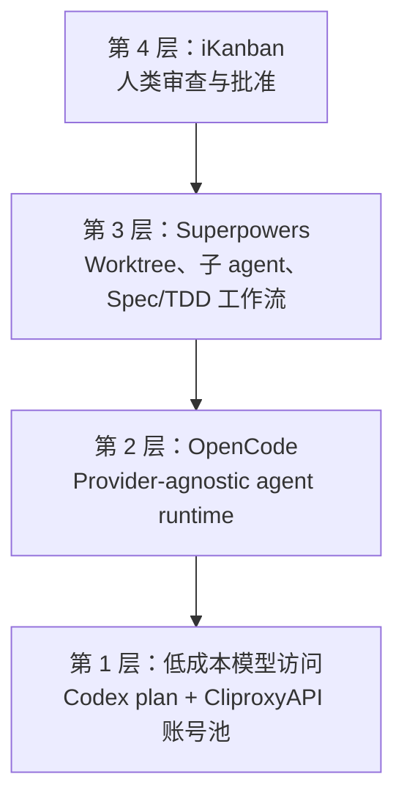

<BilibiliVideo bvid="BV1fzAAzPEQ4" />

<TOCInline fromHeading={1} toHeading={2} toc={props.toc} />

---

## 为什么我们重新认真做多 Agent 工作流

很长一段时间里，真正的 **多 agent 编程工作流** 看起来很吸引人，但并不现实。一次同时跑多个 agent，通常会比单 agent 会话消耗更多 token，所以如果成本模型不变，这种工作流就很难真正落地。我们的预算并没有突然变大，真正变化的是性价比：在切换到一条更便宜的、基于 GPT 的 Codex 访问路径之后，同样的月度花费，大约换来了 **10 倍可用 token 预算**。这才是让我们愿意认真尝试这套流程的转折点 <a href="#ref-1">[1]</a>。

这篇文章是写给**刚接触 agent coding** 的读者的。核心观点其实很简单：我们的工作流并不是某一个神奇工具，而是一个四层堆栈。最底层是低成本模型访问；再往上是 provider-agnostic 的 runtime；再往上是负责隔离、规划和并行执行的工作流层；最上层则是一个审查界面，由人来决定接受、拒绝，还是重跑结果。

如果你之前读过我们关于 [OpenCode](/zh/blog/tools/opencode-cli)、[多 agent 并行工作](/zh/blog/tools/multi-agent-parallel)、[vibe-kanban](/zh/blog/tools/vibe-kanban-intro)，或者[AI-first IDE 思路](/zh/blog/ide/great-ai-ide)的文章，那么这篇可以看作它们的下一步：前面那些分散的想法，开始被真正组合成一个可重复使用的系统 <a href="#ref-2">[2]</a> <a href="#ref-3">[3]</a> <a href="#ref-4">[4]</a> <a href="#ref-5">[5]</a>。

## 一个具体例子：用这套堆栈实现一个功能

假设现在有一个任务：**给一个 Web 应用增加 OAuth 登录**。在单 agent 工作流里，一个长会话通常需要自己读代码库、思考架构、编辑文件、跑测试、修失败，再最后总结结果。这当然也能做，但随着上下文不断变长，这个会话往往会越来越慢、越来越贵，也越来越脆弱。

而在我们现在的工作流里，同一个功能会被拆成几个边界明确的小任务。一个 agent 先准备实现方案；另一个在隔离的 worktree 里完成真正的后端改动；第三个可以专门处理测试或文档。在这个过程中，人类不需要手动盯着每一条命令去协调。人的主要工作变成查看进度、检查 diff，并判断这个方案是否可以接受。

关键变化不只是“并行”本身，而是 **有结构的并行**。每个 agent 的任务更窄、边界更清晰、执行环境也更干净。如果某一个分支走偏了，可以单独拒绝，而不会污染整个仓库。如果任务彼此独立，它就可以长时间运行，而不会阻塞整个流程。

## 四层结构

这套堆栈之所以能成立，是因为每一层都在解决一个不同的问题。模型层解决成本，runtime 层解决 provider 接入，工作流层解决任务拆解与隔离，界面层解决审查与决策。

## 第 1 层：先让多 Agent 在成本上跑得起

第一层最不炫，但最关键：**预算**。多 agent 工作流天生就是吃 token 的。如果一个 agent 都已经很贵，那再开三四个 agent 并不是什么工作流升级，只是在更快地把额度烧完。

真正改变局面的，是我们拿到了一个更便宜的 GPT 系 coding plan。以实际使用感受来说，**15 元左右** 的 Codex 类访问成本，已经足以把这件事从“偶尔试试”变成“可以在日常中用”。和之前相比，等效预算接近于 **可用 token 提高 10 倍**。这个余量非常重要，因为它意味着我们终于有空间去做规划、重试、长时间运行任务，以及并行会话，而不是把每次交互都压缩成一个很短的单线程对话。

为了把这种访问方式稳定接入到日常使用里，我们还需要一个**账号池层**，这里我们选择的是 **CliproxyAPI** <a href="#ref-1">[1]</a>。账号池本身并不是工作流，但它是让工作流在经济上可持续的基础设施。没有这一层，往上的几层都很难长期维持。

## 第 2 层：把 OpenCode 作为 Runtime

第二层是 **OpenCode**，它依然是我们当前最核心的 agent runtime <a href="#ref-2">[2]</a>。我们之前已经单独写过介绍，所以这篇不再重复安装和配置，而是重点讲它为什么在这套堆栈里重要。答案很简单：**provider independence**。OpenCode 不绑定单一模型厂商，这意味着当价格、可用性，或者模型质量发生变化时，整套工作流不会一起失效。

在多 agent 场景下，这种灵活性比单 agent 场景更重要。不同任务往往适合不同模型：规划任务可能偏好一个模型，快速实现任务或者低成本 review 任务可能更适合另一个模型。OpenCode 给这些 agent 提供了统一 runtime，因此上层的编排逻辑不需要随着模型组合的变化不断重写。

这也是 OpenCode 为什么和 AI-first 界面天然契合。agent 的操作对象是 CLI 工具和仓库状态，而不是一个笨重的 GUI。这样它更容易和 worktree、审查工具，以及自定义工作流逻辑组合起来。在之前的 [OpenCode 指南](/zh/blog/tools/opencode-cli)里，我们强调的重点是摆脱 vendor lock-in；而在这套新堆栈里，新的重点变成了：**runtime 的可移植性，是编排能力的前提**。

## 第 3 层：Superpowers 负责隔离与长时间并行执行

第三层，是我们最近一周重点尝试的部分：**Superpowers** <a href="#ref-6">[6]</a>。实际用下来，有两个能力最先体现出价值。第一，它非常重视 **git worktree**，把不同任务隔离开来。第二，它可以分发 **并行 subagent** 去处理独立步骤。这两点，正好就是多 agent 工作流在面对长时间任务时最需要的东西。

在有这一层之前，我们虽然也能跑多个 agent，但大量调度工作仍然是手动完成的：谁做什么、什么时候拆任务、怎样避免冲突，都得靠人持续盯着。Superpowers 把这部分流程更明确地形式化了。它让我们更容易表达一种工作方式：把规划、执行、验证拆成不同阶段，而不是全都塞进一个大 prompt 里。

另一个很有价值的地方，是 Superpowers 支持更结构化的方法，比如 **spec-driven development** 和 **test-driven development**。这当然不会神奇地消灭错误，但它确实能降低 agent 在目标不清楚时直接开始乱改代码的概率。实际效果就是，在真正写代码之前，工作流会先投入更多精力去定义任务，而这通常会改善长时间运行任务的质量。

不过它的代价也很真实：对于小任务来说，Superpowers 有时会显得 **工程味过重**。如果任务本身很简单，额外的流程结构反而可能拖慢速度，而不是加快速度。这一点需要明确说出来：这套堆栈并不是要替代所有快速的一次性交互。它更适合那些已经大到值得引入隔离、规划和审查开销的任务。

## 第 4 层：iKanban 作为人类审查界面

最上面一层，是我们自己的项目 **iKanban** <a href="#ref-7">[7]</a>。这就是人重新回到回路里的地方。如果说下面几层负责“生成和组织工作”，那么 iKanban 负责的就是 **审查和决策**。它把 agent 做过的事集中到一个地方，让我们可以查看计划、批准或拒绝方案、检查命令历史、查看改动文件，然后再决定是否接受结果。

这一层非常重要，因为多 agent 系统并不会消除人类判断，反而会让它变得更关键。一旦多个分支或多个子任务同时推进，人的角色就会从“直接敲代码”转向 **质量控制、优先级判断，以及最终验收**。iKanban 正是围绕这个角色来设计的。它不只是把 agent 当成一个聊天框，而是把整个工作流视为一个需要可见状态的系统：有计划、有命令、有文件改动，也有批准动作。

这也是我们之前关于 **AI-first IDE** 的思考真正落地的地方 <a href="#ref-5">[5]</a>。人类不再需要一个庞大的界面去亲手完成所有编程动作。人主要需要的是表达意图，以及验证结果。从这个角度看，iKanban 与其说是传统 IDE，不如说更像是一个 agent 执行流程的控制面板。

## 为什么它比一个超长单 Agent 会话更有效

这套堆栈的价值，不在于每一层单独看起来多么厉害，而在于每一层都拿掉了旧工作流里的一个瓶颈。低成本 token 让并行变得可负担；OpenCode 让模型选择保持可移植；Superpowers 让长时间并行工作更有结构；iKanban 则让审查过程变得可见且可管理。

当这些部分组合起来之后，人类的角色反而变得更清楚了。人依旧负责设定方向、判断什么重要、审查结果是否可接受；但人不再需要把整个流程都硬塞进一个脆弱的长对话里。工作被分散到不同层中，而每一层都只做自己最擅长的一件事。

这也是为什么我们还不把它称为“完全自治的流水线”。这里仍然有人工审查，仍然有重跑，仍然有很多简单任务应该继续保持简单。但和之前那种手动调度 agent、一个个盯着隔离会话的阶段相比，这套堆栈已经更接近一种真正可以日常使用的运行模式。

## 总结

我们最新的多 agent 工作流，最适合被理解成一个 **四层系统**。最底层，是更便宜的 Codex 类访问路径和账号池，让 token 预算终于足够支撑多个 agent；再往上，OpenCode 提供 provider-agnostic runtime；再往上，Superpowers 提供 worktree 隔离、并行 subagent，以及更结构化的开发方法；最上层，iKanban 给人类提供了一个审查、批准、拒绝和重跑工作的界面。

对于刚接触 agent coding 的读者来说，最重要的结论不是“多开几个 agent”，而是先建立 **更好的约束条件**：可负担的 token、可移植的 runtime、隔离的执行环境，以及可见的审查界面。只有这些条件先到位，多 agent 工作才不会只是一个 demo，而会开始像一个真正的工作流。

---

## References

<ol>
  <li id="ref-1"><a href="https://help.router-for.me/introduction/what-is-cliproxyapi.html">CliproxyAPI introduction</a> —— 用于低成本访问的账号池层。</li>
  <li id="ref-2"><a href="/zh/blog/tools/opencode-cli">OpenCode：Claude Code 的开源替代方案</a> —— 我们此前对 provider-agnostic runtime 的介绍。</li>
  <li id="ref-3"><a href="/zh/blog/tools/multi-agent-parallel">多 Agent 并行工作流：从写代码的人到指挥调度者</a> —— 我们之前关于并行 agent 执行的文章。</li>
  <li id="ref-4"><a href="/zh/blog/tools/vibe-kanban-intro">Vibe-Kanban：编排多 Agent AI 编程工作流</a> —— 关于编排与 worktree 的相关背景文章。</li>
  <li id="ref-5"><a href="/zh/blog/ide/great-ai-ide">更好的 AI IDE：软件应先服务 AI，再服务人类</a> —— 审查层背后的界面哲学。</li>
  <li id="ref-6"><a href="https://github.com/obra/superpowers/blob/main/README.md">Superpowers README</a> —— 负责 worktree、subagent 和结构化开发的工作流层。</li>
  <li id="ref-7"><a href="https://github.com/isomoes/ikanban">iKanban</a> —— 我们用于计划审批、命令历史查看和文件检查的审查界面。</li>
</ol>
