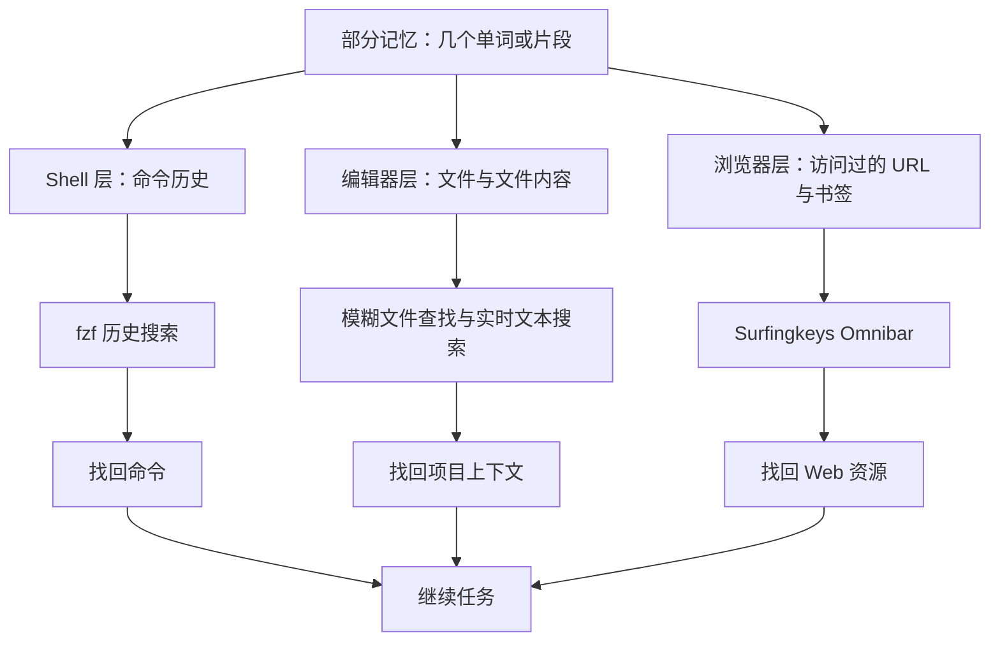

<BilibiliVideo bvid="BV15T8w63EZ8" />

<TOCInline fromHeading={1} toHeading={2} toc={props.toc} />

---

## 新的瓶颈是找回上下文

AI 辅助开发让我们能以前所未有的速度创建软件、收集信息。LLM 可以在几分钟内生成一条命令、解释陌生 API、找到一份有用文档，或者帮助我们创建一个新项目。副作用是，我们积累上下文的速度也快了很多：更多仓库、更多文件、更多终端命令、更多文档页面，以及更多打开时觉得重要的 URL。

所以，创建或收集资源只完成了一半。另一半问题，是在以后需要时把它找回来。

面对如此大量的信息，人脑并不是一个可靠的索引。我可能记得上周用过一条很长的 Docker 命令，改过一个与模糊搜索有关的 Neovim 配置文件，或者读过一篇有用的 AI agent 工具文章。但要记住完整命令、路径、文件名或 URL，就困难得多。手动浏览目录、滚动查看 shell 历史，或者重新翻找浏览器标签页，都会给本来应该可以复用的工作增加阻力。

通常，我记住的并不是完整标识符，而是几个片段：

- 命令的一部分，例如 `compose`、`agent` 和 `up`
- 文件名的一部分，例如 `fuzzy` 或 `workflow`
- 文件中的一句话，例如 `human in every loop`
- 之前访问过的页面主题或域名

因此，与精确查找相比，**模糊查找更符合人类记忆的工作方式**。系统不再要求我完整记住资源，而是让我输入仍然记得的少量片段，再对可能的结果进行排序。

## 理想方案：一个可搜索的资源索引

最容易想到的方案，是建立一个统一索引。所有有用资源都进入这个索引，然后通过一个模糊搜索界面返回最佳匹配，无论目标是本地文件、shell 命令，还是远程 URL。

这样的索引对 AI agent 也很有价值。如果索引能够通过 shell 工具访问，agent 就能搜索我所搜索的资源、检查选中的文件，并修改它被允许修改的内容。从这个意义上说，agent 可以在一定程度上**看见我曾经看见的东西**，而不是每个任务都从空白 context window 开始。

这篇文章不会深入讨论 agent 如何集成进工作流。这里更重要的一点是：一个基于文本、可以通过命令访问的检索层，可以同时服务人和 agent。搜索索引的 shell 命令对我来说是交互工具，也可以成为 agent 工作流中的一个工具。

现实问题是，我目前并没有一条命令或一个索引，能同时覆盖本地和远程的所有资源。命令保存在 shell 历史里，项目知识存在于文件名和文件内容中，Web 资源则留在浏览器历史与书签里。每个应用已经持有一部分数据，但这些数据是分散的。

所以，与其等待一个完美的统一索引，我选择**在信息原本所在的不同层级建立多个小索引**。



从技术上看，这不是一个索引；但从工作流上看，它表现得像一个索引：**记住片段，在正确层级进行模糊搜索，然后复用结果**。

## 第一层：从 Zsh 历史中搜索命令

长 shell 命令的重建成本很高。它们经常包含多个参数、路径、端口、环境变量或子命令。即使这条命令以前成功运行过，靠记忆重新输入仍然容易产生小错误。

Zsh 历史就是这一层的索引。在我的 `~/.zshrc` 中，历史记录会被持久化到一个文件：

```zsh
HISTFILE="$HOME/.histfile"
```

随后，我使用 `fzf` 对历史记录进行交互式搜索。常见配置会在 shell 中通过 `Ctrl-R` 启动模糊历史搜索。具体的集成方式可能不同，但操作过程基本一致：

1. 按下 `Ctrl-R`。
2. 输入旧命令中的几个片段。
3. 从排序结果中选择最合适的一条。
4. 在命令行中修改它，然后再执行。

例如，假设我以前运行过：

```bash
docker compose -f compose/agentsview/compose.yml up -d
```

几周后，我可能只记得这是一条与 `agentsview` 有关的 Compose 命令。这时输入：

```text
compose agent up
```

就足以让 `fzf` 从历史记录中筛选出相关命令。结果回到提示符后，我既可以直接复用，也可以修改 compose 文件、服务名或参数。

这里的编辑步骤很重要。历史搜索不只是更快地重复命令，也是一种找回已验证结构并进行调整的方式。对于只有路径、目标或某个参数不同的长命令，这一点尤其有用。

Shell 历史也能为 AI agent 提供有价值的操作记录。当历史以文本形式保存，并能通过 shell 工具搜索时，经过授权的 agent 可以检查某项任务过去是怎样完成的，而不必从头猜一条新命令。不过，历史记录可能包含敏感参数，所以仍然需要谨慎处理访问权限与 secret。

## 第二层：在 Neovim 中搜索项目文件与内容

下一层是编辑器。在这里，我需要回答两个不同的问题：

1. **我要打开的是哪个文件？**
2. **哪个文件包含我记得的想法或实现？**

这两个问题需要不同的索引。模糊文件查找器搜索路径和文件名，内容搜索则扫描文件中的文本。我的 `~/.config/nvim` 配置通过基于 `fzf` 的界面完成这两类操作。

### 示例：用不完整名称查找文件

假设项目中有这样一个文件：

```text
data/blog/en/tools/fuzzy-finding-everything.mdx
```

我不需要记住完整的目录树。打开文件查找器并输入：

```text
fuzzy everything
```

就可以让目标文件排在无关结果前面。在大型仓库中，这种方式尤其有效，因为查询可以组合路径中不同位置的片段。

### 示例：查找文件内的上下文

有时，我记得某个想法，却不记得文件名。例如，我可能记得自己写过要把人从“every loop”中移出去，却忘了这句话位于哪一篇 AI agent 文章。这时可以实时搜索：

```text
human every loop
```

然后回到对应文章与具体行。

这一区别很重要：

- 记得路径或文件名时，使用**文件搜索**
- 记得短语、符号、配置值或实现细节时，使用**内容搜索**

这两种搜索结合起来，就把代码仓库变成了一种可以找回的工作记忆。编辑器不再只是我修改文件的地方，也是项目上下文的索引。

这一层天然适合 coding agent。文件与文本搜索，本来就是 agent 最常通过 shell 调用的工具之一。如果人和 agent 操作同一个仓库，通过路径或短语找到的结果就可以直接成为下一条指令的精确上下文：“打开这个文件”“修改这一节”，或者“找到与这个结果有关的配置”。

## 第三层：用 Surfingkeys 搜索看过的 URL

很多资源永远不会成为本地文件。文档、issue 讨论、参考实现、视频和讨论页面都会留在浏览器里。为每个可能有用的页面创建书签，需要太多手动整理；而让所有页面一直开着，又会产生无法管理的标签页集合。

浏览器历史本身就是“我看过什么”的索引。[Surfingkeys](/zh/blog/tools/surfingkeys-intro) 让这个索引可以通过键盘驱动的 Omnibar 访问。

在 Surfingkeys 的默认工作流中，按下 `t` 会打开 Omnibar，用于从历史与书签中搜索 URL。例如，我可能记得读过一篇关于 Chrome DevTools 与 AI agent 验证的页面，却忘了标题和 URL。这时输入：

```text
chrome devtools agent
```

就可以在不需要精确匹配的情况下找回访问过的页面。

同样的方法也适用于经常重访的项目面板、GitHub 仓库、文档页面和 Web 应用。与其提前判断哪些页面值得放进精心分类的书签，我可以先搜索日常浏览自然产生的历史记录，再把其中最重要的资源提升为书签。

Surfingkeys 为浏览器提供了与终端和编辑器相同的基本检索模式：

- 用键盘打开搜索界面
- 输入记忆中剩下的片段
- 检查排序后的候选项
- 打开选中的资源

数据来源不同，但心智模型是统一的。

## 三个小索引覆盖了大部分工作流

这三个层级覆盖了不同形式的信息：

| 层级    | 现有索引             | 我记得的内容             | 找回的内容           |
| ------- | -------------------- | ------------------------ | -------------------- |
| Shell   | Zsh 历史文件         | 命令片段                 | 可复用的命令行       |
| Neovim  | 项目文件名与文本内容 | 路径片段或短语           | 本地文件与项目上下文 |
| Browser | 浏览器历史与书签     | 标题、主题或域名中的片段 | 之前访问过的 URL     |

在我现在的工作流中，这三个层级大约覆盖了**日常需要重新找回的 90% 资源**。这是个人估计，并不是基准测试，但它解释了为什么这套方法有用：不需要建立新数据库或庞大的知识管理系统，就能覆盖工作上下文积累的几个主要位置。

这种设置也避免了过多的手动分类。我不需要给每条命令、每个文件或每个页面提前指定类别。Shell 自动记录命令，仓库存储文件，浏览器记录访问历史，模糊搜索只需要叠加在这些已有集合之上。

## 这套方法没有解决什么

分层索引是一种实用的临时方案，并不是一个完整的信息系统。

信息仍然是分散的。我还是需要先判断，要找的资源更可能是一条命令、本地文件，还是一个网页。搜索质量也取决于原始信息是否被记录：隐私浏览可能不会保存 URL，shell 历史设置可能丢掉某条命令，生成文件或被忽略的文件也可能不会出现在编辑器搜索中。

除此之外，还有很多资源不属于这三层：消息、PDF、截图、笔记、远程文件、agent session，以及只存在于人类记忆中的事实。部分资源也能用类似工具建立索引，但不断添加独立搜索界面，最终可能会在更大范围内重新制造碎片化问题。

安全性也是明确边界。Shell 历史可能包含 token 或敏感参数，浏览器历史会暴露浏览活动，项目索引也可能包含私有源代码。因此，把这些资源开放给 AI agent 时，访问应该是明确且范围受控的，而不是自动完成的。

更长期的方向，可能是一个统一资源索引：整合本地与远程来源、保留资源来源信息、尊重权限边界，并为人和 agent 同时暴露命令行接口。这里介绍的分层工作流之所以实用，恰恰是因为我的配置中还不存在这样一个完整系统。

## 结论：围绕不完整记忆设计检索

在 LLM 时代，软件开发周围的信息量增长得更快。AI 帮助我们快速生成代码、收集上下文；但如果无法找回已经创建或发现的内容，这项优势就会减弱。

模糊查找之所以有效，是因为它符合记忆的真实工作方式。我经常忘记完整路径、命令和 URL，却会保留几个单词、概念或片段。好的检索系统应该接受这些片段，而不是要求完美回忆。

现在，我使用三个层级：

- 用 Zsh 历史加 `fzf` 查找命令
- 用 Neovim 中基于 `fzf` 的工作流查找文件名与文件内容
- 用 Surfingkeys 查找浏览器历史、书签与 URL

这些工具彼此独立，但使用习惯是统一的：**留下可搜索的痕迹，只记住一个片段，再让模糊匹配找回资源**。这个小改变让过去的工作更容易复用，减少重复搜索，也创建了一层上下文；在权限适当的前提下，这层上下文未来同样可以与 AI agent 共享。

---

## 相关文章

- [**Surfingkeys：把浏览器变成 Vim 驱动的导航工具**](/zh/blog/tools/surfingkeys-intro)
- [**使用 Arch Linux 一年后：从终端极简到浏览器优先工作流**](/zh/blog/misc/one-year-arch-linux-browser-workflow)
- [**AI Agent 应该接管那些原本由我们自己承担的部分**](/zh/blog/tools/ai-agent-own-what-we-owned)
- [**我的 2026 Arch Linux Dotfiles：围绕 AI Agent 重新构建**](/zh/blog/misc/arch-linux-dotfiles-2026)
