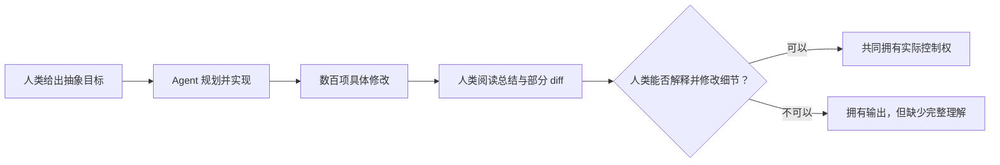
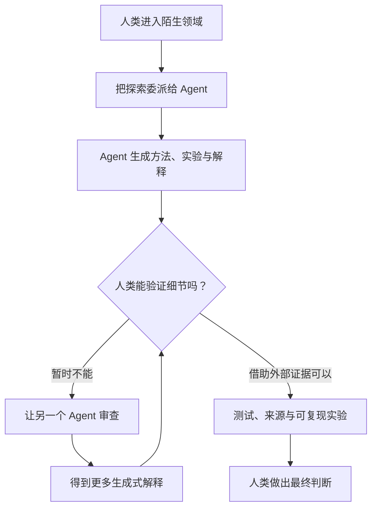
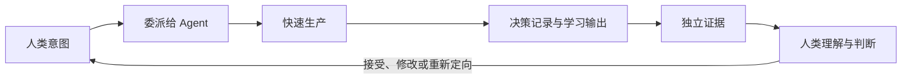

<BilibiliVideo bvid="BV1XVtG6FECm" />

<TOCInline fromHeading={1} toHeading={2} toc={props.toc} />

---

## 引言

在之前的一篇文章中，我们提出，[AI agents 应该接管更多过去由人类负责的工作](/zh/blog/tools/ai-agent-own-what-we-owned)。如果一个 agent 能够实现功能、检查结果、运行测试、修正错误，并在完成自己的局部闭环之后再返回，那么人类就不必监督每一个中间步骤。正是这种工作方式，让长时间运行和多 agent 并行成为可能。

现在，我们已经把这个想法推进得更远。借助 **Claude Code 20x 计划**、**GPT 20x 计划**、[动态工作流](/zh/blog/tools/dynamic-workflows)和多 agent 执行，我们只需给出一次抽象目标，就能让 agents 连续工作数小时，有时甚至接近半天。我们还为软件开发、论文研究和技术写作等特定工作配置了工具与可复用 skills。一个 prompt 就可以启动完整流程，让系统自行规划、委派、实现、测试和修改，而我们可以去处理其他事情。

这些产出是真实的。我们可以看到消耗的 token、创建的 commits、修复的 issues、提出的新功能以及完成的实验。从生产能力来看，这套系统已经远远超过了我们手动编写每一行代码所能达到的规模。

但这种成功也暴露出了一个更难的问题：

> **如果 AI 属于我们，它的能力也真的属于我们吗？**

最近的经历让我们的答案变得更加谨慎。AI agents 的确能够扩展我们的产出，但它们生成的结果不会自动变成我们的知识、理解与判断。当生成速度超过吸收速度时，agent 可能让项目走得更远，却让背后的人越来越难解释、验证或修改它所完成的工作。

## 高 Token 用量背后的真实感受

每天，使用量面板都会给出一个非常清楚的活动指标。一个高层目标会展开成大量生成工作，代码仓库积累了更多 commits，bugs 消失了，新功能出现了。从外部看，这似乎就是人类能力的直接延伸：我们表达意图，系统交付实现。

然而，我们真正获得的东西并不均衡。

我们知道了 AI agent **可以实现**某个功能，却不一定学会这个功能在更深层次上如何工作，为什么选择这种方法而不是另一种，哪些替代方案被放弃，以及最终实现依赖了哪些假设。这些信息往往仍然存在于 session 历史、代码或 diff 中。我们可以继续与 agent 对话、检查变更，并追问每个重要决定背后的原因，从而把它们找回来。

但在实际使用中，我们经常没有这样做。

审查需要注意力，而 agent 已经开始推进下一个任务。只要测试通过，我们就很容易直接接受结果并继续前进。我们开始问自己：**如果 agent 已经能完成这件事，我们还需要学习它吗？** 对许多低层或重复性的任务，诚实的答案可能确实是否定的。我们没有必要记住每个 API，也不必手动重写每一行生成的代码。

问题并不在于委派本身。问题是，委派可能悄悄变成一种**不再学习、不再追问、也不再保持好奇心**的习惯。因为 agent 经常成功，我们开始把它的能力想象成没有边界。对工具的信心逐渐变成依赖，而依赖又慢慢削弱了我们检查细节的动力。

到了这个阶段，AI 生产得更多，而我们吸收得更少。

## 生成速度不等于理解速度

这种不平衡在大型维护任务中尤其明显。我们最近让一个 agent 更新依赖库。任务运行了大约一个小时，修改了 **500 多个文件**。Agent 可以搜索整个仓库、选择迁移策略、应用修改、修复后续错误，并持续迭代，直到项目恢复到可以接受的状态。

我们却无法用相同的速度读完 500 个文件的变更。

在下一个任务开始之前，我们也无法完整还原 agent 使用的每一种策略，或检查每一个潜在影响。Agent 的生成速度超过了我们的审查速度，它的操作范围也超过了我们能够保持逐行控制的程度。

这就产生了一条**抽象鸿沟**：

在高层，我们仍然掌握方向。我们决定目标、约束和验收条件。但在底层，我们可能已经无法在不向同一个 agent 求助的情况下，自信地修改某一行关键代码。系统仍然运行在我们的账号下，代码也仍然位于我们的仓库中，但它的一部分已经超出了我们的实际控制能力。

这并不必然意味着失败。现代软件本来就建立在没有任何单个开发者能够完全理解的抽象之上。我们使用操作系统、编译器、框架和库，却不会阅读它们的每一处实现。AI 只是增加了新的抽象层——但它与稳定的库不同，它每个小时都可以生成一套全新且陌生的抽象。变更的体量和速度，让这一层更难检查。

因此，commit 数量、token 用量和修改文件数衡量的是**吞吐量**，而不是人类的理解程度。更多输出并不能证明我们自身的技术能力也按相同比例增长。

## 探索与验证悖论

当我们让 agents 进入一个自己从未研究过的领域时，风险会进一步放大。

在熟悉的软件工作中，我们通常至少可以验证一部分结果。我们知道预期行为，可以运行测试、检查架构，也能识别可疑的设计。即使 agent 编写的代码多到无法逐行审查，我们仍然有一个可以用来判断结果的心智模型。

但在探索任务中，这个心智模型可能根本不存在。我们之所以让 agent 探索一个陌生方法，正是因为我们尚不了解这个领域。随后，agent 选择组件、实现方案、运行实验，并写出一份清晰的总结。然而，这份总结同样是 agent 生成的。如果它遗漏了限制条件、误读了证据，或者把一个工程组合描述成全新的方法，我们可能没有足够的知识发现问题。

这就形成了一个验证悖论：

1. 因为不了解这个领域，我们把探索任务委派给 agent。
2. 也因为不了解这个领域，我们无法深入审查它完成的工作。
3. 我们让 agent 解释或验证自己的结果。
4. 新的解释仍然由同一类可靠性受到质疑的系统生成。
5. 真正独立的验证，可能需要与亲自学习该领域同样多的时间。

增加更多 agent 调用，可以通过独立审查者、对抗性检查和重复实验改善验证。我们的[动态工作流](/zh/blog/tools/dynamic-workflows)已经出于这个原因使用了相互独立的生成与验证 agents。但重新生成并不等于证据，多个 agents 达成一致也不能证明一个结论正确。

我们对一个领域了解得越少，流畅的最终答案就越容易显得可信，而我们检验它的能力反而越弱。

## 为什么研究和论文写作更能暴露边界

科学研究让这一限制变得格外明显。AI agents 已经很适合搜索论文、实现 baselines、运行实验、整理结果、编辑文字和适配模板。我们的 [Claude Code 配置](/zh/blog/tools/claude-code-config)为这些工作使用了专用 agents、MCP 工具和可复用流程。这些能力确实可以显著加速研究与写作。

但一篇论文并不只是报告“我们使用了这种方法，并获得了这个结果”。它还必须回答更难的问题：

- 为什么选择这种方法？
- 考虑过哪些替代方案，又为什么放弃它们？
- 这项贡献是真正的创新、已知思路的新组合，还是主要属于工程改进？
- 哪些证据支撑每一项 claim？
- 整篇论文的核心科学故事是什么？
- 面向不同期刊或读者时，这个故事应该如何变化？
- 哪些 figures 真正解释了方法，而不只是装饰结果？
- 从问题定义到结论，推理是否始终连贯？

Agent 可以为所有这些问题生成看似合理的回答。但生成合理答案，并不等于拥有可靠的科学立场。

我们已经看到 agents 通过代码生成和快速迭代获得更好的实验结果。但目前还没有看到同样有力的公开证据，证明 autonomous research agents 能稳定地把这些结果组织成适合不同期刊的最佳科学论述。它们仍可能难以处理论文整体逻辑、figure 设计、创新边界，以及严格遵守本地写作规则。一旦较弱的逻辑进入前缀上下文，后续章节可能只会继续润色和强化它，而不是主动挑战它。

这正是更多 token 和更长运行时间不再自动构成优势的地方。正如我们在重新思考 provider 限制之后的工作流时所写的那样，[更多 agents、更多 tokens 和更长运行时间，并不必然产生更多有用工作](/zh/blog/tools/ai-workflow-after-claude-ban)。它们也可能制造出超过研究者实际评估能力的材料。

即使是我们目前能够使用的最强模型，也依然存在边界。它们是强大的实现者与加速器，但这并不意味着 autonomous research judgment 已经成为一个解决了的问题。

## 输出能力不等于人的能力

现在，我们可以把几个容易混淆的概念分开：

| AI 扩展的东西      | 不会自动转移给人的东西          |
| ------------------ | ------------------------------- |
| 可以尝试的任务数量 | 对每一种实现的理解              |
| 代码生成速度       | 独立维护代码的能力              |
| 初步探索的广度     | 判断探索质量所需的领域知识      |
| 实验数量           | 确认实验回答了正确问题的信心    |
| 草稿生成速度       | 对论文科学逻辑的掌控            |
| 随时获得解释       | 脱离 agent 独立思考的动力与能力 |

AI 显然扩展了我们的**行动能力**。只要具备足够的工具、上下文与 tokens，一个人就可以发起过去需要更多时间或更大团队才能完成的工作。这是一种真实的杠杆扩展。

但 agent 的全部能力不会自动成为我们的能力。只有当我们能够带着判断使用结果时，这种能力才真正属于我们：理解关键假设、验证证据、识别失败、解释决定，并在上下文变化时主动介入。

一个更清楚的区分是：

> **从所有权上说，AI 的输出属于我们；但只有经过理解、验证和判断，AI 的能力才会真正成为我们的能力。**

如果缺少这些环节，我们拥有文件，却不一定拥有文件背后的知识。

## 重新思考工作流

答案并不是重新回到手写每一行代码。那样会丢弃长时间运行 agents 带来的真实价值。我们的目标应该是在继续委派的同时，避免人类从思考过程中彻底消失。

健康的工作流不需要把人类放进每一个实现步骤，而应该在人类真正建立所有权的位置把人带回循环：决策、证据、学习与判断。

### 1. 决定哪些事情必须由人类掌握

在启动长时间工作流之前，先确定哪些决定是我们必须能够解释的。在软件中，这可能包括架构、安全边界、数据模型和不可逆迁移；在研究中，则包括研究问题、方法选择依据、创新 claim、证据链和论文叙事。

Agent 可以帮助形成这些决定，但不应该在不知不觉中成为它们唯一的拥有者。

### 2. 审查关键决定，而不是假装读完每一行

一个修改 500 个文件的 diff 可能根本无法逐行检查。解决方案不是完全跳过审查，而是要求 agent 生成决策记录：迁移策略、替代方案、假设、高风险文件、生成文件、测试证据和未解决问题。随后，我们可以抽查高风险修改并检查接口，而不是假装所有文件都得到了同等程度的阅读。

### 3. 把学习设定为明确的输出

长时间任务不应该只返回代码或文字。它还应该为最终必须掌握结果的人提供一份解释：改了什么、为什么这样改、学到了什么、还存在哪些不确定性，以及哪些概念值得继续深入研究。

如果学习没有被写进目标，吞吐量通常会占据全部注意力。

### 4. 使用独立证据，而不只是相信 agents 的一致意见

Verifier agents 很有价值，但重要 claims 最终必须落在可观察的证据上：测试、benchmarks、原始论文、可复现实验或直接检查。另一份生成式总结可以指导验证，却不能替代验证。

### 5. 保留一部分属于自己的认知闭环

如果每个困难任务都立即被委派出去，好奇心就会逐渐减弱。我们需要刻意保留一些仍由自己完成的工作：阅读论文、跟踪代码路径、设计 figure，或者亲自撰写核心论证。这并不是因为手动工作永远更高效，而是因为思考、追问和形成独立立场的能力，只有在持续使用时才会增长。

## 结论

对我们而言，长时间运行的 AI agents 已经跨过了一个重要门槛。借助高 token 计划、专用工具、可复用 skills、动态工作流和多个 agents，一个 prompt 现在就能启动数小时的生产工作。系统可以创建 commits、修复 issues、提出功能、迁移依赖、运行实验并起草论文，其规模确实扩展了一个人的产出能力。

但生产只是能力的一部分。

当 agents 的生成速度超过我们的吸收速度时，这种关系可能发生反转。AI 不再扩展我们的理解，我们反而变成一个自己无法完全审查的输出流的操作者。我们保留了抽象层面的控制，却失去了细节层面的控制。在陌生领域中，我们甚至可能不知道如何验证一份经过精心润色的最终结果。在研究中，这条鸿沟会出现在最困难的部分：方法选择、创新性、证据、figures、期刊定位，以及连接整篇论文的逻辑。

因此，我们的答案已经改变。**AI 的能力可以扩展我们的能力，但它不会自动成为我们的能力。** 只有当工作流保留了人的理解、独立验证和继续思考的动力时，它才真正属于我们。否则，agent 的能力仍然是一种外部能力：强大、有用，并且在技术意义上由我们拥有，却并不真正属于我们自己知道如何完成的事情。

所以下一个挑战不应该只是让 agents 运行得更久，而是设计一种新的工作流：既允许 agents 以机器速度生产，又不会把人类的理解留在身后。

---

## 相关文章与资源

- [**AI Agents 应该接管我们过去负责的工作**](/zh/blog/tools/ai-agent-own-what-we-owned)
- [**从手动拆分任务到动态工作流**](/zh/blog/tools/dynamic-workflows)
- [**多 Agent 并行工作流：从程序员到指挥者**](/zh/blog/tools/multi-agent-parallel)
- [**从 Vibe Coding 到 Agent Coding**](/zh/blog/ide/ai-vibe-coding-2026)
- [**如何选择 AI Agent 编程的 Token 计划**](/zh/blog/tools/ai-agent-token-plan)
- [**Claude Code 配置指南**](/zh/blog/tools/claude-code-config)
- [**A Harness for Every Task: Dynamic Workflows in Claude Code**](https://claude.com/blog/a-harness-for-every-task-dynamic-workflows-in-claude-code)
- [**Multi-Agent Coordination Patterns**](https://claude.com/blog/multi-agent-coordination-patterns)
