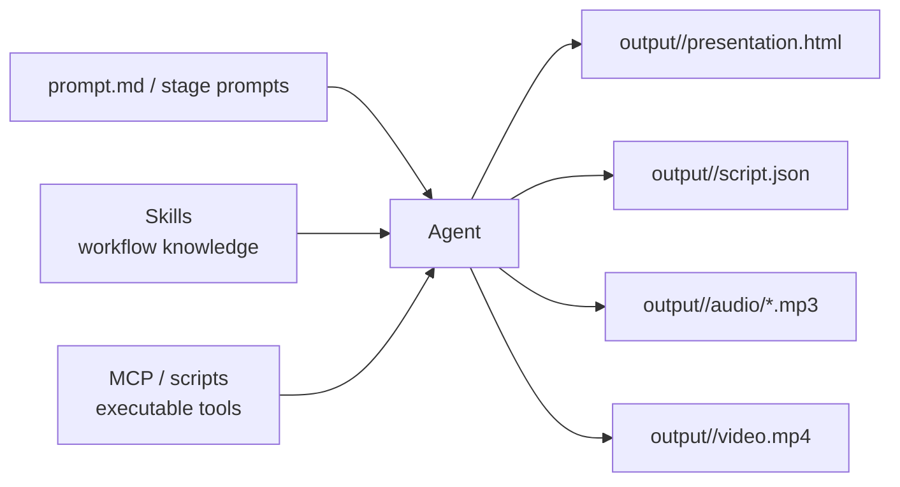

<BilibiliVideo bvid="BV1CFXpBKEZ3" />

<TOCInline fromHeading={1} toHeading={2} toc={props.toc} />

---

## 为什么 md2video 值得写一篇文章

大多数软件到今天为止，依然是围绕“人类操作者”来设计的。我们会做一个 GUI 让人去点，也会做一个 CLI 让人去敲，还会提供一个 SDK 让程序员把它接到别的系统里。但 [**md2video**](https://github.com/isomoes-video/md2video) 的出发点不太一样：在越来越多工作流里，真正的一线操作者已经开始变成 **AI agent**。这个变化看起来不大，但它会直接改变软件应该接受什么输入、怎样暴露能力，以及整个 workspace 该如何组织。

在 md2video 里，第一输入不是设置面板，也不是 Python SDK，而是一个类似 `prompt.md` 的 **提示词文件**，再加上仓库里按阶段拆开的 prompt。这个 prompt 会明确告诉 agent：要产出什么 artifact、应该放到哪里、每个阶段需要遵守什么规则。换句话说，这个 repo 更像一个 **agent workspace**，而不是一个传统意义上的应用。它把指令、边界和自动化能力都提前放进仓库里，方便 agent 直接使用。

所以我觉得，这个项目不只是一个小型的视频工具。它更像是在指向一种新的软件形态，而且这种形态在当前 AI 时代会越来越重要：软件开始优先为 **agent 执行** 而设计，人类更多负责给方向、做审查、验收结果，而不是亲手驱动每一个步骤。我们已经知道，**skill** 可以打包知识和工作流规则，**MCP 风格的工具能力** 可以打包可执行代码；真正缺少的，是一个能把这两者围绕具体任务组织在一起的 workspace。

## Skills + MCP + Workspace

实际问题其实很简单：**怎样让被打包的知识和被打包的工具，在同一个工作空间里协同工作？** md2video 给出了一个很直观的答案。仓库里有定义各阶段行为的 prompt 文件，有定义幻灯片结构和样式要求的 reveal.js skill，也有负责语音生成和视频拼接的辅助脚本。对于 agent 来说，它不需要从零猜整个流程，因为这个 repo 已经把说明、工具边界和输出契约提前写好了。

这件事之所以重要，是因为 agent 的能力，往往取决于它能不能看到完整的工作表面。skill 负责告诉它怎样设计幻灯片，工具负责生成 TTS 音频或合成最终视频，而 workspace 则把这一切绑在同一个目录结构里，让 agent 可以在不丢上下文的情况下，从规划一路走到执行。

从这个角度看，md2video 不只是一个“做视频”的项目。它更像一个非常紧凑的 **agent-native 软件架构样本**。这个软件不假设人类会逐步点完所有按钮，而是假设 agent 能读说明、调工具、写文件，并把整个 workspace 从头到尾维持一致。

## 从 GUI、CLI 到 CUI

这个项目背后还有第二个变化。对于很多 AI 工作流来说，主要界面已经不再是传统 GUI，甚至也不只是经典 CLI。越来越多时候，真正的主界面其实是 **聊天回路本身**：用户用自然语言表达目标，agent 再决定该调用哪些 prompt、哪些文件、哪些工具。我一般会把这种形态叫做 **CUI：Chat User Interface**。

这并不意味着 GUI 和 CLI 会消失。它们依然重要，尤其在检查状态、调试问题、直接控制某些细节的时候。但在 agent 密度越来越高的工作流里，它们不再是唯一入口。聊天界面现在可以承担编排层的角色，把人的意图、仓库上下文、可复用 skill，以及可执行工具连接到一起。

md2video 就很适合这种模式。人类只需要表达一个意图，比如“把这份 markdown 源内容做成带旁白的视频”，而 agent 会把这个请求翻译成一组边界明确的阶段任务。于是，CUI 负责承接意图，repo 则负责承接真正的执行契约。这种分工很有价值，因为它既保留了交互上的灵活性，也没有让执行路径变得含糊。

## md2video 是怎样把 Markdown 变成视频的

从项目本身来看，md2video 的设计其实相当克制。它接受 `source.md` 这类源文件，或者直接的文本输入，然后按 repo 里定义好的 prompt 阶段逐步推进。第一阶段使用 [`prompts/plan-prompt.md`](https://github.com/isomoes-video/md2video/blob/main/prompts/plan-prompt.md)，在 `output/<presentation-slug>/` 下创建一个 reveal.js 演示文稿 workspace。这个 workspace 会产出 `presentation.html`、`styles.css`、`script.json`，以及一个每页对应一张幻灯片的 `output.pdf`。

第二阶段使用 [`prompts/tts-prompt.md`](https://github.com/isomoes-video/md2video/blob/main/prompts/tts-prompt.md)，读取 `script.json`，为每一页生成对应的 narration MP3。第三阶段使用 [`prompts/combine-prompt.md`](https://github.com/isomoes-video/md2video/blob/main/prompts/combine-prompt.md)，把 PDF 页面和对应的 MP3 建立映射，然后合成为最终的 `video.mp4`。另外还有一个可选步骤 [`prompts/script2intro-prompt.md`](https://github.com/isomoes-video/md2video/blob/main/prompts/script2intro-prompt.md)，可以从 narration script 自动生成视频简介文本。

整个流程很直接：

1. 从 markdown 或其他源内容开始。
2. 让 agent 使用 planning prompt 先生成幻灯片和 narration script。
3. 审查生成出来的 workspace。
4. 让 agent 继续生成逐页旁白音频。
5. 再让 agent 把幻灯片画面和音频合成为 `video.mp4`。

这个项目真正有意思的地方，不只是在最终输出上，而在于它把整个流程都组织成了 **agent 能理解、也能产出的文件系统工作流**。Markdown 变成 slides，slides 变成 narration units，narration units 变成音频文件，最后这些文件再变成视频。每个阶段都很明确、可检查，也天然适合 agent 来执行。

## 一个很小的项目，但指向了更大的方向

md2video 本身是一个很简洁的项目，但它背后的想法比仓库本身要大得多。它在暗示，未来的软件交付形态可能不只是 app 和 library，也会越来越多地变成 **agent workspace**：有 prompt 入口，有可复用 skill，有工具访问层，有严格的输出契约，上面再覆盖一个人类在回路中的聊天界面。这样的组合，能让 agent 有足够的结构去做真实工作，同时又不至于把整个流程变成黑箱。

如果要用一句话概括这个项目，那就是：**md2video 用一种 agent-first、prompt-driven 的工作流，把 markdown 类源内容转成带旁白的幻灯片视频。** 如果要再往前走一步，说出它真正更大的意义，那就是：软件正在从 GUI 和 CLI，逐渐走向 **CUI + workspace** 的形态——人类负责表达意图，agent 负责围绕清晰定义的 artifact 去执行。在今天的 AI 软件世界里，这不像一个边缘实验，反而更像是某种新默认值的预告。
