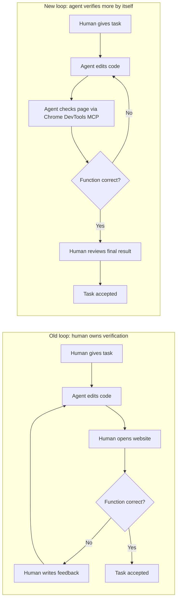

<TOCInline fromHeading={1} toHeading={2} toc={props.toc} />

---

## Introduction

Over the last two years, **vibe coding has evolved very quickly**. The early stage was mostly Copilot-style assistance: ask mode, autocomplete, and short conversational help inside the editor. Then the workflow moved toward **auto mode** and finally toward **agent mode**, where the model no longer just suggests code but reads files, edits them, runs commands, and tries to finish a bounded task end to end.

As that shift happened, agents gained access to more and more **context**. They can read larger repositories, inspect diffs, load reusable skills, call external tools through MCP, and operate with a much richer view of the task than earlier coding assistants ever had. In the single-agent world, this already feels powerful. A human gives the intent, the agent performs the implementation, and the human checks whether the result is acceptable.

That **human-in-the-loop** pattern is still one of the key ideas in vibe coding. For one agent working on one task, it is usually the right design. The human gives direction and performs the final judgment. The problem is that this logic does **not** scale cleanly into a real multi-agent system.

If every task, every subtask, and every session requires a human to come back and manually inspect the result before the next step can continue, then the human becomes the throughput limit of the whole workflow. In other words, the bottleneck is no longer model quality or token budget. The bottleneck is **one person's review bandwidth**.

That is why I think the next important step is this: **do not remove the human from the whole system, but remove the human from each inner loop whenever the agent can verify the result by itself**. Human oversight still matters. Human approval still matters. But if we want long-running agents and truly parallel multi-agent systems, we need to become more intentionally **anti-human-in-loop for each individual task/session**.

## The Problem with Human-In-The-Loop Everywhere

In the current vibe coding workflow, the human often plays the same role again and again:

- ask the agent to implement something
- inspect whether the result looks correct
- give feedback
- ask for another revision
- repeat until it is good enough

This loop works because software correctness is often hard to judge from code generation alone. The human acts as the evaluator. But that also means the agent is not really finishing the task. It is only finishing one draft of the task, and then waiting for human judgment before it can continue.

For a single feature, this is acceptable. For a **multi-agent workflow**, it becomes expensive in a different sense. Even if you can afford the tokens and run several agents in parallel, those agents still pause at the same place: they all need the same human to tell them whether to continue.

This is why I think the right target is not “full autonomy” in the abstract. The practical target is narrower and more useful: **agents should own more of the validation loop for the domains they can actually observe**. Once that happens, a human no longer needs to supervise every small iteration. The human can review at a higher level: accept the feature, reject the branch, rerun the task, or change the goal.

That shift matters because it changes the system from a chat-based coding assistant into a workflow engine for longer-running work.

## A Website Development Example

Frontend and website work make this difference especially clear.

In the older loop, the process usually looks like this: tell the agent to change the code, wait for it to finish, open the page yourself, inspect the UI, decide whether the behavior is right or wrong, then go back to the agent with another round of feedback. The agent can edit code, but the human still owns the functional judgment.

That is still useful, but it keeps the agent trapped inside a **partial development loop**. The agent can write, but it cannot really see. It cannot confirm whether the layout broke, whether the interaction works, or whether the final page behaves the way the task required.

Once we add tools such as **Chrome DevTools MCP**, the situation changes. The agent can open the running page, inspect the DOM, check layout state, observe errors, and verify whether the implemented function actually behaves as expected. That does not make the agent infallible, but it does let the agent **close more of the loop by itself**.

The difference is not just convenience. It changes what kind of task can run unattended.

In the first loop, the human is inside every iteration. In the second loop, the human moves outward and becomes the reviewer of the **completed local loop**, not the driver of each correction cycle.

This is exactly the kind of change that makes long-running agent work more practical. If the agent can implement, inspect, revise, and retest without waiting for human attention after each small step, then the task becomes much easier to leave running. And once tasks can run this way, **parallel multi-agent execution becomes much more realistic**. Several agents can work independently for longer periods because they are not all blocked by one human checking intermediate states.

## Remove the Human from the Inner Loop, Not from the System

It is important to be precise here. I am **not** arguing that humans no longer matter. The human still sets the objective, defines the constraints, decides the priority, and performs the final acceptance. In many tasks, the human also provides the product judgment that current tools still cannot replace.

The point is narrower: the human should not be forced to participate in **every local correction cycle** when the agent has enough tools to observe the result directly.

That is why MCP matters so much in practice. It is not only about connecting an agent to more tools. It is about giving the agent a way to **see the consequence of its own actions**. A coding agent without observation tools is often reduced to code generation plus guesswork. A coding agent with browser inspection, test execution, documentation lookup, and structured workflows can begin to act more like a bounded autonomous worker.

For multi-agent systems, this distinction is critical. If every subtask still requires human inspection at each iteration, then adding more agents just increases the number of times the same person must stop and look. But if agents can own more of their own loops, then one human can supervise a much larger amount of parallel work.

That is the practical meaning of “AI agents should own what we used to own.” They should increasingly own the parts of the workflow that used to require constant human micromanagement, especially **local validation and retry loops**.

## What Works Well Right Now

Based on our current experience, the best fit is already fairly clear.

For **one medium-complexity task**, one agent often works very well if it has enough context and enough tools to implement and verify the result. For **several independent tasks**, parallel agents also work well, as long as each task has clear boundaries and enough local autonomy that it does not constantly wait for human feedback.

The next problem is communication. Once several agents are running, the harder question is no longer just how to start them. The harder question is **how to let them communicate asynchronously** without turning the workflow into chaos. That matters because many real problems are not linear. They involve partial dependencies, branching exploration, retries, and information discovered at different times.

I think this is the next thing worth learning seriously. We already know that one agent can handle a bounded task, and we already know that independent tasks can be parallelized. The next frontier is a multi-agent system that can exchange useful state asynchronously, so the whole workflow can deal with more complex and non-linear questions without collapsing back into human coordination.

## Summary

The big lesson here is simple. **Human-in-the-loop is still valuable, but human-in-every-loop is not scalable.** That pattern works for single-agent vibe coding, but it becomes a bottleneck in multi-agent systems.

The website example makes the difference concrete. In the older workflow, the human had to repeatedly test the page and tell the agent what was wrong. With tools such as **Chrome DevTools MCP**, the agent can observe more of the result by itself, revise its own implementation, and return to the human only when the local loop is already much closer to complete.

That is why I think the next stage of agent coding is not just better models or bigger context windows. It is a shift in **ownership of the loop**. The more agents can own their own bounded validation cycles, the less often humans become the bottleneck, and the more realistic long-running and parallel multi-agent workflows become.

For now, this already works well for one medium-complexity agent task and for several independent tasks in parallel. The next step is to learn how to build **asynchronous agent communication**, so multi-agent systems can deal more efficiently with complex, non-linear work.

---

## Related Posts

- [**Vibe Coding to Agent Coding: A 15-Month Shift in How We Build Software**](/blog/ide/ai-vibe-coding-2026)
- [**Multi-Agent Parallel Workflow: From Coder to Conductor**](/blog/tools/multi-agent-parallel)
- [**A Four-Layer Multi-Agent Workflow That Finally Fits the Budget**](/blog/tools/four-layer-multi-agent-workflow)
- [**The Better AI IDE: Software Should Serve AI First, Then Humans**](/blog/ide/great-ai-ide)
- [**OpenCode: The Open Alternative to Claude Code**](/blog/tools/opencode-cli)
