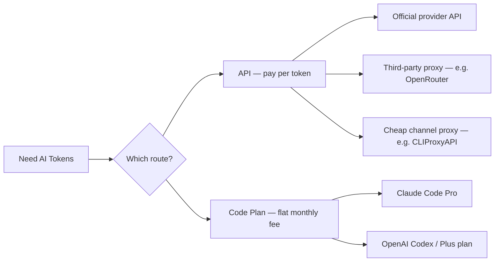

<BilibiliVideo bvid="BV1nCXrBSE5d" />

<TOCInline fromHeading={1} toHeading={2} toc={props.toc} />

---

## The Token Budget Is the Real Bottleneck

Most writing about AI coding tools focuses on model quality, IDE integration, or which agent framework to use. The question that actually determines whether a workflow is sustainable is simpler: **how much can you afford to prompt?**

A single complex agentic session — where the model reads files, revises code, runs tests, and iterates — consumes far more tokens than a quick chat. If the cost per session is too high, you adjust your behavior to compensate: shorter prompts, fewer retries, less parallel work. That adjustment quietly kills the productivity benefit that agents are supposed to provide.

There are two fundamentally different approaches to acquiring those tokens. One is the **API route**, where you pay per token consumed. The other is the **code plan route**, where you pay a fixed monthly subscription and receive a usage quota. Each has a different economic logic, and the right choice depends on how you actually work.

## The Two Major Paths

Before comparing prices, it helps to understand what makes the two approaches structurally different.

**API access** is metered. You pay for exactly what you use, at per-token rates, with no ceiling on how much you can spend or how much you can consume. This suits irregular, low-volume usage well, but becomes expensive quickly when agents run long sessions. There are no rate limits on spending — only on your budget.

**Code plans** (subscription-based coding quotas) flip this logic. You pay a flat monthly fee, and the provider gives you a fixed token or request budget, often with time-based rate limits — for example, a rolling 5-hour or weekly cap. The cost per token is much lower than API pricing, but the total available tokens are bounded.

## Path 1: API Access

### Official Provider APIs

The most straightforward entry point is a direct API key from the model provider. Anthropic, OpenAI, and Google all offer this. The advantage is reliability and full feature support. The disadvantage is cost.

For solo developer use — the kind of iterative, exploratory agentic session where the model reads a codebase, drafts changes, and loops through a few revisions — a single meaningful session costs roughly **$1–3 per question or task**. If you are running an agent continuously for an hour, the total easily reaches $5–15. At official API rates, this makes daily heavy use genuinely expensive and is hard to justify as a baseline workflow.

There is also a regional access problem. Official APIs are not available everywhere without additional network infrastructure, which adds friction and sometimes makes reliable access difficult for individual developers in certain regions.

### Third-Party Proxy APIs

The well-known alternative is a **multi-model proxy** like [OpenRouter](https://openrouter.ai/), which aggregates access to many providers through a single API endpoint. OpenRouter's appeal is breadth: Claude, GPT, Gemini, and many others are available under one key, with no switching overhead. As we described in our [OpenRouter cost analysis](https://github.com/isomoes/opencode-config/blob/main/docs/openrouter.md), this works well for workloads where you want to route simpler tasks to cheaper models.

However, OpenRouter still prices at full API rates for the premium models. The token costs are not meaningfully lower than going direct, and the additional routing layer can add latency.

### Cheap Channel Proxies (CLIProxyAPI and Similar)

A third approach has become increasingly practical: using a proxy that routes requests through provider channels that carry lower per-token rates than the standard commercial API. The project [CLIProxyAPI](https://github.com/router-for-me/CLIProxyAPI) is one example of this pattern. The tool proxies model access — including current models like Claude Sonnet 4.6 — through channels that can be **10–30x cheaper** than the official API price, making it possible to run extended agent sessions that would otherwise be unaffordable.

The trade-off is important to be honest about. These proxy channels are not officially supported, they can be shut down without notice, and the reliability is not guaranteed. There is also a meaningful account ban risk if the usage pattern is detected as violating terms of service. For exploratory or experimental work where cost is the primary constraint, this can still be worthwhile. For production or continuous professional use, the stability risk is real.

A practical summary of the API options:

| Option | Relative Cost | Stability | Region Access | Notes |
|---|---|---|---|---|
| Official API | Baseline | High | Limited by region | $1–3 per complex session |
| OpenRouter | ~Baseline | High | Broader | Multi-model, same pricing tier |
| CLIProxyAPI (proxy) | 10–30x cheaper | Low | Depends on channel | Unofficial, shutdown risk |

## Path 2: Code Plans

Code plans are subscription products sold by AI labs specifically for coding tool use. The most commonly used ones right now are **Claude Code Pro** from Anthropic and the **Codex usage** available through OpenAI's Plus plan.

### Claude Code Pro

Claude Code Pro costs **\$20/month** (roughly 140 RMB). That subscription includes a token budget equivalent to approximately $140 in API value, which is a strong ratio on paper. The plan gives you Claude Code with sub-agent support, MCP integration, and the full feature surface — everything covered in our [Claude Code configuration guide](/blog/tools/claude-code-config).

The constraint is the rate limit. Usage is gated by a rolling window, which affects how intensively you can run parallel agents within a given hour or day. For a single-agent workflow focused on one task at a time, the quota is generally sufficient. For a multi-agent parallel workflow where several agents are running simultaneously — the kind described in our [multi-agent parallel post](/blog/tools/multi-agent-parallel) — you will hit the rate limit faster and the effective token budget feels smaller.

Claude models are also priced at roughly **2x the token cost** of comparable GPT models, which means the same dollar buys fewer tokens, all else equal.

### OpenAI Codex via Plus Plan

OpenAI's Plus plan at **\$20/month** (roughly 40 RMB at current rates, depending on region and payment method) provides access to Codex-based coding workflows including GPT-based agents. Based on our local testing, running Codex continuously for a month comes to approximately **$320 in API equivalent** at standard pricing — meaning the Plus plan delivers significantly more token volume than Claude Code Pro at the same nominal price.

The specific economics we measured: at the same \$20 month spend, Codex delivers roughly **\$320** in API-equivalent token value while Claude Code Pro delivers **\$140**. That is already a **2.3x** difference in raw token volume. On top of that, Claude models cost approximately **1.5x more per token** than equivalent GPT models, so the combined effective advantage works out to roughly **2.3 × 1.5 ≈ 5x** more usable budget for Codex in multi-agent scenarios where token volume matters most.

As we described in our [four-layer multi-agent workflow post](/blog/tools/four-layer-multi-agent-workflow), tools like CLIProxyAPI can also act as an account pool layer that smooths out the rate limits inherent to any single subscription, though this adds operational complexity.

### Code Plan Comparison

| Plan | Monthly Cost | Effective Token Value | Rate Limits | Best For |
|---|---|---|---|---|
| Claude Code Pro | $20 (≈140 RMB) | ~$140 API value | Yes, rolling window | Single-agent focused workflows |
| OpenAI Plus (Codex) | $20 (≈40 RMB*) | ~$320 API value | Yes, rolling window | Multi-agent, token-heavy workflows |

*Regional pricing varies; check current rates in your region.

## The Recommendation

The picture that emerges from these comparisons is fairly clear, even if no option is perfect.

**Official API access is the most expensive path** for heavy agentic use. At $1–3 per complex session, a sustained daily workflow becomes difficult to afford for solo developers. It is the right choice only for very light, infrequent use where you need guaranteed reliability and full feature support.

**Third-party proxy channels like OpenRouter** do not solve the cost problem for heavy use. They expand model selection and reduce regional friction, but token prices remain in the same tier as the official API.

**Cheap channel proxies** solve the cost problem but introduce a reliability problem. If your workflow depends on uninterrupted access and you cannot afford a service disruption, this is not a good primary path. If you are experimenting, prototyping, or willing to tolerate occasional outages in exchange for dramatically lower costs, it is a reasonable supplement.

**Code plans are the practical baseline** for sustained AI agent work. The flat monthly fee, the included quota, and the integration with purpose-built tools like Claude Code or Codex make the workflow feel stable and predictable.

The choice between Claude Code Pro and Codex via Plus plan depends on what you are building:

- **Single-agent workflows** built around Claude Code benefit from its sub-agent architecture, custom agents, MCP integration, and the overall configuration ecosystem. Claude Code Pro at $20/month is well-suited here.

- **Multi-agent workflows** that need to run many agents in parallel, sustain high token volume, and keep costs predictable benefit more from Codex through the Plus plan. The 5x cost advantage at equivalent spending is significant when token budget is the constraint, and OpenAI's current pricing promotions make the effective rate especially attractive.

This is the pattern we arrived at in our [four-layer workflow](/blog/tools/four-layer-multi-agent-workflow): cheap model access at the bottom of the stack makes everything above it sustainable. For multi-agent parallel work, that currently means GPT Codex over Claude, for purely economic reasons — not because Claude is worse, but because the dollar goes further when you need volume.

---

## Related Resources

- [**DeepSeek Meets Claude Code**](/blog/tools/deepseek-claude-code) — Running Claude Code with DeepSeek for 68x lower API costs
- [**Claude Code Configuration Guide**](/blog/tools/claude-code-config) — Full Claude Code setup with agents, commands, and MCP
- [**Multi-Agent Parallel Workflow**](/blog/tools/multi-agent-parallel) — How to structure parallel agent work with vibe-kanban
- [**Four-Layer Multi-Agent Workflow**](/blog/tools/four-layer-multi-agent-workflow) — Our current budget-aware multi-agent stack
- [**OpenRouter Cost Analysis**](https://github.com/isomoes/opencode-config/blob/main/docs/openrouter.md) — Detailed comparison of Claude Code Pro vs OpenRouter
- [**CLIProxyAPI**](https://github.com/router-for-me/CLIProxyAPI) — Proxy tool for cheap channel model access
