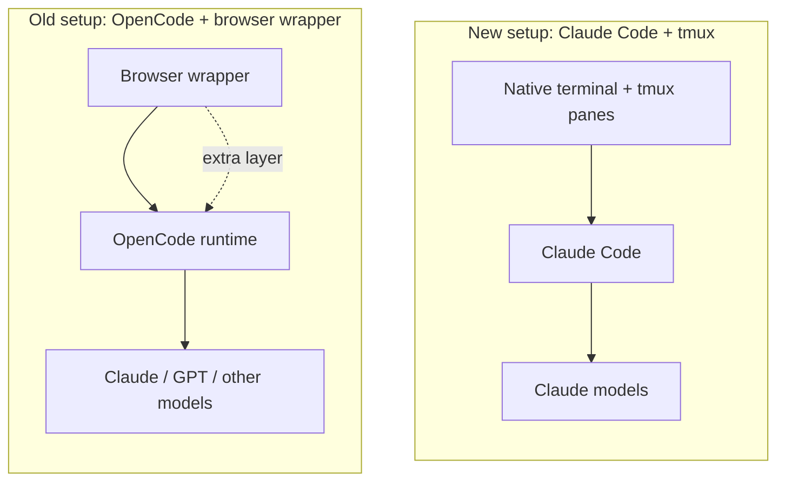

<TOCInline fromHeading={1} toHeading={2} toc={props.toc} />

---

## Why This Post Exists

Over the last several months, most of our agent-coding work has run on top of [**OpenCode**](/blog/tools/opencode-cli). We did not just use it; we built around it. [**iKanban**](https://github.com/isomoes/ikanban) for review, **iPaper** for research workflows, a set of agents and plugins for our [four-layer multi-agent stack](/blog/tools/four-layer-multi-agent-workflow), and a fair amount of multi-provider experimentation across DeepSeek, KIMI-K2, Qwen-Code, GLM-4.6, and the GPT family. The provider-agnostic runtime was the point. If one model became too expensive or too restricted, we could swap it without rebuilding the workflow.

That investment was real, and it still has value. But the daily driver has shifted back to **Claude Code**. This post is the honest version of why, written for anyone who has made a similar bet on a provider-agnostic stack and is wondering whether the tradeoffs still hold.

## The Model Side: Why Claude Came Back into Focus

The first reason is the simplest one: model quality.

While running across many providers, our practical assessment is that the **Chinese open-weights and hosted models are still not at the level we need** for sustained agent coding. They are useful as cheap supplements for narrow tasks, and they have improved quickly, but they are not yet a reliable primary model for the long, tool-heavy sessions our workflow depends on.

For a period, **GPT-5.5 was genuinely strong** — strong enough that the multi-provider story felt complete. Then OpenAI tightened its account-security posture. The exact mechanism is less important than the outcome: at the same effective price, GPT-5.5 stopped being the best available choice for our workflow, and the comparison flipped. Side by side on real tasks, **Claude Opus 4.6 and 4.7** came out ahead at the same spend level.

Once that flip happened, the question stopped being "which provider should we route to" and became "given that we need Claude models for the hard work, what is the cleanest way to run them?"

## The Runtime Side: Cost of Routing Claude Through OpenCode

If the answer were "OpenCode plus Anthropic API," the rest of this post would not exist. The complication is that **using Claude through OpenCode well is not a free choice**.

There are two practical paths, and both have costs that turned out to matter more than we initially admitted.

**Path A — Claude API direct through OpenCode.** This works. It is also the most expensive path for sustained agentic use, as we covered in [How to Choose a Token Plan for AI Agent Coding](/blog/tools/ai-agent-token-plan). At $1–3 per complex session, it is not a baseline workflow; it is a fallback.

**Path B — Use the Claude Code subscription plan through OpenCode.** The community has converged on solutions for this, and they do function. The risk is what they imply: this is **not a sanctioned use of the Claude Code plan**, and the account-ban risk is real. We had already seen what happened on the GPT side when account-security policies tightened. Building a daily workflow on a path that explicitly violates a provider's terms is the kind of foundation that quietly looks fine until the day it does not.

Neither path is a clean answer when the model you actually need is Claude.

## The Cache Side: A Less Obvious but Constant Tax

The cost issue above is the visible one. There is a second issue that is less visible and, in our experience, more consequential over a week of real usage: **prefix-cache hit rate**.

Claude's pricing model rewards reusing a stable prefix at the start of each request. The system prompt, the tool definitions, and the early conversation form a cache key. When that prefix matches a recent request, the cached portion is billed at a much lower rate. When it does not match, you pay the full input price again on every token of the prefix.

Claude Code is designed around this. Its system prompt and tool definitions are stable, so most turns inside a session reuse the cached prefix. OpenCode is a different program. Its **system prompt is different, its tool definitions are different, and the exact serialization is different** — which means a Claude model talking through OpenCode does not reuse Claude Code's prefix cache, and within OpenCode itself the prefix is more sensitive to configuration changes than we initially noticed.

The result, on the Claude Code subscription plan running through OpenCode, was that we hit the **weekly usage limit noticeably faster** than we did running the same volume of work directly through Claude Code. We were not generating more tokens of useful output; we were just paying full price on more of the prefix. Once we measured this carefully, the multi-provider runtime started to look less like neutral infrastructure and more like a steady cache tax on whichever provider we routed through it.

## The Interface Side: The Browser-Wrapper Experiment

The other piece of the picture is an experiment we ran on top of OpenCode: wrapping it inside a browser. The intent was to take the **AI-first interface philosophy** we described in [The Better AI IDE](/blog/ide/great-ai-ide) and turn it into something concrete — a browser-based control surface where multiple OpenCode sessions could be managed in parallel, with richer state visibility than a terminal can offer.

This is a genuinely interesting direction, and the work itself was not wasted. But the honest accounting is that the browser wrapper did **not give us a step-change in multi-session management**. The improvements over a well-organized terminal setup were real but small, and they came with their own complexity: a browser process to keep alive, an extra layer to debug when something broke, and a less direct path to the underlying agent.

When the rest of the stack is also being reconsidered, "interesting but not a step-change" is not enough to justify keeping a custom interface layer. Simpler wins.

The replacement is deliberately less ambitious. **Native terminal plus tmux** gives us multi-pane, multi-session agent execution without an extra interface layer to maintain. We lose some of the visual richness the browser experiment promised, but we recover the simplicity that made the terminal pleasant to begin with — and, just as important, we stop carrying a piece of infrastructure that did not pay its keep.

## What This Means for the Four-Layer Stack

This is not a repudiation of the four-layer thinking from earlier posts. The structure still holds: cheap model access at the bottom, a runtime in the middle, a workflow layer above that, and a review interface at the top. What is changing is which specific piece occupies which layer, and the answer is now closer to the conventional one.

- **Layer 1 (model access):** Claude Code subscription, used as intended.
- **Layer 2 (runtime):** Claude Code itself, instead of OpenCode.
- **Layer 3 (workflow):** subagents, skills, and [Claude Code configuration](/blog/tools/claude-code-config) — the same workflow ideas, expressed in the runtime that is designed for them.
- **Layer 4 (review):** iKanban remains useful and is not tied to which runtime is below it.

The work we did inside OpenCode is not lost. The agents, the commands, the MCP wiring, and the workflow conventions translate cleanly back. The migration mapping in our [OpenCode post](/blog/tools/opencode-cli) runs in both directions.

## What We Are Keeping from the OpenCode Period

Two things from the OpenCode period are worth keeping explicitly.

First, the **provider-agnostic instinct** is still correct. Vendor lock-in remains a real risk, and the fact that this post exists at all — moving a daily workflow between runtimes in response to changing pricing and policy — is evidence that the optionality matters. We are not arguing for permanent commitment to one provider; we are arguing that, right now, the cleanest path runs through Claude Code.

Second, the **tools we built** — iKanban for review, iPaper for research, the plugin work, the multi-agent patterns — were not specific to OpenCode. They are runtime-adjacent, and they continue to do their job. If the model landscape shifts again, the cost of moving back will be lower than it was the first time.

## Summary

The short version is straightforward. **The model we want is Claude.** Running it through OpenCode either costs more directly (API path) or carries account-ban risk (subscription path), and on top of that, the prefix-cache mismatch between OpenCode and Claude Code burns the weekly quota faster than running natively. The browser-wrapper experiment was interesting but did not deliver enough multi-session value to keep its complexity. Replacing it with native terminal plus tmux returns the setup to something we can maintain without thinking about it.

The four-layer mental model survives the change. The runtime in the middle is just a different runtime now. The work we built around the old runtime moves cleanly across, and the workflow is simpler than it was a month ago.

---

## Related Posts

- [**OpenCode: The Open Alternative to Claude Code**](/blog/tools/opencode-cli)
- [**Claude Code Configuration Guide**](/blog/tools/claude-code-config)
- [**How to Choose a Token Plan for AI Agent Coding**](/blog/tools/ai-agent-token-plan)
- [**A Four-Layer Multi-Agent Workflow That Finally Fits the Budget**](/blog/tools/four-layer-multi-agent-workflow)
- [**AI Agents Should Own What We Used to Own**](/blog/tools/ai-agent-own-what-we-owned)
- [**The Better AI IDE: Software Should Serve AI First, Then Humans**](/blog/ide/great-ai-ide)
