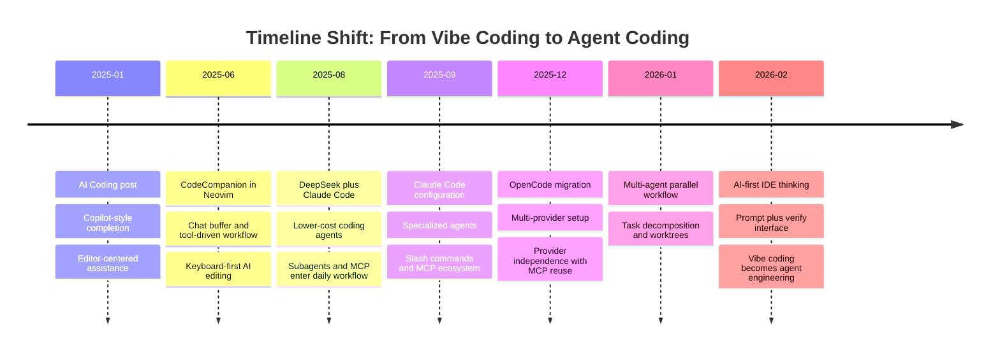
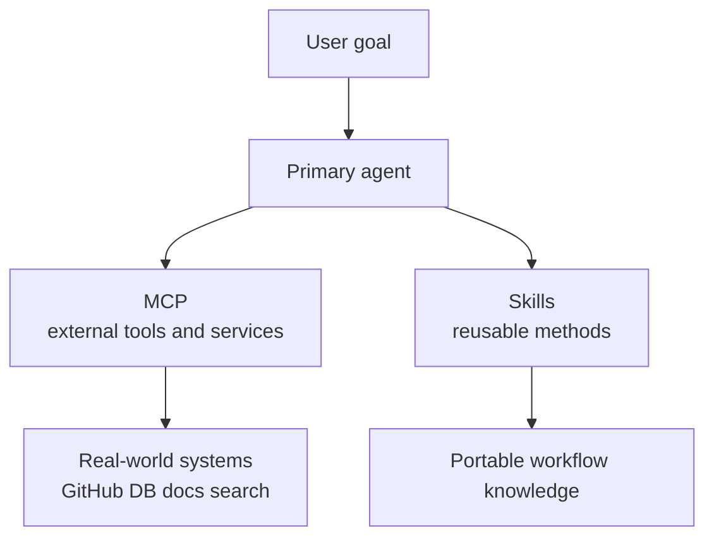
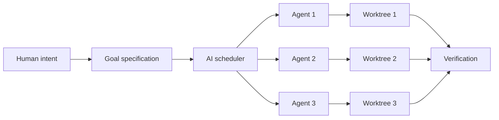

<TOCInline fromHeading={1} toHeading={2} toc={props.toc} />

---

## Introduction

From January 2025 to March 2026, the workflow shifted from vibe coding toward agent coding. In the earlier stage, the main value was speed: faster completion, easier prompting, and a looser style of asking the model to produce code. Fifteen months later, the center of gravity has moved toward agents, worktrees, orchestration, and review. The human role has not disappeared, but it has become more explicitly engineering-oriented: define intent, provide constraints, shape the system, and verify the result.

This post is organized around three changes in the workflow itself. First, vibe coding gradually became **agent coding**, where implementation is treated less as freeform generation and more as bounded task execution. Second, the agent's ability was extended through **MCP** and **skills**, which let it connect to outside systems and load reusable methods. Third, software work began moving toward **multiple agents running at the same time**, which changed the human role from direct implementer to orchestrator, reviewer, and engineering decision-maker.

## Part I: Coding by the Agent

When the first [AI Coding](/blog/ide/ai-code) post was published in January 2025, the dominant mental model was still shaped by GitHub Copilot. AI was treated as an assistant inside the editor: it completed functions, expanded comments into code, and helped reduce repetition. Even when the post mentioned better reasoning models and RAG-style workflows, the human was still doing most of the driving. That was the beginning of vibe coding: natural-language intent, lightweight delegation, and fast iteration, but not yet a fully engineered agent workflow.

That stage was still important because it changed what counted as normal development work. Instead of writing every line directly, developers began describing intent in natural language and reviewing generated output in smaller diffs. The [Continue](https://docs.continue.dev/customize/overview) plugin represented this transition well: model providers, context providers, slash commands, and tool calling already hinted that coding would become more conversational and more compositional. What looked like an improved editor plugin was actually the beginning of an agent workflow.

During 2025, the workflow kept moving toward the terminal and toward stronger control. In [Neovim metting AI (CodeCompanion)](/blog/misc/neovim-ai), AI support entered a keyboard-first editing environment with chat buffers, inline editing, and tool-driven agents. In [DeepSeek Meets Claude Code](/blog/tools/deepseek-claude-code), the discussion shifted from simple completion to cost, tool use, and system integration. By the time [My 2025 Big Changes](/blog/misc/change-2025) was written, the key lesson was already clear: the path from VSCode plus Copilot to Neovim plus OpenCode was really a path toward simplicity, control, and provider independence.

That is also where the phrase _vibe coding_ became more precise. It does not simply mean asking AI to generate code casually. It describes a transition in which the developer stops treating typing as the main unit of work and starts delegating implementation through natural-language intent. But the next step matters even more: once the workflow becomes reliable, vibe coding hardens into agent coding, where tasks, tools, boundaries, and verification are handled in a more explicit engineering way.

The endpoint of this first shift is simple: the unit of execution is no longer the line of code typed by hand, but the task executed by the agent. At that point, the workflow is no longer just "coding with vibes." It becomes engineering through agents. Once that change is accepted, the next questions become obvious. How can the agent be extended? And what happens when one agent is no longer enough?

## Part II: Extending the Agent with MCP and Skills

If the first stage was about letting the agent write code, the second stage is about extending the agent's ability. In practice, the two most visible building blocks are now **MCP** and **skills**. MCP expands what an agent can _do_ by connecting it to external tools and services. Skills expand what an agent can _know how to do_ by packaging reusable methods, workflows, and best practices. Together, they push AI coding beyond prompt engineering and toward a modular ecosystem.

### MCP: connecting the agent to the world

The turning point in [Mastering Claude Code](/blog/tools/claude-code-config) was not only better prompting. It was the integration of external capabilities through the **Model Context Protocol**. With MCP, an agent is no longer limited to the local prompt and the local file tree; it can access research databases, GitHub repositories, and other external services through a common interface. The `all-in-mcp` setup in that post made this practical for academic search, while [OpenCode](/blog/tools/opencode-cli) showed that the same pattern could survive migration across providers.

One reason MCP became so important in late 2025 and early 2026 is the rapid growth of the surrounding ecosystem. The directory at [mcpservers.org](https://mcpservers.org/) now tracks thousands of published MCP servers across categories such as **development**, **search**, **database**, **cloud service**, **version control**, and **web scraping**. At the time of writing, the site lists more than **6,500** servers in total, including more than **2,100** in development and more than **500** in search. That scale changes the meaning of AI tooling: instead of asking one model to know everything, we increasingly give it the ability to call the right external capability at the right time.

| MCP server                                                                                          | Typical role                   | Why it is useful in AI coding                                          |
| --------------------------------------------------------------------------------------------------- | ------------------------------ | ---------------------------------------------------------------------- |
| [Context7](https://mcpservers.org/servers/upstash/context7-mcp)                                     | Documentation search           | Retrieves up-to-date library and framework docs during implementation  |
| [Playwright](https://mcpservers.org/servers/microsoft/playwright-mcp)                               | Browser automation             | Lets agents test UI flows, click through pages, and verify behavior    |
| [Chrome DevTools MCP](https://mcpservers.org/servers/github-com-chromedevtools-chrome-devtools-mcp) | Frontend inspection            | Exposes live browser debugging, DOM inspection, and performance checks |
| [Next.js DevTools MCP](https://mcpservers.org/servers/vercel/next-devtools-mcp)                     | Framework-specific development | Gives targeted tools for Next.js projects and app debugging            |
| [all-in-mcp](https://github.com/jiahaoxiang2000/all-in-mcp)                                         | Academic and GitHub workflow   | The custom stack used in this blog for paper search and repo context   |

### Skills: reusable behavior loaded only when needed

The newest addition is **skills**. Earlier posts in this blog already moved toward reusable agents and slash commands, but recent OpenCode documentation adds a clearer packaging layer: a skill is a reusable `SKILL.md` definition that can be discovered from the repo or the global config and loaded only when relevant. In practice, this means recurring knowledge no longer has to live inside one giant system prompt or be copied into every agent definition.

This idea is also growing into its own ecosystem. The directory at [skills.sh](https://skills.sh/) presents itself as an open agent-skills ecosystem and tracks reusable skills across many clients, including Claude Code, OpenCode, Codex, Cursor, Gemini, GitHub Copilot, Cline, Goose, VS Code, and Windsurf. The leaderboard on the site shows that skills are no longer a niche configuration trick. They are becoming a portable packaging format for procedural knowledge: frontend rules, framework best practices, debugging methods, browser workflows, document generation, deployment steps, and code-review habits can all be distributed as installable units.

This is a small technical detail with large workflow consequences. A skill does not primarily add a new external tool; it adds a reusable method. That separation makes AI systems easier to maintain because workflows become more composable: one agent can load a release skill, a documentation skill, or a deployment skill only when needed. If MCP connects agents to tools, skills connect them to reusable operational knowledge.

| Skill                                                                                                 | Source      | Typical role       | Why it is commonly used                                               |
| ----------------------------------------------------------------------------------------------------- | ----------- | ------------------ | --------------------------------------------------------------------- |
| [find-skills](https://skills.sh/vercel-labs/skills/find-skills)                                       | Vercel Labs | Skill discovery    | Helps agents locate and install the right skill for a new task        |
| [vercel-react-best-practices](https://skills.sh/vercel-labs/agent-skills/vercel-react-best-practices) | Vercel Labs | React guidance     | Encodes practical React patterns for agent-led implementation         |
| [subagent-driven-development](https://skills.sh/obra/superpowers/subagent-driven-development)         | Obra        | Task decomposition | Reinforces the specialized-agent workflow discussed in this post      |
| [using-git-worktrees](https://skills.sh/obra/superpowers/using-git-worktrees)                         | Obra        | Parallel isolation | Fits multi-agent workflows where independent branches matter          |
| [mcp-builder](https://skills.sh/anthropics/skills/mcp-builder)                                        | Anthropic   | MCP authoring      | Useful when the next step is not using an MCP server but building one |

## Part III: Multiple Agents Running at the Same Time

The third shift begins when one agent is no longer the natural unit of work. In [Multi-Agent Parallel Workflow](/blog/tools/multi-agent-parallel), the key idea was not simply speed, but **decomposition**. Once a project is broken into independent parts, several agents can work at the same time. One can research, one can implement, and one can prepare documentation or tests. This changes software work from a single threaded interaction into a coordinated system.

The tools around this shift became clearer in [Vibe-Kanban](/blog/tools/vibe-kanban-intro), which used isolated git worktrees and a visual scheduler to coordinate concurrent runs. Instead of one assistant session holding the whole task, each agent receives a bounded context and its own execution space. That isolation matters because concurrency without boundaries quickly creates conflicts. Worktrees, separate sessions, and explicit task assignment make parallel work reviewable instead of chaotic.

This also changes the interface. Traditional IDEs were built for a human who clicks, browses, edits, and debugs directly. AI-first tooling assumes that the machine performs most operations through CLI commands, while the human mainly writes prompts and reviews results. That is why the two-pane model discussed in [The Better AI IDE](/blog/ide/great-ai-ide) feels convincing: one pane for intent, one pane for verification, and everything else becomes secondary.

The human role therefore shifts again. In the first stage, the human coded with assistance. In the second, the human operated a stronger agent. In this third stage, the human becomes the coordinator of multiple agents: decomposing work, assigning context, reviewing results, and integrating outputs. The next likely step is an AI scheduler that handles more of this middle layer automatically, but even before that happens, the practical lesson is already clear: **keep the workflow modular**. Use provider-agnostic runtimes such as [OpenCode](/blog/tools/opencode-cli), keep context portable through Git and diffs, connect external systems through MCP only when they are actually useful, move reusable know-how into skills instead of duplicating prompts everywhere, and isolate parallel work with worktrees whenever possible. That is the engineering shape of agent coding.

## Conclusion

From January 2025 to March 2026, the workflow changed in three visible steps. First, vibe coding matured into agent coding, and implementation moved from human typing toward bounded agent execution. Second, agent ability expanded through MCP and skills. Third, the workflow moved from one agent to several agents running in parallel. The direction is consistent across all these posts: fewer manual operations, clearer abstractions, and more emphasis on intent, architecture, and review.

Vibe coding, in that sense, is not the end state. It is the entry point. The more mature form is agent coding: a way of organizing engineering work around task definition, tool integration, modular workflows, and verification. The better these systems become, the more valuable it is to think carefully about architecture, task boundaries, interfaces, and review. That is likely to be the real work of AI-native software development in 2026.

---

## Related Posts

- [AI Coding](/blog/ide/ai-code)
- [Neovim metting AI (CodeCompanion)](/blog/misc/neovim-ai)
- [DeepSeek Meets Claude Code](/blog/tools/deepseek-claude-code)
- [Claude Code Subagents](/blog/misc/claude-subagent)
- [Mastering Claude Code](/blog/tools/claude-code-config)
- [OpenCode: The Open Alternative](/blog/tools/opencode-cli)
- [Multi-Agent Parallel Workflow](/blog/tools/multi-agent-parallel)
- [Vibe-Kanban](/blog/tools/vibe-kanban-intro)
- [The Better AI IDE](/blog/ide/great-ai-ide)
- [My 2025 Big Changes](/blog/misc/change-2025)
